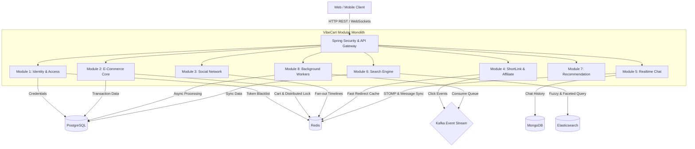

# 🛒 VibeCart - Social E-Commerce & Affiliate Platform 🍃

[](#)
[](https://spring.io/projects/spring-boot)
[](https://www.postgresql.org/)
[](https://redis.io/)
[](https://kafka.apache.org/)
[](https://www.elastic.co/)
[](https://www.mongodb.com/)
[](https://www.docker.com/)

> [!NOTE]
> **Dự án Nghiên cứu & Học tập Cá nhân (Personal Learning Project)**
> 
> VibeCart được thiết lập và phát triển với mục đích tự học tập, nghiên cứu chuyên sâu về kiến trúc ứng dụng bền vững (**Modular Monolith**), thử nghiệm tích hợp các công nghệ Enterprise (Kafka, Redis Cache/Lock, Elasticsearch, MongoDB) và hiện thực hóa các giải pháp xử lý bất đồng bộ/đồng thời thực tế. Dự án không phục vụ cho mục đích thương mại.

**VibeCart** là một nền tảng Thương mại Điện tử tích hợp Mạng xã hội (Social Commerce) và Tiếp thị Liên kết (Affiliate Platform) hiện đại. Hệ thống được thiết kế nhằm kết nối liền mạch giữa trải nghiệm lướt bảng tin, xem đánh giá (reviews), trò chuyện thời gian thực và mua sắm trực tiếp. Đồng thời, nền tảng tối ưu hóa công cụ tạo thu nhập thụ động cho các KOL/Creators thông qua liên kết rút gọn thông minh nhận hoa hồng tự động.

---

## 🏗️ Kiến trúc Hệ thống (System Architecture)

VibeCart được xây dựng theo mô hình **Modular Monolith** chuẩn chỉnh (N-Layer: *Controller -> Service -> Repository* trong từng phân hệ độc lập), giúp cân bằng giữa tốc độ phát triển dự án và khả năng mở rộng (scale-out) thành Microservices dễ dàng trong tương lai.



---

## 🧩 Các Phân Hệ Cốt Lõi (System Modules)

<details>
<summary><b>🔒 Phân hệ 1: Hệ thống Tài khoản & Định danh (Identity & Access)</b></summary>

*   **Bảo mật mật khẩu:** Băm (hash) mật khẩu bằng thuật toán `Bcrypt` trước khi lưu trữ.
*   **Xác thực kép:** Sử dụng cặp Access Token (JWT - hiệu lực 15 phút) và Refresh Token (hiệu lực 7 ngày) được mã hóa tối ưu.
*   **Đăng nhập một chạm:** Tích hợp xác thực mạng xã hội OAuth2 qua tài khoản Google.
*   **Bảo mật phiên đăng nhập:** Hỗ trợ thu hồi quyền truy cập khi Đăng xuất bằng cách đưa JWT hiện tại vào Blacklist lưu trữ tạm thời trên Redis.
*   **Phân quyền chặt chẽ (RBAC):** Phân chia vai trò 3 cấp độ: `USER` (Người mua), `CREATOR` (KOL/Affiliate), và `ADMIN` điều phối hệ thống.
</details>

<details>
<summary><b>🛒 Phân hệ 2: Cốt lõi Thương mại Điện tử (E-Commerce Core)</b></summary>

*   **Quản lý sản phẩm:** Nghiệp vụ CRUD sản phẩm và quản lý số lượng tồn kho (Inventory).
*   **Giỏ hàng siêu tốc:** Lưu trữ dữ liệu giỏ hàng trên Redis Cache giúp giảm thiểu độ trễ phản hồi dưới 10ms.
*   **Xử lý Đơn hàng & Chống bán âm kho (Flash Sale):** Ứng dụng kỹ thuật khóa cơ sở dữ liệu (`Pessimistic Locking` hoặc `Redis Distributed Lock` qua Redisson) để giải quyết xung đột khi hàng ngàn yêu cầu đặt hàng xảy ra đồng thời.
*   **Vòng đời Đơn hàng:** Kiểm soát trạng thái chặt chẽ (`PENDING` -> `PAID` -> `SHIPPED` -> `DELIVERED`).
*   **Cổng thanh toán:** Tích hợp cổng thanh toán PayOS và xây dựng hệ thống xử lý Webhook phản hồi giao dịch tự động.
</details>

<details>
<summary><b>📱 Phân hệ 3: Mạng Xã Hội Thu Nhỏ (Social Mini)</b></summary>

*   **Đăng bài viết:** Hỗ trợ bài viết đính kèm hình ảnh/video cùng tính năng Tag sản phẩm (Kèm Product ID).
*   **Tương tác cộng đồng:** Thả tim (Like/Unlike), bình luận phân cấp (Comment Threads) và theo dõi Creator (Follow System).
*   **Bảng tin cá nhân hóa (News Feed):** Áp dụng thuật toán **Fan-out** (Fan-out on Write) đẩy ID bài viết mới trực tiếp vào Redis Timeline của các Follower để lướt Feed tức thì không bị lag.
</details>

<details>
<summary><b>🔗 Phân hệ 4: Tiếp thị & Rút gọn Link (Shortlink & Affiliate)</b></summary>

*   **Thuật toán rút gọn:** Mã hóa ID sản phẩm sử dụng thuật toán **Base62** tạo link rút gọn siêu ngắn (Ví dụ: `vibe.ly/X8kP`).
*   **Điều hướng siêu tốc:** Lookup trực tiếp mã Base62 trên Redis Cache và trả về HTTP 302 Redirect trong thời gian dưới 20ms.
*   **Click Tracking bất đồng bộ:** Lưu vết lượt nhấp chuột ẩn danh qua hệ thống hàng đợi Kafka để tránh làm tăng thời gian chờ của người dùng.
*   **Thống kê hiệu suất:** Cung cấp dashboard phân tích lượt click, tỷ lệ chuyển đổi cho Creator theo thời gian thực.
</details>

<details>
<summary><b>💬 Phân hệ 5: Nhắn tin Thời gian thực (Realtime Messaging)</b></summary>

*   **Khởi tạo phòng chat:** Phòng chat 1-1 tự động giữa Shopper và Creator/KOL.
*   **Giao thức kết nối:** Đọc/ghi tin nhắn tức thời qua Websockets (Giao thức STOMP).
*   **Lịch sử hội thoại:** Lưu trữ phi cấu trúc trong MongoDB để tối ưu tốc độ ghi và phân trang tin nhắn cũ.
*   **Đồng bộ đa máy chủ:** Sử dụng cơ chế `Redis Pub/Sub` để đồng bộ tin nhắn realtime ngay cả khi ứng dụng scale trên nhiều cổng/server khác nhau.
</details>

<details>
<summary><b>🔍 Phân hệ 6: Công cụ Tìm kiếm (Search Engine)</b></summary>

*   **Đồng bộ dữ liệu:** Cơ chế lắng nghe sự kiện thay đổi dữ liệu từ PostgreSQL để tự động đồng bộ (Indexing) sang Elasticsearch.
*   **Tìm kiếm toàn văn (Full-Text Search):** Tìm kiếm thông minh theo từ khóa sản phẩm và mô tả.
*   **Tìm kiếm mờ (Fuzzy Search):** Sửa lỗi chính tả tự động (Ví dụ: "Tai ngje" -> "Tai nghe").
*   **Bộ lọc đa thuộc tính (Faceted Filtering):** Lọc chéo kết quả theo Khoảng giá, Danh mục và Số sao đánh giá.
</details>

<details>
<summary><b>💡 Phân hệ 7: Gợi ý Cá nhân hóa (Recommendation System)</b></summary>

*   **Lịch sử hành vi:** Ghi nhận ngầm các hành động xem sản phẩm và thêm vào giỏ.
*   **Batch Processing Job:** Thiết lập tác vụ ngầm định kỳ 2h sáng chạy thuật toán **Collaborative Filtering** phân tích hành vi của tất cả người dùng và xuất ma trận gợi ý sản phẩm vào Redis.
*   **Cung cấp kết quả:** API truy xuất danh sách gợi ý cá nhân hóa từ Redis với độ trễ tối thiểu $O(1)$.
</details>

<details>
<summary><b>⚙️ Phân hệ 8: Hàng đợi & Xử lý Nền (Background Workers)</b></summary>

*   **Gửi Email tự động:** Kafka Consumer lắng nghe event thanh toán thành công để gửi hóa đơn điện tử cho khách hàng dưới nền.
*   **Delay Queue cancellation:** Sử dụng Delay Queue (Redis/Kafka) tự động quét đơn hàng ở trạng thái `PENDING` quá 15 phút chưa thanh toán để tự hủy đơn và cộng lại tồn kho.
*   **Cơ chế Retry & DLQ (Dead Letter Queue):** Tự động thử lại tác vụ lỗi (như gửi mail thất bại do mạng) tối đa 3 lần trước khi đẩy vào DLQ để kỹ thuật viên kiểm tra thủ công.
</details>

<details>
<summary><b>🛡️ Phân hệ 9 & 10: Bảo mật & Giám sát Hệ thống</b></summary>

*   **Rate Limiting:** Tích hợp bộ lọc `Bucket4j` kết hợp `Redis` chặn IP spam API (Lỗi HTTP 429 - Too Many Requests).
*   **Global Exception Handling:** Xây dựng bộ điều khiển lỗi tập trung trả về cấu trúc thông báo lỗi thống nhất toàn hệ thống.
*   **Distributed Tracing (MDC):** Đính kèm tự động mã `Trace_ID` duy nhất vào từng dòng log của mỗi request để dễ dàng debug vết lỗi.
*   **Metrics Exporter:** Cấu hình Spring Boot Actuator kết hợp Prometheus để giám sát CPU, RAM, Connection Pool của ứng dụng theo thời gian thực.
</details>

---

## 📂 Cấu trúc Thư mục Dự án (Project Layout)

```text
vibecart/
├── docs/                       # Tài liệu thiết kế hệ thống chi tiết (Chuẩn Big Tech)
│   ├── business/               # Tài liệu nghiệp vụ (PRD, Business Rules, Flow)
│   ├── technical/              # Tài liệu thiết kế kỹ thuật (Arch, DB Design, Concurrency)
│   ├── api/                    # Đặc tả API chi tiết (REST, WebSockets)
│   └── operations/             # Hướng dẫn cài đặt hạ tầng & vận hành
│
├── backend/                    # Mã nguồn Spring Boot (Modular Monolith)
│   ├── src/main/java/com/vibecart/...
│   └── pom.xml
│
├── frontend/                   # Mã nguồn Frontend ứng dụng
│
└── docker-compose.yml          # Cấu hình khởi tạo toàn bộ hạ tầng phụ trợ
```

---

## ⚡ Bắt Đầu Nhanh (Quick Start)

### Yêu cầu hệ thống:
*   Java JDK 17 hoặc cao hơn.
*   Docker & Docker Compose.
*   Maven 3.8+.

### 1. Khởi động hạ tầng Docker
Khởi chạy toàn bộ cơ sở dữ liệu phụ trợ (PostgreSQL, Redis, Kafka, Elasticsearch, MongoDB):
```bash
docker-compose up -d
```

### 2. Cấu hình biến môi trường
Sao chép file cấu hình mẫu và điền đầy đủ thông tin kết nối DB của bạn:
```bash
cp .env.example .env
```

### 3. Chạy ứng dụng Backend
Di chuyển vào thư mục backend và khởi chạy ứng dụng Spring Boot:
```bash
cd backend
./mvnw spring-boot:run
```

---

## ✍️ Tác giả (Author)

*   **Nguyễn Đức Hoàng Nam**
    *   🌐 Facebook: [Nguyễn Đức Hoàng Nam](https://www.facebook.com/namhoang511/)
    *   📧 Email: [namnguyenduchoang@gmail.com](mailto:namnguyenduchoang@gmail.com)
