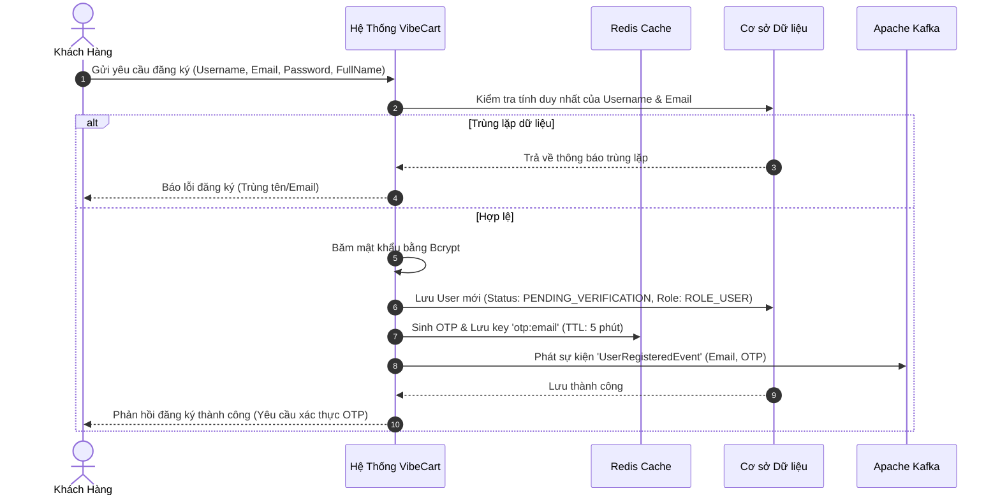
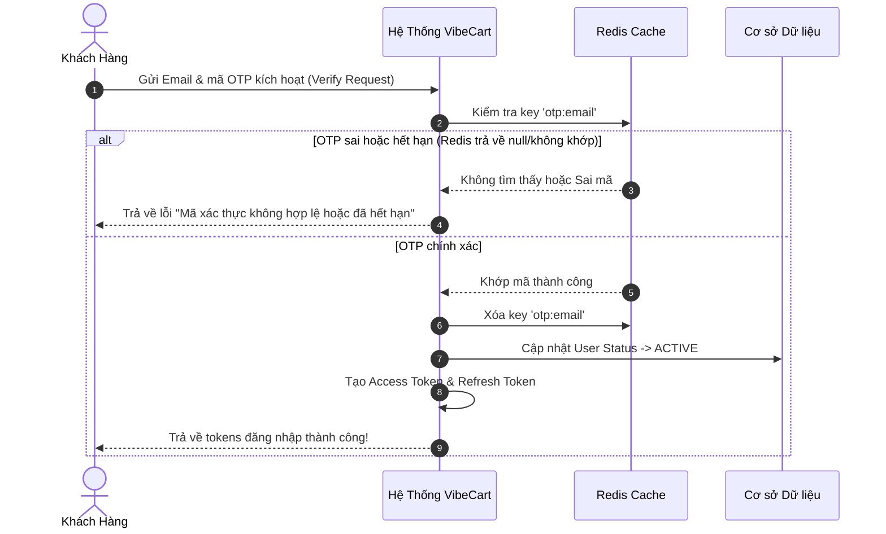

# 💼 Tài liệu Nghiệp vụ - Phân hệ 1: Hệ thống Tài khoản & Định danh (IAM)

Hệ thống Tài khoản & Định danh (Identity & Access Management - IAM) là cổng vào duy nhất của hệ thống **VibeCart**. Phân hệ này chịu trách nhiệm quản lý vòng đời tài khoản người dùng, xác thực danh tính (Authentication) qua nhiều phương thức (Local, Google, Facebook) và phân quyền kiểm soát truy cập (Role-Based Access Control) cho toàn bộ ứng dụng.

---

## 👥 1. Các Đối Tượng Hệ Thống (System Actors & Roles)

Hệ thống phân quyền chi tiết dựa trên vai trò (RBAC) với 3 nhóm đối tượng chính:

| Vai trò (Role) | Ký hiệu hệ thống | Quyền hạn nghiệp vụ |
| :--- | :--- | :--- |
| **Người mua (Shopper)** | `ROLE_USER` | • Xem tin tức, viết bình luận, thả tim bài viết. • Theo dõi (Follow) các Creator khác. • Thêm sản phẩm vào giỏ hàng và đặt mua hàng (Thanh toán qua PayOS). • Trò chuyện realtime với Creator. |
| **Nhà sáng tạo (Creator/KOL)** | `ROLE_CREATOR` | • Toàn bộ quyền của `ROLE_USER`. • Đăng bài viết review đính kèm sản phẩm. • Tạo link rút gọn tiếp thị liên kết (Affiliate Short Link). • Xem Dashboard thống kê lượt click, hoa hồng nhận được. |
| **Quản trị viên (Admin)** | `ROLE_ADMIN` | • Toàn quyền điều phối hệ thống. • Quản lý danh mục sản phẩm, quản lý đơn hàng. • Quản lý trạng thái hoạt động của tài khoản người dùng (Khóa/Mở tài khoản). |

---

## 🔄 2. Các Quy trình Nghiệp vụ Cốt lõi (Core Business Flows)

### 2.1 Quy trình Đăng ký Tài khoản & Xác thực OTP (Registration & OTP Flow)
Để đảm bảo tính xác thực của người dùng và giảm thiểu tài khoản ảo, quy trình đăng ký cục bộ được chia làm 2 giai đoạn: Đăng ký tạo tài khoản tạm thời và Xác thực kích hoạt tài khoản qua OTP.

#### A. Giai đoạn 1: Đăng ký tạo tài khoản tạm thời
1. Khách hàng gửi yêu cầu đăng ký với đầy đủ thông tin cá nhân.
2. Hệ thống kiểm tra tính duy nhất của `Username` và `Email`.
3. Nếu hợp lệ, hệ thống sẽ:
   * Băm mật khẩu cục bộ bằng Bcrypt.
   * Tạo tài khoản mới trong cơ sở dữ liệu với trạng thái mặc định ban đầu là **`PENDING_VERIFICATION`**.
   * Tự động sinh mã xác thực OTP ngẫu nhiên gồm 6 chữ số và lưu vào **Redis Cache** với thời gian sống (TTL) là **5 phút**.
   * Phát đi một Sự kiện **`UserRegisteredEvent`** vào hàng đợi **Kafka** chứa thông tin email và mã OTP vừa sinh.
   * Hệ thống phản hồi thành công và thông báo người dùng kiểm tra hòm thư để nhận mã kích hoạt.
   * Dưới nền, một Worker lắng nghe sự kiện từ Kafka và thực hiện tác vụ gửi email chứa OTP cho người dùng.

#### B. Giai đoạn 2: Xác thực kích hoạt tài khoản (OTP Verification)
1. Người dùng nhận được mã OTP trong hòm thư, nhập mã gửi lên hệ thống.
2. Hệ thống đối khớp mã OTP gửi lên với giá trị lưu trữ trong Redis Cache.
3. Nếu khớp và chưa hết hạn:
   * Hệ thống cập nhật trạng thái người dùng trong DB từ `PENDING_VERIFICATION` sang **`ACTIVE`**.
   * Xóa khóa OTP khỏi Redis.
   * Tiến hành sinh cặp Access Token (JWT) & Refresh Token để đăng nhập thẳng cho người dùng.
4. Nếu sai hoặc hết hiệu lực, hệ thống báo lỗi xác thực và giữ nguyên trạng thái tài khoản chờ xác thực.

*   **Quy tắc nghiệp vụ & Kịch bản xử lý lỗi (Edge Cases):**
    *   `Username` và `Email` phải là duy nhất trên toàn hệ thống.
    *   Mật khẩu bắt buộc phải được mã hóa trước khi lưu vào cơ sở dữ liệu.
    *   **Quy tắc phân vai trò khi Đăng ký (Role Registration Rule):**
        *   Khi đăng ký tài khoản, người dùng chủ động lựa chọn Vai trò của mình: **Người mua (Shopper)** hoặc **Nhà sáng tạo (Creator)**.
        *   Nếu chọn Creator, tài khoản sẽ được khởi tạo với vai trò `ROLE_CREATOR` và tự động kích hoạt cửa hàng cá nhân. Nếu chọn Shopper (hoặc bỏ trống), tài khoản mặc định nhận vai trò `ROLE_USER`.
        *   **Đóng băng vai trò (Frozen Role Rule):** Vai trò này được xác định duy nhất một lần tại thời điểm đăng ký, đóng băng cố định và **không cho phép nâng cấp hay thay đổi vai trò** sau này để tối giản hóa thiết kế hệ thống và chống gian lận.
    *   Tài khoản đăng ký mới luôn có trạng thái mặc định ban đầu là `PENDING_VERIFICATION`.
    *   **Thời gian sống của OTP:** Mã OTP có hiệu lực tối đa là **5 phút**. Sau thời gian này, khóa OTP trong Redis sẽ tự động bị xóa, người dùng nhập mã sẽ nhận thông báo lỗi hết hạn.
    *   **Thời gian chờ gửi lại OTP (Cooldown):** Để tránh Spam/Flood email, hệ thống áp đặt thời gian chờ tối thiểu là **60 giây** giữa 2 lần yêu cầu gửi mã mới. Nếu yêu cầu gửi lại trước 60 giây, hệ thống sẽ chặn và báo lỗi ngay lập tức.
    *   **Giới hạn số lần thử (Brute-force protection):** Cho phép tối đa **5 lần nhập sai mã**. Nếu nhập sai quá 5 lần, hệ thống sẽ **hủy ngay lập tức mã OTP hiện tại** trong Redis để chống tấn công dò số, đồng thời yêu cầu người dùng phải sinh lại mã mới.
    *   **Cơ chế ghi đè mã mới:** Nếu người dùng yêu cầu gửi mã mới sau khi hết 60s cooldown (và mã cũ vẫn còn hạn), mã mới sinh sẽ được ghi đè lên key cũ trên Redis và reset lại TTL về **5 phút** từ đầu.
    *   Tài khoản ở trạng thái `PENDING_VERIFICATION` không thể thực hiện đăng nhập thông qua API Login thông thường.

---

### 2.2 Quy trình Đăng nhập Hệ thống (User Login)
Hệ thống xác thực nghiêm ngặt để đảm bảo tài khoản không bị dò mật khẩu và các phiên đăng nhập được kiểm soát chặt chẽ.

#### A. Đăng nhập Cục bộ (Local Login) & Cơ chế Bảo vệ Tài khoản
*   Người dùng sử dụng cặp thông tin: `Username hoặc Email` + `Mật khẩu`.
*   **Điều kiện hoạt động & Kiểm soát trạng thái:**
    *   Tài khoản ở trạng thái **`ACTIVE`**: Đăng nhập bình thường, truy cập toàn bộ tính năng hệ thống.
    *   Tài khoản ở trạng thái **`PENDING_DELETION`**: Hệ thống **cho phép đăng nhập thành công**, nhưng phiên đăng nhập này bị giới hạn quyền truy cập — Frontend sẽ điều hướng người dùng thẳng đến một trang duy nhất: *"Tài khoản của bạn đang trong quá trình xóa. Bạn có muốn hủy yêu cầu không?"*. Người dùng chỉ có thể thực hiện 2 hành động: **Hủy yêu cầu xóa** (khôi phục tài khoản về `ACTIVE`) hoặc **Đăng xuất**. Tuyệt đối không cho phép truy cập vào các tính năng mua sắm, xã hội hay quản lý tài khoản thông thường.
    *   Tài khoản ở trạng thái **`PENDING_VERIFICATION`** hoặc **`BANNED`**: Hệ thống **từ chối đăng nhập** ngay lập tức và trả về mã lỗi tương ứng.
*   **Quy tắc chống Brute-force mật khẩu (Account Lockout):**
    *   Hệ thống cho phép nhập sai mật khẩu tối đa **5 lần liên tiếp**.
    *   Khi nhập sai đến lần thứ 5, tài khoản tự động bị khóa tạm thời trong **15 phút** (chuyển sang trạng thái `LOCKED_TEMPORARY`).
    *   Trong thời gian khóa, mọi nỗ lực đăng nhập đều bị hệ thống chặn đứng ở tầng API mà không cần truy vấn mật khẩu trong DB.
*   **Quy tắc giới hạn phiên đồng thời (Concurrent Session Control):**
    *   Một tài khoản chỉ được phép duy trì đăng nhập tối đa **3 thiết bị cùng lúc**.
    *   Khi người dùng đăng nhập vào thiết bị thứ 4, hệ thống sẽ thực hiện cơ chế **Session Kick-out (Đá phiên cũ)**: Tự động thu hồi phiên đăng nhập (Refresh Token) của thiết bị cũ nhất, ép thiết bị này phải đăng xuất khi phiên Access Token hiện tại hết hạn.
*   **Cảnh báo thiết bị / Địa điểm bất thường (Anomalous Login Alert):**
    *   Mỗi lần đăng nhập thành công, hệ thống trích xuất thông tin thiết bị (`User-Agent`) và địa điểm (`IP Address` kết hợp định vị GeoIP).
    *   Nếu phát hiện đăng nhập từ **Thiết bị hoàn toàn mới** hoặc **Địa lý cách xa bất thường** so với phiên trước đó, hệ thống sẽ gửi một thông báo khẩn cấp (Push Notification / Email) để người dùng chủ động kiểm soát tài khoản.

#### B. Đăng nhập qua Mạng xã hội (OAuth2 Google & Facebook)
Quy trình giúp tối ưu hóa tỷ lệ chuyển đổi khách hàng nhờ cơ chế tự động liên kết tài khoản:
1.  Người dùng bấm đăng nhập bằng Google/Facebook trên Client và nhận về một Identity Token.
2.  Client gửi Token này lên Backend để xác thực với nhà cung cấp (Google/Facebook).
3.  **Chuẩn hóa Email OAuth (OAuth Email Normalization):** Trước khi đem Email nhận được từ Google/Facebook đi đối chiếu với Database, hệ thống **bắt buộc** phải chạy qua hàm chuẩn hóa `toLowerCase()` — tương tự như chuẩn hóa Email khi đăng ký cục bộ — để tránh lệch pha chữ hoa/chữ thường giữa Email mạng xã hội và Email lưu trong DB (ví dụ: Google trả về `HoangNam@Gmail.com` nhưng DB lưu `hoangnam@gmail.com`).
4.  **Cơ chế xử lý liên kết (OAuth Account Linker):**
    *   *Trường hợp 1 (Đã tồn tại tài khoản OAuth cùng Provider):* Đăng nhập thành công, trả về Access/Refresh Token.
    *   *Trường hợp 2 (Email OAuth đã tồn tại dưới dạng tài khoản LOCAL):* Hệ thống tự động liên kết ID mạng xã hội vào tài khoản Local hiện tại mà không làm thay đổi hay đè thông tin đăng nhập Local. Lần sau người dùng có thể đăng nhập bằng cả 2 cách.
    *   *Trường hợp 3 (Tài khoản chưa từng tồn tại):* Tự động tạo mới một tài khoản, tự sinh `Username` duy nhất tách từ tiền tố Email, đặt tên đầy đủ và ảnh đại diện lấy từ mạng xã hội, gán Role mặc định `ROLE_USER`.

---

### 2.3 Quy trình Gia hạn Phiên đăng nhập (Refresh Access Token)
Giúp người dùng duy trì trạng thái đăng nhập liên tục mà không cần nhập lại mật khẩu sau mỗi 15 phút (thời gian sống của Access Token).

*   **Luồng hoạt động:** 
    *   Khi Access Token hết hạn, ứng dụng client tự động gửi `Refresh Token` lên hệ thống.
    *   Hệ thống kiểm tra tính hợp lệ của Refresh Token trong Redis Cache.
    *   Nếu hợp lệ, hệ thống **thu hồi ngay lập tức Refresh Token cũ (Token Rotation)** để chống tấn công phát lại (Replay Attack), tạo ra cặp Access Token & Refresh Token mới tinh cấp lại cho Client.
*   **Cơ chế Ân hạn chống đá phiên nhầm (Grace Period — Refresh Token Race Condition):**
    *   **Bài toán:** Trên môi trường mạng không ổn định (4G chập chờn), Frontend có thể vô tình bắn liên tiếp 2 request refresh token gần như cùng một mili giây (do cơ chế retry tự động của Axios hoặc do 2 API call đồng thời khi token vừa hết hạn). Request đầu xoay vòng token thành công. Request sau mang theo token cũ → hệ thống nhầm tưởng bị tấn công Token Theft → đá toàn bộ phiên, gây trải nghiệm người dùng (UX) bị ức chế.
    *   **Giải pháp:** Khi Refresh Token cũ bị xoay vòng, hệ thống lưu giữ một bản sao tạm thời (Shadow Key) của token cũ trên Redis với **TTL ngắn 10 giây** (Grace Period). Trong khoảng thời gian ân hạn này, nếu có request trùng lặp gửi lên cùng Refresh Token cũ, hệ thống sẽ **trả về cặp token mới đã sinh ở request đầu tiên** chứ không kích hoạt cơ chế phát hiện trộm Token. Sau 10 giây, Shadow Key tự hủy — bất kỳ request nào dùng lại token cũ sau thời hạn này mới bị quy chiếu là Token Theft thực sự.

---

### 2.4 Quy trình Đăng xuất (Logout & Token Invalidation)
Đảm bảo an toàn tuyệt đối cho người dùng bằng cách thu hồi quyền truy cập ngay lập tức ở cả hai cấp độ token.

*   **Vô hiệu hóa Refresh Token:** Xóa Refresh Token tương ứng ra khỏi Redis Cache để ngăn chặn việc gia hạn phiên.
*   **Vô hiệu hóa Access Token (Token Blacklisting):** Do Access Token dạng JWT có tính chất phi trạng thái (Stateless) và tự mang thông tin xác thực, khi người dùng bấm logout, hệ thống sẽ đưa Access Token hiện tại vào danh sách đen (Blacklist Key) trên Redis. Thời gian tồn tại của khóa này bằng đúng thời gian sống còn lại của Access Token đó. Mọi request đính kèm token bị blacklist sẽ bị từ chối truy cập ngay lập tức.

---

### 2.5 Quy trình Quên mật khẩu & Hợp nhất Tài khoản (Forgot Password & Account Merging)

Nhằm hỗ trợ người dùng tự lấy lại tài khoản và linh hoạt hóa phương thức đăng nhập, hệ thống thiết lập luồng nghiệp vụ chuẩn như sau:

#### A. Quy trình Quên mật khẩu theo chuẩn bảo mật
1.  **Yêu cầu khôi phục:** Người dùng nhập Email trên giao diện Quên mật khẩu.
2.  **Chống dò quét tài khoản (User Enumeration Defense):** Hệ thống luôn trả về một thông báo duy nhất: *"Nếu email này tồn tại trên hệ thống, chúng tôi đã gửi liên kết khôi phục mật khẩu vào hòm thư của bạn"*. (Hệ thống tuyệt đối không thông báo "Email không tồn tại" để chặn đứng hacker dò quét email người dùng).
3.  **Sinh mã Token an toàn:** Hệ thống sinh mã Reset Token ngẫu nhiên (UUID), lưu vào Redis Cache với TTL **10 phút**.
4.  **Gửi Mail khôi phục bất đồng bộ:** Hệ thống bắn event sang Kafka để gửi một đường dẫn chứa token tới hòm thư người dùng: `https://vibecart.com/reset-password?token=<UUID>`.
5.  **Thiết lập mật khẩu mới:** Người dùng click vào link, điền mật khẩu mới.
    *   Hệ thống kiểm tra tính hợp lệ và thời hạn của token trên Redis.
    *   Nếu hợp lệ, băm mật khẩu mới bằng BCrypt và lưu vào DB.
    *   Xóa Reset Token khỏi Redis.
    *   **Cơ chế Kick-out toàn phiên:** Hệ thống tự động xóa sạch tất cả các session đang online của user này trên Redis để bảo vệ tài khoản lập tức.

#### B. Mật khẩu của Người dùng Đăng nhập bằng Email & Mạng xã hội
*   **Tài khoản đăng ký cục bộ (Local):** Mật khẩu đăng nhập bằng Email **chính là** mật khẩu dùng khi đăng nhập bằng Username. Người dùng có thể điền linh hoạt Username hoặc Email vào trường `usernameOrEmail` để đăng nhập.
*   **Tài khoản mạng xã hội (Google/Facebook):**
    *   Khi đăng nhập bằng Google/Facebook, trường `password` trong PostgreSQL được lưu là **`null`**. Hệ thống chặn tuyệt đối việc đăng nhập bằng Email + Mật khẩu rác đối với các tài khoản này.
    *   **Quy trình hợp nhất tài khoản (Account Merging):** Nếu người dùng muốn bổ sung mật khẩu để đăng nhập bằng Email + Password truyền thống, họ chỉ cần thực hiện quy trình **Quên mật khẩu** bằng chính Email mạng xã hội đó. Sau khi đặt mật khẩu mới thành công, trường `password` sẽ được cập nhật, cho phép người dùng đăng nhập bằng cả 2 cách song song (lai - Hybrid login).

#### C. Quy trình Đổi mật khẩu (Change Password Flow) khi đang đăng nhập
Đối với người dùng **đã đăng nhập thành công** và muốn chủ động thay đổi mật khẩu định kỳ:
1.  **Xác thực mật khẩu cũ bắt buộc:** Người dùng phải nhập mật khẩu cũ (`oldPassword`) để hệ thống kiểm tra đối khớp trong Postgres. Điều này ngăn chặn tuyệt đối trường hợp hacker mượn máy người dùng đang đăng nhập để tự ý đổi mật khẩu (Anti-Session Takeover).
2.  **Ràng buộc bảo mật mật khẩu mới:**
    *   Mật khẩu mới (`newPassword`) phải khác hoàn toàn mật khẩu cũ.
    *   Mật khẩu mới phải đáp ứng đầy đủ các tiêu chí validate phức tạp như đăng ký.
3.  **Xóa phiên (Session Kick-out):** Ngay sau khi đổi mật khẩu thành công, hệ thống sẽ thực hiện thu hồi toàn bộ các Refresh Token khác đang online trên Redis (chỉ giữ lại phiên hiện tại hoặc đá toàn bộ để người dùng đăng nhập lại từ đầu bằng mật khẩu mới).

#### D. Quy trình Cập nhật Hồ sơ cá nhân (Update Profile Flow)
Để duy trì thông tin chính xác phục vụ mua sắm và mạng xã hội:
1.  **Phạm vi cập nhật cho phép:** Người dùng có thể thay đổi các trường thông tin cơ bản: Họ tên (`fullName`) và Ảnh đại diện (`avatarUrl`).
2.  **Cơ chế tải lên ảnh đại diện (Avatar Upload Architecture):**
    *   Hệ thống phân tách tác vụ lưu trữ: Ứng dụng client gửi ảnh đến dịch vụ Lưu trữ độc lập (`StorageService` kết hợp MinIO/S3 hoặc local storage cấu hình tại `StorageConfig.java`) để nhận về URL trực tuyến.
    *   Sau đó, client gửi URL ảnh này lên API cập nhật hồ sơ của phân hệ IAM để cập nhật trường `avatarUrl` trong cơ sở dữ liệu Postgres.
3.  **Quy tắc nghiệp vụ bảo mật khi đổi Email/SĐT:**
    *   Để tránh bị hack chiếm đoạt tài khoản (Account Takeover), nếu người dùng có nhu cầu thay đổi Email nhận thông báo, hệ thống **không được phép cập nhật trực tiếp**.
    *   Hệ thống bắt buộc phải gửi mã OTP xác nhận về Email cũ *hoặc* Email mới (quy trình Re-verification) trước khi chính thức ghi nhận thay đổi vào cơ sở dữ liệu.

#### E. Quy trình Quản trị & Kiểm soát Tài khoản của Admin (Admin User Control)
Dành riêng cho đối tượng `ROLE_ADMIN` để duy trì trật tự và bảo mật hệ thống:
1.  **Vô hiệu hóa tài khoản vi phạm (Account Banning):**
    *   Admin có quyền khóa tài khoản của bất kỳ người dùng nào vi phạm chính sách (`status` chuyển thành `BANNED`).
    *   **Cơ chế kích hoạt bảo mật tức thì:** Ngay sau khi bấm khóa, hệ thống tự động quét và xóa sạch tất cả các phiên đăng nhập (Refresh Tokens) đang online của tài khoản đó trên Redis, ép người dùng bị khóa phải văng ra khỏi hệ thống ngay lập tức (không cho phép sử dụng token cũ để truy cập tiếp).
2.  **Yêu cầu Xóa tài khoản (Account Deletion Pipeline):**
    Để tuân thủ luật bảo vệ dữ liệu cá nhân (**GDPR**) và bảo toàn tính toàn vẹn tài chính, quy trình xóa tài khoản được thiết kế chuẩn qua 2 giai đoạn:
    *   **Giai đoạn 1 - Đóng băng tạm thời (Grace Period):** 
        *   Khi người dùng gửi yêu cầu, tài khoản chuyển trạng thái thành **`PENDING_DELETION`** và đánh dấu cờ xóa mềm `deleted = true` (ẩn hoàn toàn khỏi hệ thống công cộng).
        *   Hủy toàn bộ các phiên hoạt động (Refresh Token) trên Redis để đá văng người dùng khỏi mọi thiết bị lập tức.
        *   Người dùng có **30 ngày thời gian chờ khôi phục (Grace Period)**. Trong thời gian này, nếu họ đăng nhập lại (xem mục 2.2.A — hệ thống cho phép tài khoản `PENDING_DELETION` đăng nhập nhưng chỉ hiển thị trang khôi phục tài khoản) và xác nhận hủy yêu cầu xóa, tài khoản sẽ phục hồi về trạng thái `ACTIVE` bình thường.
    *   **Giai đoạn 2 - Ẩn danh hóa & Làm sạch dữ liệu vĩnh viễn (Hard Delete & Anonymization):**
        *   Sau 30 ngày, hệ thống chạy tác vụ ngầm tự động phát sự kiện `UserHardDeleteEvent` đi qua các phân hệ để làm sạch dữ liệu bất đồng bộ.
        *   **Tại sao không xóa dòng (Row) trong DB?** Để tránh vi phạm khóa ngoại trong lịch sử mua sắm (hóa đơn cũ trong `orders`), hệ thống **tuyệt đối không xóa vật lý dòng người dùng trong PostgreSQL**.
        *   **Giải pháp Ẩn danh hóa (Anonymization):** Hệ thống ghi đè thông tin nhạy cảm của tài khoản trong PostgreSQL:
            *   Email -> `deleted_<id>@vibecart.com` (Bảo toàn tính unique của cột).
            *   Username -> `deleted_user_<id>`
            *   Mật khẩu -> `null` (Vô hiệu hóa vĩnh viễn khả năng đăng nhập).
            *   Họ tên -> `Người dùng đã xóa` (Hiển thị an toàn trong hóa đơn cũ).
            *   AvatarUrl / Số điện thoại / OAuth_ID -> `null`.
        *   **Làm sạch đa hệ thống:** Các module lắng nghe Kafka Event để tự làm sạch: Xóa file ảnh đại diện vật lý trên S3/MinIO, xóa Index trên Elasticsearch, ẩn danh người gửi trong MongoDB Chat.

---

## 🛡️ 3. Ràng buộc Nghiệp vụ (Business Constraints)

1.  **Tính phi trạng thái (Stateless) của Access Token:** Để phục vụ cho việc mở rộng quy mô (Scale-out) ứng dụng chạy trên nhiều máy chủ, Access Token JWT không được lưu trong DB hay Session, mọi thông tin vai trò (`roles`) phải được nén trực tiếp vào JWT Claims.
2.  **Thời gian sống của Token (Lifetimes):**
    *   Access Token: **15 phút**.
    *   Refresh Token: **7 ngày**.
3.  **Khóa tài khoản:** Khi một tài khoản bị chuyển trạng thái khác `ACTIVE` (ví dụ: bị khóa bởi Admin), mọi Access Token đã cấp trước đó vẫn hoạt động cho đến khi hết hạn (tối đa 15 phút), nhưng người dùng sẽ không thể đăng nhập mới hay sử dụng Refresh Token để gia hạn.
4.  **Tính lưu vết (Audit Trail):** Mọi hành động đăng ký tài khoản mới bắt buộc phải tự động lưu vết chính xác thời điểm đăng ký (`created_at`) và người thực hiện tác vụ (ghi nhận tự động `SYSTEM` cho đăng ký tự do).
5.  **Độ tin cậy của sự kiện Đăng ký (Event Consistency):** Đảm bảo tuyệt đối luồng đồng bộ: người dùng chỉ nhận được mail xác thực OTP khi tài khoản của họ đã được ghi nhận thành công trong cơ sở dữ liệu hệ thống (tránh việc gửi email rác không có tài khoản, hoặc đăng ký thành công mà không nhận được mail kích hoạt do lỗi hệ thống mạng Kafka).

---

## 📐 4. Quy tắc Kiểm tra Dữ liệu Đầu vào (Data Validation Rules)

Tại các công ty lớn, việc kiểm soát dữ liệu đầu vào khi đăng ký tài khoản được thắt chặt tối đa để bảo vệ cơ sở dữ liệu và tối ưu hóa tính an toàn bảo mật:

| Trường thông tin | Quy tắc kiểm tra (Validation Rules) | Mục đích nghiệp vụ |
| :--- | :--- | :--- |
| **Username** (Tên đăng nhập) | • Độ dài: **5 - 30 ký tự**. • Định dạng: Chỉ bao gồm chữ cái, chữ số, dấu chấm (`.`), dấu gạch dưới (`_`) hoặc gạch ngang (`-`). Không chứa khoảng trắng. • Bộ lọc từ cấm (Profanity Filter): Từ chối các username chứa từ khóa nhạy cảm hoặc từ khóa hệ thống (`admin`, `support`, `system`, `root`, `vibecart`). | • Tránh giả mạo quản trị viên (Spoofing). • Đảm bảo tính duy nhất và định dạng URL thân thiện. |
| **Email** | • Định dạng: Chuẩn RFC 5322 (ví dụ: `user@domain.com`). • Chuẩn hóa: Tự động chuyển về dạng chữ thường (**Lowercase**) trước khi check trùng và lưu DB. • Bộ lọc Disposable Email: Chặn các tên miền email tạm thời (như `tempmail.com`, `10minutemail.com`) để chống spam tài khoản ảo. | • Đảm bảo gửi email OTP thành công. • Ngăn chặn gian lận tài khoản clone quy mô lớn. |
| **Password** (Mật khẩu) | • Độ dài: **8 - 100 ký tự**. • Ràng buộc độ phức tạp: Ít nhất **1 chữ hoa** (`A-Z`), **1 chữ thường** (`a-z`), **1 chữ số** (`0-9`), và **1 ký tự đặc biệt** (`@#$%^&+=...`). • Chống Brute-force CPU (Bcrypt limit): Giới hạn tối đa 100 ký tự để tránh gây quá tải CPU cho máy chủ khi băm mật khẩu cực dài. | • Ngăn chặn mật khẩu yếu dễ bị đoán. • Tránh tấn công DDoS làm cạn kiệt tài nguyên CPU hệ thống (Bcrypt CPU Exhaustion). |
| **Full Name** (Họ và tên) | • Độ dài: **2 - 100 ký tự**. • Định dạng: Chỉ chứa chữ cái (bao gồm chữ có dấu đa ngôn ngữ) và khoảng trắng. Không chứa số hoặc ký tự đặc biệt. | • Đảm bảo thông tin định danh khách hàng chuẩn xác trên hóa đơn mua sắm. |

