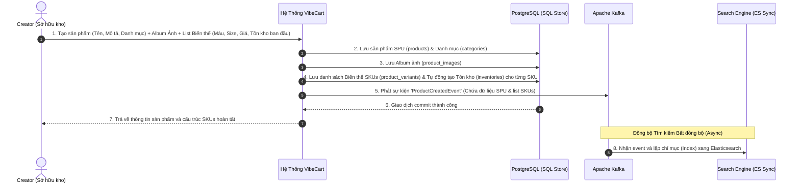
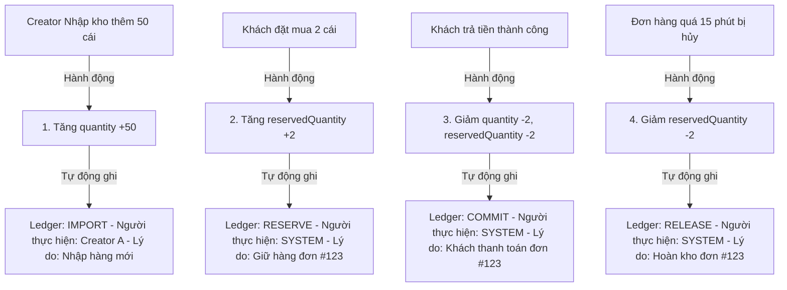
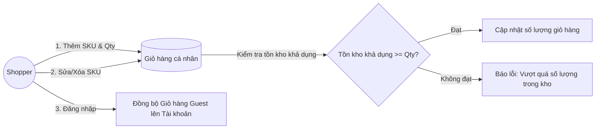
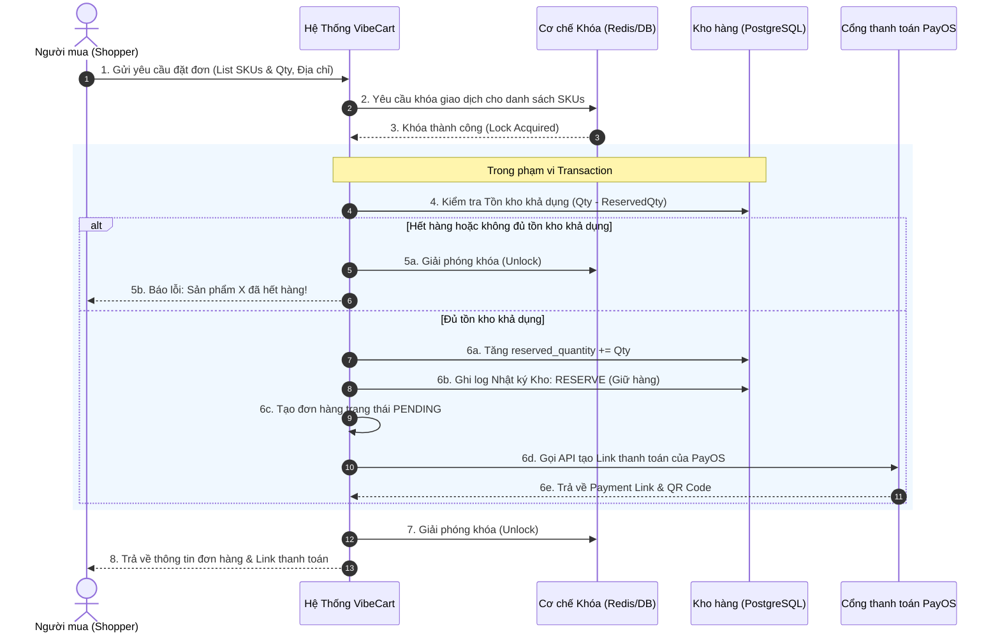
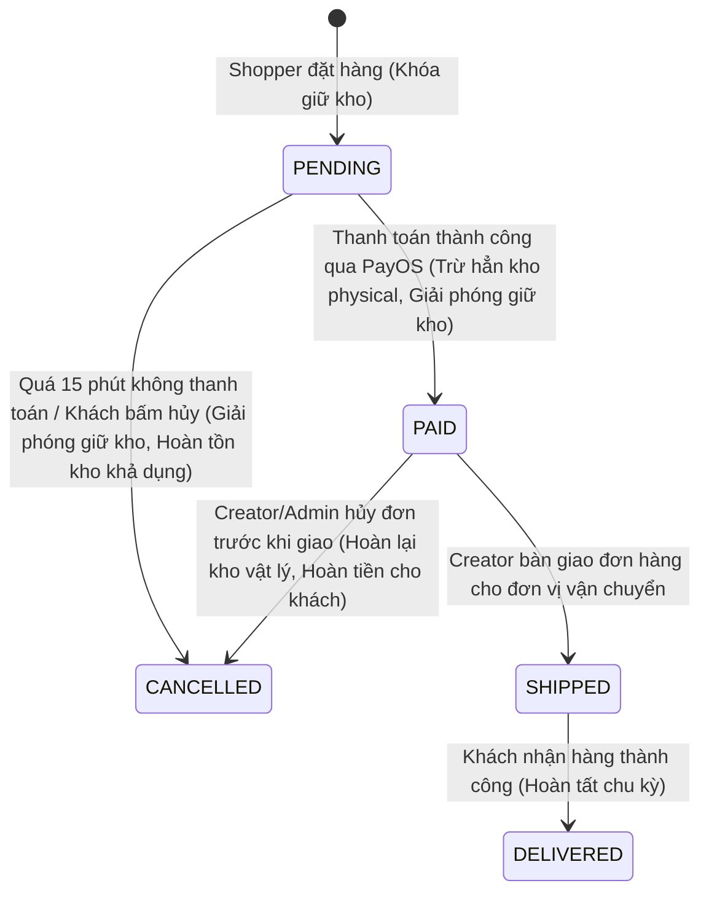
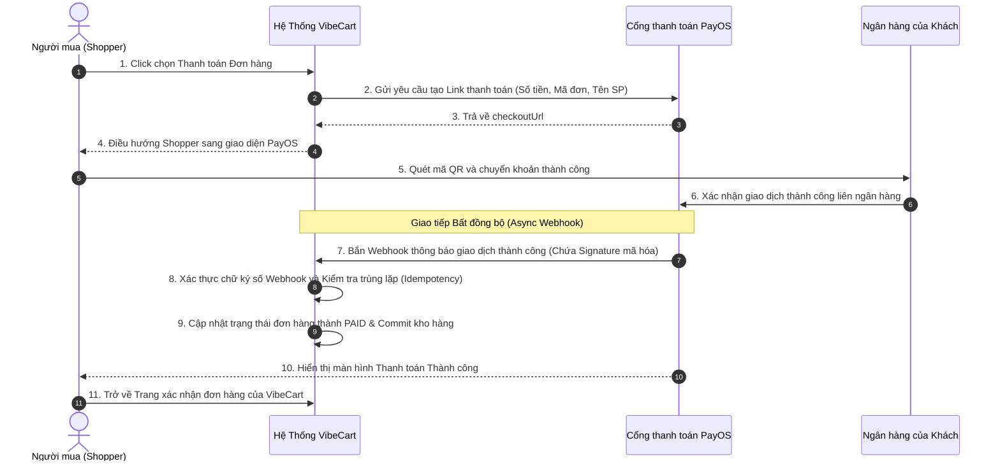
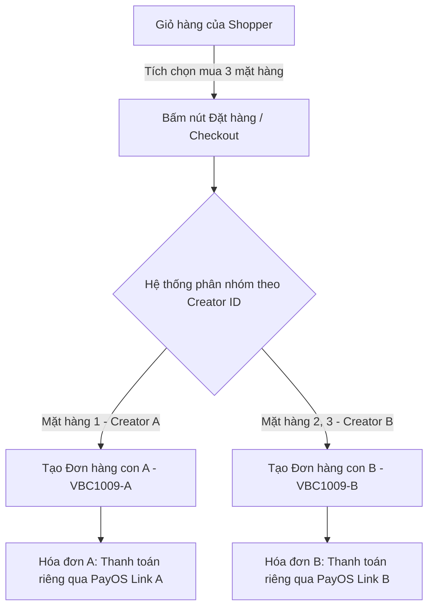

# 💼 Tài liệu Nghiệp vụ - Phân hệ 2: Cốt lõi Thương mại Điện tử (E-Commerce Core)

Phân hệ Cốt lõi Thương mại Điện tử (E-Commerce Core) là trung tâm vận hành thương mại của hệ thống **VibeCart**. Tài liệu này mô tả chi tiết các yêu cầu nghiệp vụ, luồng trải nghiệm khách hàng, luật kinh doanh của tất cả tiểu phân hệ từ Sản phẩm, Giỏ hàng, Quy trình Đặt hàng đến Thanh toán.

---

## 👥 1. Các Đối Tượng Hệ Thống & Vai trò (System Actors & Roles)

Quy trình quản lý và vận hành thương mại điện tử được phân chia trách nhiệm chặt chẽ:

| Vai trò (Role) | Ký hiệu hệ thống | Tương tác Nghiệp vụ Thương mại Điện tử |
| :--- | :--- | :--- |
| **Nhà sáng tạo (Creator)** | `ROLE_CREATOR` | • Sở hữu kho hàng riêng. • Thêm mới, cập nhật sản phẩm (SPU), biến thể (SKU) và album ảnh của chính họ. • Tự chủ động điều chỉnh tồn kho vật lý (Nhập/Xuất kho) của chính mình. • Quản lý và theo dõi Nhật ký Kho cá nhân. • Theo dõi và cập nhật trạng thái vận chuyển cho các đơn hàng mua sản phẩm của chính mình. |
| **Quản trị viên (Admin)** | `ROLE_ADMIN` | • Quyền kiểm duyệt và ẩn sản phẩm vi phạm chính sách (Soft Delete). • Quyền can thiệp điều chỉnh kho kỹ thuật khi có lỗi hệ thống hoặc tranh chấp. • Quản lý cây Danh mục sản phẩm đa cấp toàn hệ thống. • Tra cứu và điều phối toàn bộ đơn hàng trên hệ thống. |
| **Người mua (Shopper)** | `ROLE_USER` / Guest | • Duyệt danh mục, xem album ảnh và tùy chọn biến thể sản phẩm. • Quản lý Giỏ hàng cá nhân (Thêm, sửa số lượng, xóa sản phẩm). • Đặt mua biến thể mong muốn dựa trên Tồn kho khả dụng của biến thể đó. • Thực hiện thanh toán trực tuyến qua cổng thanh toán PayOS. |

---

## 🔄 2. Luồng Nghiệp vụ Cốt lõi (Core Business Flows)

### 2.1 Luồng Thêm mới Sản phẩm (SPU), Biến thể (SKUs) & Album Ảnh
Khi tạo mới một sản phẩm, hệ thống hỗ trợ khai báo sản phẩm gốc (SPU) đính kèm danh sách ảnh và phân rã thành nhiều biến thể bán hàng (SKUs) khác nhau.

---

### 2.2 Luồng Cập nhật & Xóa sản phẩm (Update & Delete Flow)
*   **Cập nhật Sản phẩm:** Creator cập nhật thông tin SPU, SKU hoặc ảnh. Hệ thống tự động đồng bộ sang Elasticsearch bất đồng bộ qua Kafka để kết quả tìm kiếm được cập nhật tức thời.
*   **Xóa Sản phẩm (Soft Delete):** 
    *   Chỉ dành riêng cho `ROLE_ADMIN` (khi vi phạm) hoặc chính Creator sở hữu sản phẩm.
    *   Hệ thống thực hiện **Xóa mềm (Soft Delete)** cờ `deleted = true` ở cả bảng SPU và SKUs, tuyệt đối không xóa vật lý trong database để tránh làm hỏng lịch sử đơn hàng cũ.
    *   Bắn sự kiện sang Kafka để **xóa hoàn toàn chỉ mục sản phẩm trên Elasticsearch**, đảm bảo người mua không thể tìm thấy sản phẩm này nữa.

---

### 2.3 Luồng Nhật ký Giao dịch Kho tự động (Inventory Transaction Ledger Flow)
Để đảm bảo tính chính xác tuyệt đối và phục vụ kiểm toán tài chính cho Creator, **mọi biến động tồn kho (Dù là nhỏ nhất) đều bắt buộc phải được hệ thống tự động lưu vết** vào bảng Nhật ký Giao dịch Kho (`inventory_histories`).

#### Sơ đồ hoạt động tự động của Nhật ký Kho:

---

### 2.4 Luồng Nghiệp vụ Giỏ hàng (Cart Operations Flow)
Giỏ hàng đóng vai trò là khu vực lưu trữ tạm thời các sản phẩm mà Shopper quan tâm trước khi tiến hành thanh toán.

*   **Đồng bộ giỏ hàng:** Khi Shopper duyệt web ở chế độ Guest (chưa đăng nhập) và thêm hàng vào giỏ, hệ thống lưu trữ ở bộ nhớ trình duyệt. Ngay khi Shopper Đăng nhập, hệ thống tự động đồng bộ (merge) các sản phẩm này vào Giỏ hàng định danh được lưu trữ tập trung trên hệ thống.
*   **Xác thực thời gian thực:** Khi Shopper mở trang giỏ hàng, hệ thống tự động kiểm tra lại giá bán mới nhất và tồn kho khả dụng của từng sản phẩm để cảnh báo kịp thời nếu sản phẩm đã hết hàng hoặc thay đổi giá.

---

### 2.5 Luồng Đặt hàng & Chống bán âm kho (Order Checkout & Stock Reservation Flow)
Quy trình đặt hàng yêu cầu tính toàn vẹn dữ liệu cực cao. Hệ thống phải đảm bảo việc giữ chỗ hàng tồn kho được thực hiện nguyên tử (atomic) và tuyệt đối không bao giờ xảy ra tình trạng bán quá số lượng thực tế trong kho (overselling) khi có hàng ngàn người mua cùng lúc.

---

### 2.6 Luồng Vòng đời Đơn hàng (Order Lifecycle State Transitions)
Đơn hàng sau khi được khởi tạo sẽ trải qua một chu kỳ trạng thái được kiểm soát nghiêm ngặt:

#### Chi tiết hành động đối với Kho hàng theo từng trạng thái Đơn hàng:
1.  **PENDING:** Tồn kho vật lý (`quantity`) giữ nguyên, Tồn kho giữ chỗ (`reserved_quantity`) tăng lên. **Tồn kho khả dụng giảm đi**.
2.  **PAID (Commit):** Tồn kho vật lý giảm, Tồn kho giữ chỗ giảm. **Tồn kho khả dụng giữ nguyên trạng thái đã giảm**.
3.  **CANCELLED từ PENDING (Release):** Tồn kho vật lý giữ nguyên, Tồn kho giữ chỗ giảm. **Tồn kho khả dụng tăng trở lại**.
4.  **CANCELLED từ PAID (Refund/Import):** Tồn kho vật lý tăng trở lại, Tồn kho giữ chỗ giữ nguyên. **Tồn kho khả dụng tăng trở lại**.

---

### 2.7 Luồng Thanh toán PayOS & Webhook (PayOS Integration Flow)
Tích hợp cổng thanh toán trực tuyến **PayOS** mang lại trải nghiệm thanh toán không tiền mặt mượt mà và an toàn qua chuyển khoản ngân hàng quét mã QR 24/7.

---

## 🛡️ 3. Ràng buộc Nghiệp vụ Tồn kho & Sản phẩm (Enterprise Constraints)

1.  **Cấu trúc SPU & SKU:**
    *   **SPU (Standard Product Unit):** Đại diện cho sản phẩm chung. Khách hàng không thể bấm mua trực tiếp SPU.
    *   **SKU (Stock Keeping Unit):** Biến thể chi tiết (ví dụ: Màu đen - Size XL). Khách hàng bắt buộc phải chọn chính xác biến thể SKU mong muốn để đặt hàng. Mỗi SKU có tồn kho, giá bán và giá giảm độc lập.
2.  **Cơ chế Tồn kho khả dụng (Available Stock) cho từng SKU:**
    *   Tồn kho khả dụng của từng biến thể SKU được tính riêng biệt:
        $$\text{Available Stock (SKU)} = \text{quantity (SKU)} - \text{reservedQuantity (SKU)}$$
    *   Hệ thống chỉ cho phép khách mua hàng nếu biến thể SKU cụ thể đó có $\text{Available Stock (SKU)} > 0$.
3.  **Quy tắc Ghi Nhật ký Kho (Audit Trail):**
    *   Tuyệt đối không có hành động nào được thay đổi trực tiếp cột `quantity` hay `reservedQuantity` mà không sinh dòng log lịch sử trong `inventory_histories`.
4.  **Danh mục đa cấp (Hierarchical Tree):**
    *   Sản phẩm bắt buộc phải liên kết với một Danh mục lá (Leaf Category - danh mục cấp nhỏ nhất không có danh mục con). Danh mục có cấu trúc cây cha-con vô hạn cấp phục vụ việc duyệt và lọc sản phẩm.
5.  **Album Ảnh sản phẩm:**
    *   Mỗi sản phẩm phải có ít nhất 1 ảnh đại diện (`thumbnail`) và tối đa 10 ảnh album để tăng trải nghiệm mua sắm của khách.
6.  **Ràng buộc Giỏ hàng cá nhân:**
    *   Số lượng của một biến thể SKU trong giỏ hàng của Shopper tại mọi thời điểm không được vượt quá **100 sản phẩm**.
    *   Sản phẩm trong giỏ hàng sẽ bị đánh dấu "Không khả dụng" và không cho phép thanh toán nếu SPU hoặc SKU đó bị Creator/Admin chuyển sang trạng thái ẩn (`deleted = true` hoặc `status = INACTIVE`).
7.  **Ràng buộc Hủy đơn hàng tự động (Pending Timeout):**
    *   Đơn hàng ở trạng thái `PENDING` giới hạn thời gian thanh toán tối đa là **15 phút** kể từ thời điểm khởi tạo.
    *   Sau 15 phút, nếu hệ thống chưa nhận được Webhook thanh toán thành công từ PayOS, hệ thống tự động chuyển đổi trạng thái đơn hàng thành `CANCELLED`, giải phóng số lượng giữ kho (`reserved_quantity -= Qty`), trả lại tồn kho khả dụng và ghi log `RELEASE` vào sổ cái kho.
8.  **Xử lý trùng lặp Webhook (Idempotency):**
    *   Để đối phó với hiện tượng mạng chập chờn khiến cổng thanh toán bắn Webhook nhiều lần cho cùng một giao dịch thành công, hệ thống bắt buộc phải kiểm tra tính duy nhất dựa trên Mã Đơn hàng (`orderCode`). Nếu đơn hàng tương ứng đã có trạng thái `PAID` hoặc `SHIPPED`, hệ thống sẽ trả về phản hồi thành công `HTTP 200 OK` ngay lập tức cho PayOS mà không thực hiện lại các thao tác sửa đổi database hay ghi lịch sử kho.
---

## 🛒 4. Đặc tả Nghiệp vụ Chi tiết Giỏ hàng (Detailed Shopping Cart Specification)

Để mang lại trải nghiệm mua sắm mượt mà nhất, nghiệp vụ thao tác Giỏ hàng được chuẩn hóa thành bộ quy tắc và tương tác hành vi sau:

### 4.1 Bảng Hành vi Thao tác Giỏ hàng (Cart Actions Matrix)

| Hành động | Điều kiện kích hoạt | Cơ chế xử lý của Hệ thống | Ràng buộc Nghiệp vụ (Business Rules) |
| :--- | :--- | :--- | :--- |
| **Thêm vào Giỏ (Add to Cart)** | Shopper click "Thêm vào giỏ" trên trang chi tiết SKU. | • Nếu SKU chưa tồn tại: Tạo mới phần tử trong giỏ. • Nếu SKU đã tồn tại: Cộng dồn số lượng mới vào số lượng cũ. | • Số lượng thêm phải $> 0$. • Tổng số lượng sau cộng dồn không được vượt quá **Tồn kho khả dụng** và giới hạn tối đa **100 sản phẩm/SKU**. • SKU phải đang ở trạng thái bán (`status = ACTIVE`, `deleted = false`). |
| **Thay đổi Số lượng (Update Quantity)**| Shopper bấm nút `+` / `-` hoặc nhập trực tiếp số lượng trên trang Giỏ hàng. | • Cập nhật giá trị số lượng mới của SKU tương ứng trên bộ nhớ đệm Redis. | • Nếu số lượng giảm về `0` hoặc nhập giá trị âm: **Tự động xóa** SKU đó khỏi giỏ hàng. • Nếu số lượng tăng vượt quá tồn kho khả dụng thời gian thực: Báo lỗi và tự động giới hạn ở mức **Tối đa tồn kho khả dụng**. |
| **Xóa một mặt hàng (Remove Item)** | Shopper click vào icon Thùng rác bên cạnh SKU. | • Xóa hoàn toàn bản ghi SKU đó khỏi giỏ hàng cá nhân. | Không có ràng buộc. |
| **Chọn mặt hàng Thanh toán (Select Items)** | Shopper click vào checkbox bên cạnh SKU muốn mua. | • Hệ thống ghi nhận các SKU được chọn để tính tạm tính tổng tiền. | • Chỉ cho phép tích chọn đối với các SKU đang ở trạng thái **Khả dụng** (còn hàng, đang bán, không bị xóa). |
| **Xóa sạch Giỏ hàng (Clear Cart)** | Khi đơn hàng được đặt thành công (Hệ thống tạo đơn PENDING). | • Hệ thống tự động xóa toàn bộ các SKU đã được chọn mua ra khỏi giỏ hàng cá nhân. | • Chỉ xóa các SKU thực sự được chọn mua để tạo đơn, các SKU khác không chọn vẫn giữ lại trong giỏ hàng. |

### 4.2 Cơ chế Đồng bộ Giỏ hàng (Guest-to-User Cart Merge)
Khi khách hàng lướt web ẩn danh (Guest) và sau đó tiến hành Đăng nhập (Login), hệ thống thực hiện luồng đồng bộ giỏ hàng từ **Local Storage (Trình duyệt)** lên **Redis Hash (Hệ thống)** theo thuật toán gộp thông minh:
1.  **Duyệt danh sách:** Lấy toàn bộ các mặt hàng trong giỏ hàng Guest.
2.  **So khớp:**
    *   Nếu SKU trong giỏ Guest **chưa có** trong giỏ User: Thêm mới trực tiếp vào Redis Hash.
    *   Nếu SKU trong giỏ Guest **đã có** trong giỏ User: Cộng dồn số lượng từ giỏ Guest vào giỏ User.
3.  **Áp dụng giới hạn:** Nếu tổng số lượng sau khi gộp vượt quá giới hạn **100 sản phẩm/SKU** hoặc vượt quá **Tồn kho khả dụng** hiện tại của SKU đó, hệ thống sẽ tự động điều chỉnh số lượng gộp bằng giới hạn tối đa cho phép và thông báo cho Shopper: *"Chúng tôi đã tự động điều chỉnh số lượng sản phẩm X trong giỏ hàng để phù hợp với tồn kho khả dụng hiện tại."*

### 4.3 Quy tắc Bảo mật Nhất quán Giá (Price & Promotion Integrity)
*   **Không tin tưởng dữ liệu Client:** Hệ thống tuyệt đối **không lưu giá bán sản phẩm trong giỏ hàng** hoặc **không dùng giá gửi lên từ Client** để tính tiền đơn hàng. Giỏ hàng chỉ lưu trữ `variantId` và `quantity`.
*   **Tính toán thời gian thực:** Mỗi khi người dùng xem Giỏ hàng hoặc bấm Checkout, hệ thống bắt buộc phải truy vấn giá gốc (`price`) và giá khuyến mãi (`discount_price`) mới nhất trực tiếp từ cơ sở dữ liệu PostgreSQL để hiển thị và tính toán tổng tiền. Điều này ngăn chặn triệt để lỗ hổng bảo mật sửa đổi giá sản phẩm thông qua công cụ phát triển (Developer Tools) trên trình duyệt hoặc sử dụng các mức giá khuyến mãi đã hết hạn.

### 4.4 Trạng thái Đặc biệt của Sản phẩm trong Giỏ (Exception & Special States)
Khi một sản phẩm nằm trong giỏ hàng rơi vào các trạng thái đặc biệt, hệ thống xử lý hiển thị trực quan và khóa hành động tương ứng:
*   **Trạng thái Hết hàng (Out of Stock):** Khi Tồn kho khả dụng của biến thể giảm về `0`. Sản phẩm hiển thị nhãn màu đỏ *"Tạm thời hết hàng"*, checkbox chọn mua bị ẩn/vô hiệu hóa.
*   **Trạng thái Ngừng kinh doanh (Inactive/Soft Deleted):** Khi Creator hoặc Admin chuyển trạng thái SKU thành `INACTIVE` hoặc `deleted = true`. Sản phẩm hiển thị nhãn màu xám *"Sản phẩm đã ngừng kinh doanh hoặc bị xóa"*, checkbox chọn mua bị ẩn/vô hiệu hóa.
*   **Trạng thái Thay đổi giá (Price Changed):** Nếu giá trị `price` hoặc `discount_price` thay đổi so với lúc khách thêm vào giỏ. Hệ thống hiển thị nhãn thông báo nhỏ *"Sản phẩm này vừa thay đổi giá bán"* để đảm bảo Shopper luôn nắm bắt đúng thông tin tài chính trước khi bấm nút Đặt hàng.

---

## 🧾 5. Đặc tả Nghiệp vụ Tính toán Hóa đơn & Phân tách Đơn hàng (Invoice Calculation & Split-Order Specification)

Nghiệp vụ tính toán hóa đơn đòi hỏi độ chính xác tài chính tuyệt đối và cơ chế vận hành tối ưu cho mô hình thương mại điện tử nhiều nhà bán hàng (Multi-Seller/Creator).

### 5.1 Công thức Tính toán Giá trị Hóa đơn (Billing Formulas)

Hệ thống tính toán chi tiết hóa đơn của một đơn hàng dựa trên các thành phần sau:

1.  **Tổng tiền hàng gốc (Gross Subtotal):**
    $$\text{Gross Subtotal} = \sum_{i=1}^{n} (\text{SKU Price}_i \times \text{Quantity}_i)$$
    *(Là tổng tiền tính theo giá gốc chưa giảm của tất cả các sản phẩm đã chọn mua).*
2.  **Tổng tiền giảm giá trực tiếp từ sản phẩm (Product Discount Total):**
    $$\text{Product Discount Total} = \sum_{i=1}^{n} ((\text{SKU Price}_i - \text{SKU Discount Price}_i) \times \text{Quantity}_i)$$
    *(Là tổng số tiền được giảm trừ trực tiếp do các chương trình giảm giá trên từng SKU biến thể).*
3.  **Giảm giá từ Voucher hệ thống hoặc Voucher Creator (Coupon Discount):**
    $$\text{Coupon Discount} = \text{Giá trị Voucher áp dụng}$$
4.  **Tổng tiền thanh toán cuối cùng (Final Invoice Amount):**
    $$\text{Final Amount} = \text{Gross Subtotal} - \text{Product Discount Total} - \text{Coupon Discount}$$

---

### 5.2 Quy tắc Phân tách Đơn hàng tự động theo Creator (Multi-Creator Split-Order Rule)

Vì **VibeCart** vận hành theo mô hình mạng xã hội thương mại điện tử, mỗi **Creator (ROLE_CREATOR)** sở hữu một kho hàng vật lý riêng biệt, chịu trách nhiệm đóng gói hàng hóa và nhận tiền doanh thu/affiliate trực tiếp. Do đó, hệ thống áp dụng quy tắc phân tách đơn hàng bắt buộc:

*   **Cơ chế Phân tách (Grouping & Splitting):**
    *   Khi Shopper tiến hành Checkout một giỏ hàng chứa sản phẩm của **nhiều Creator khác nhau**, hệ thống bắt buộc phải tự động phân nhóm các mặt hàng theo `creator_id` của sản phẩm gốc (SPU).
    *   Tự động tách thành **nhiều Đơn hàng con (Sub-orders) riêng biệt** trong cơ sở dữ liệu.
*   **Độc lập hóa Đơn hàng con:** Mỗi đơn hàng con sau khi tách sẽ là một thực thể độc lập có:
    1.  Mã đơn hàng riêng (Ví dụ: Đơn gốc `VBC90812` tách thành `VBC90812-1` và `VBC90812-2`).
    2.  Quy trình xử lý vòng đời riêng (Creator A có thể đóng gói ship hàng trước, Creator B đóng gói sau).
    3.  Mỗi đơn hàng con có một **Link thanh toán PayOS độc lập**. Shopper tiến hành thanh toán từng đơn hàng con một cách riêng biệt.

---

### 5.3 Ràng buộc Kỹ thuật & Độ chính xác Tài chính (Safe Constraints)

1.  **Quy tắc chống sai số (Rounding & Datatype):**
    *   Tuyệt đối **cấm sử dụng các kiểu dữ liệu dấu phẩy động (như `float`, `double` trong Java hoặc `REAL` trong SQL)** để thực hiện các phép tính tiền mặt và giảm giá. Sai số làm tròn nhị phân có thể gây thất thoát tài chính.
    *   Tất cả các trường tài chính bắt buộc phải dùng kiểu số chính xác cao: **`BigDecimal`** trong mã nguồn Java Backend và **`NUMERIC(12,2)`** trong PostgreSQL.
2.  **Ràng buộc giá trị không âm (Non-negative Rule):**
    *   Giá trị tổng tiền thanh toán cuối cùng (`Final Amount`) của mỗi đơn hàng con bắt buộc phải $\ge 0$.
    *   Nếu tổng số tiền giảm giá từ Voucher lớn hơn số tiền hàng gốc, hệ thống tự động điều chỉnh số tiền phải thanh toán về mức tối thiểu là **1,000 VND** (hoặc 0 VND tùy thuộc cấu hình nghiệp vụ và yêu cầu của ngân hàng kết nối) chứ không được phép âm tiền.
3.  **Khóa giá thời điểm đặt hàng (Price Freeze):**
    *   Ngay khi Shopper bấm nút "Đặt hàng", giá bán của SKU và giá trị giảm giá tại thời điểm đó sẽ được **đóng băng (freeze)** và lưu trực tiếp vào bảng `order_items` (trong các cột `price` và `discount_price`). Mọi thay đổi về giá bán của SKU do Creator thực hiện sau thời điểm đặt hàng đều không được làm thay đổi giá trị hóa đơn của đơn hàng đã đặt.

