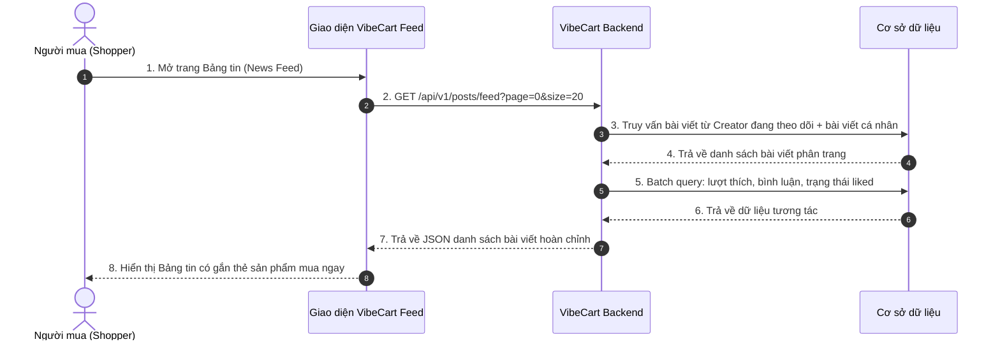
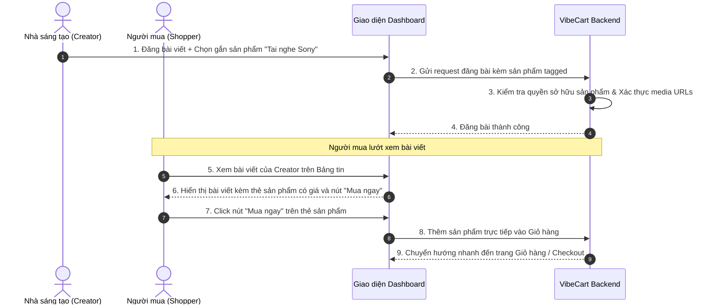
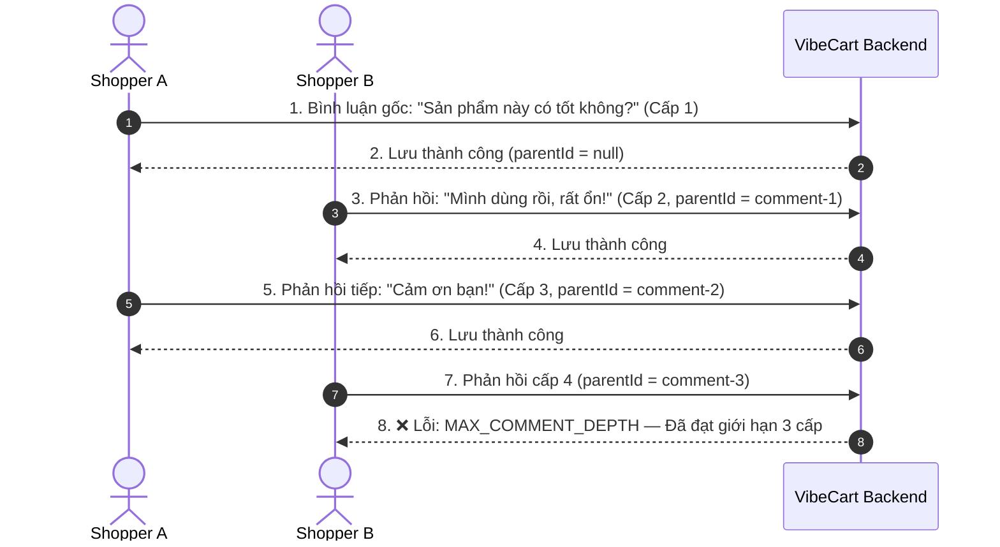

# 💼 Tài liệu Nghiệp vụ - Phân hệ 3: Mạng xã hội thu nhỏ (Social Mini-Network)

Phân hệ Mạng xã hội thu nhỏ (Social Mini-Network) là cầu nối tương tác trực tiếp giữa Nhà sáng tạo (Creator) và Người mua (Shopper) trên nền tảng **VibeCart**. Bằng cách tích hợp nội dung số (hình ảnh, video, bài viết) với tính năng thương mại điện tử (gắn thẻ sản phẩm, chia sẻ tiếp thị liên kết), phân hệ này giúp tối ưu hóa tỷ lệ chuyển đổi đơn hàng và tăng chỉ số tương tác (Engagement) của khách hàng trên sàn.

> **📖 Tài liệu liên quan:**
> - Thiết kế kỹ thuật chi tiết (DB, Thuật toán, Kiến trúc): [03_social_mini_design.md](file:///d:/Learning/vibecart/docs/technical/03_social_mini_design.md)
> - Đặc tả API RESTful (Endpoints, Payloads): [03_social_api.md](file:///d:/Learning/vibecart/docs/api/03_social_api.md)

---

## 👥 1. Các Đối Tượng Hệ Thống & Vai trò (System Actors & Roles)

Các chủ thể tương tác và luật nghiệp vụ áp dụng trên mạng xã hội thu nhỏ:

| Vai trò (Role) | Ký hiệu hệ thống | Tương tác Nghiệp vụ |
| :--- | :--- | :--- |
| **Nhà sáng tạo (Creator)** | `ROLE_CREATOR` | • Đăng tải bài viết nội dung (hình ảnh, video, văn bản). • Gắn thẻ (Tag) sản phẩm từ cửa hàng cá nhân vào bài viết. • Quản lý bình luận trên các bài viết cá nhân (có quyền xóa bình luận spam). • Chỉ được sử dụng media (ảnh/video) do chính mình tải lên — không được dùng file của Creator khác. |
| **Người mua (Shopper)** | `ROLE_USER` | • Theo dõi (Follow) hoặc Hủy theo dõi (Unfollow) các Creator yêu thích. • Xem Bảng tin (News Feed) chứa bài viết mới từ các Creator đang theo dõi. • Tương tác bài viết: Thích (Like/Unlike), Bình luận (Comment), phản hồi bình luận (Nested Reply). • Click sản phẩm gắn thẻ trên bài viết để xem chi tiết hoặc bấm "Chia sẻ" để nhận link tiếp thị kiếm hoa hồng. |
| **Quản trị viên (Admin)** | `ROLE_ADMIN` | • Có toàn quyền xóa bất kỳ bài viết hoặc bình luận vi phạm nội quy nền tảng. |

---

## 🔄 2. Luồng Nghiệp vụ Cốt lõi (Core Business Flows)

### 2.1 Luồng Tải Bảng tin Cá nhân hóa (News Feed Flow)

Khi Shopper mở Bảng tin, hệ thống tổng hợp các bài viết mới nhất từ chính người mua và các Creator họ đang theo dõi, sắp xếp theo thời gian giảm dần và phân trang trả về cho Client. Bảng tin sử dụng cơ chế **cuộn vô hạn (Infinite Scroll)** — Client không cần biết tổng số trang, chỉ cần kiểm tra trường `last` để quyết định có tải thêm trang tiếp hay không.

---

### 2.2 Luồng Tương tác Bài viết & Gắn thẻ Sản phẩm (Interaction & Tagging Flow)

Creator tạo nội dung đính kèm sản phẩm. Shopper tương tác trực tiếp trên bài viết để xem thông tin hoặc mua hàng nhanh.

---

### 2.3 Luồng Bình luận Đa cấp (Nested Comment Flow)

Người dùng có thể bình luận trực tiếp trên bài viết (cấp 1), phản hồi bình luận (cấp 2), hoặc phản hồi bình luận cấp 2 (cấp 3). Hệ thống chặn cứng bình luận từ cấp 4 trở đi.

---

## 🛡️ 3. Ràng buộc Nghiệp vụ (Social Mini Business Rules)

### 3.1 Ràng buộc về Gắn thẻ Sản phẩm (Product Tagging Rules)
*   **Chính chủ (Ownership Lock):** Creator chỉ được phép gắn thẻ các sản phẩm thuộc sở hữu của chính cửa hàng Creator đó. Tuyệt đối không cho phép gắn thẻ sản phẩm của Creator khác.
*   **Trạng thái hoạt động (Visibility Match):** Sản phẩm gắn thẻ bắt buộc phải ở trạng thái hoạt động (`status = ACTIVE` và chưa bị xóa).
*   **Tự động ẩn thẻ:** Khi sản phẩm bị ẩn hoặc xóa trên kho thương mại điện tử chính, hệ thống tự động ẩn thẻ sản phẩm trên tất cả các bài viết liên quan mà không cần chỉnh sửa bài viết thủ công.
*   **Giới hạn số lượng:** Mỗi bài viết được gắn tối đa **5 sản phẩm**.

### 3.2 Ràng buộc về Media đính kèm (Media Attachment Rules)
*   **Giới hạn số lượng:** Mỗi bài viết được đính kèm tối đa **10 media URLs** (hình ảnh/video).
*   **Xác thực nguồn gốc:** Mọi file media đính kèm bài viết phải tồn tại trong hệ thống lưu trữ (S3) và đã qua xác thực (`VERIFIED`).
*   **Sở hữu vật lý (Media Ownership):** Creator chỉ được sử dụng file media do chính mình tải lên. Hệ thống chặn việc Creator A nhét S3 Key đã VERIFIED của Creator B vào bài viết.

### 3.3 Quy tắc Bảng tin (News Feed Rules)
*   **Phạm vi hiển thị:** Bảng tin hiển thị bài viết từ chính User và tất cả Creator mà User đang theo dõi.
*   **Sắp xếp:** Bài viết mới nhất hiển thị đầu tiên (chronological descending).
*   **Phân trang Infinite Scroll:** Client cuộn vô hạn dựa trên trường `last` thay vì tổng số trang.
*   **Tính nhất quán thời gian thực:** Khi Follow/Unfollow, bài viết của Creator tương ứng xuất hiện/biến mất ngay lập tức trên Bảng tin.

### 3.4 Quy tắc Tương tác & Lọc bình luận (Like & Comment Rules)
*   **Tương tác Thích (Post Likes):**
    *   Mỗi User chỉ được tính tối đa **1 lượt Thích** trên một bài viết. Click lần 2 tương đương bỏ Thích (Toggle Like/Unlike).
*   **Phân cấp bình luận (Nested Comments Limit):**
    *   Hệ thống giới hạn nghiêm ngặt tối đa **3 cấp** bình luận (Cấp 1: Gốc, Cấp 2: Phản hồi, Cấp 3: Phản hồi phản hồi).
    *   Mọi nỗ lực viết bình luận từ cấp 4 trở đi bị chặn và ném mã lỗi `MAX_COMMENT_DEPTH`.
*   **Kiểm duyệt từ ngữ (Profanity Filter):**
    *   Tất cả bình luận trước khi lưu đều qua bộ lọc từ ngữ thô tục, nhạy cảm.
    *   Bình luận vi phạm bị từ chối đăng và cảnh báo cho người dùng.
*   **Quyền quản trị nội dung:** Creator có toàn quyền xóa bất kỳ bình luận nào trên bài viết do mình đăng. Admin có toàn quyền xóa bất kỳ bài viết/bình luận nào.

### 3.5 Quy tắc Theo dõi (Follow Rules)
*   **Không tự theo dõi:** Người dùng không thể theo dõi chính mình → mã lỗi `CANNOT_FOLLOW_SELF`.
*   **Toggle Follow:** Nếu đã theo dõi → click lần 2 sẽ hủy theo dõi (Unfollow). Hành vi tương tự Like Toggle.

---

## 📊 4. Ma trận Quyền hạn theo Vai trò (Permission Matrix)

| Hành động | `ROLE_USER` (Shopper) | `ROLE_CREATOR` | `ROLE_ADMIN` |
| :--- | :---: | :---: | :---: |
| Đăng bài viết | ❌ | ✅ | ✅ |
| Sửa bài viết | ❌ | ✅ (chỉ bài của mình) | ❌ |
| Xóa bài viết | ❌ | ✅ (chỉ bài của mình) | ✅ (tất cả) |
| Like / Unlike bài viết | ✅ | ✅ | ✅ |
| Viết bình luận | ✅ | ✅ | ✅ |
| Xóa bình luận | ✅ (chỉ bình luận của mình) | ✅ (bình luận của mình + trên bài của mình) | ✅ (tất cả) |
| Follow / Unfollow | ✅ | ✅ | ✅ |
| Xem Bảng tin (Feed) | ✅ | ✅ | ✅ |
| Xem danh sách followers/following | ✅ (công khai) | ✅ (công khai) | ✅ (công khai) |
