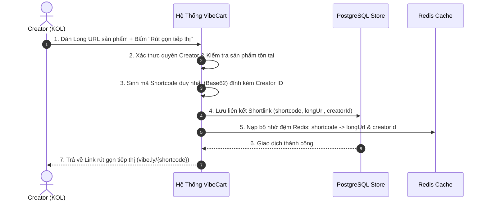
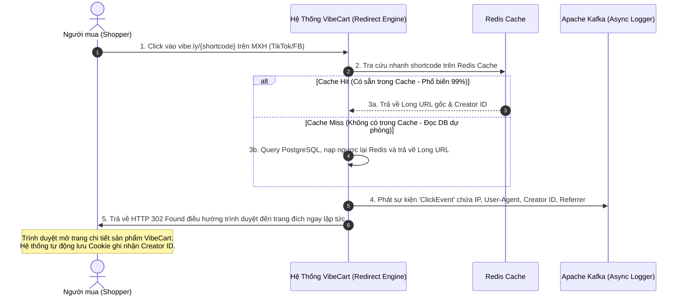
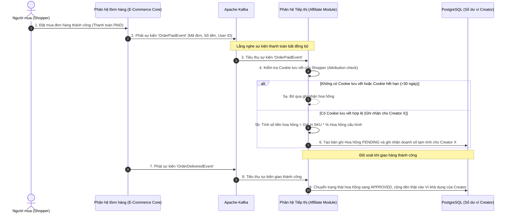

# 💼 Tài liệu Nghiệp vụ - Phân hệ 4: Tiếp thị & Rút gọn Link (Shortlink & Affiliate)

Phân hệ Tiếp thị & Rút gọn Link (Shortlink & Affiliate) là động cơ tăng trưởng doanh thu và thu hút người dùng của hệ thống **VibeCart**. Phân hệ này cho phép các Creator/KOL dễ dàng chia sẻ sản phẩm thông qua các liên kết siêu ngắn, đồng thời tự động hóa quy trình ghi nhận lượt click, đối soát đơn hàng và chi trả hoa hồng chính xác.

---

## 👥 1. Các Đối Tượng Hệ Thống & Vai trò (System Actors & Roles)

Các chủ thể tương tác và trách nhiệm trong chu trình tiếp thị liên kết:

| Vai trò (Role) | Ký hiệu hệ thống | Tương tác Nghiệp vụ Tiếp thị & Rút gọn Link |
| :--- | :--- | :--- |
| **Nhà sáng tạo (Creator)** | `ROLE_CREATOR` | • Tạo và quản lý các liên kết rút gọn tiếp thị (Shortlinks) cho bất kỳ sản phẩm nào. • Chia sẻ Shortlink lên các mạng xã hội bên ngoài (Facebook, TikTok, YouTube...). • Xem thống kê hiệu suất click, số đơn hàng chuyển đổi và số dư hoa hồng khả dụng trên Dashboard cá nhân. • Yêu cầu rút tiền hoa hồng tích lũy về tài khoản ngân hàng. |
| **Người mua (Shopper)** | Khách vãng lai / User | • Click vào liên kết rút gọn của Creator trên các nền tảng xã hội. • Được hệ thống điều hướng tức thời đến trang chi tiết sản phẩm trên VibeCart. • Tiến hành đặt đơn mua hàng (Hệ thống tự động ghi nhận hoa hồng nếu mua hàng thành công). |
| **Quản trị viên (Admin)** | `ROLE_ADMIN` | • Cấu hình tỷ lệ (%) chi trả hoa hồng chung cho toàn hệ thống hoặc riêng lẻ cho từng danh mục ngành hàng/Creator đặc thù. • Phê duyệt hoặc từ chối các yêu cầu rút tiền hoa hồng của Creator. • Giám sát hệ thống phòng chống gian lận click ảo (Anti-Fraud monitoring). |

---

## 🔄 2. Luồng Nghiệp vụ Cốt lõi (Core Business Flows)

### 2.1 Luồng Tạo Shortlink tiếp thị (Shortlink Generation Flow)
Creator chủ động tìm kiếm các sản phẩm tiềm năng trên sàn VibeCart và tiến hành tạo mã liên kết tiếp thị cá nhân hóa.

---

### 2.2 Luồng Người mua Click & Điều hướng siêu tốc (Shopper Click & Fast Redirect Flow)
Đảm bảo khách hàng click vào link tiếp thị trên mạng xã hội sẽ được chuyển hướng ngay lập tức đến trang mua sắm mà không bị cảm giác gián đoạn hay trễ trang.

---

### 2.3 Luồng Ghi nhận & Đối soát Hoa hồng (Commission Attribution Flow)
Quy trình tự động hóa việc tính toán số dư tài chính tiếp thị dựa trên hành vi mua sắm thành công của Shopper sau khi click link.

---

## 🛡️ 3. Ràng buộc Nghiệp vụ & Luật đối soát (Enterprise Attribution & Fraud Rules)

Để bảo vệ tính minh bạch và tránh thất thoát tài chính, hệ thống áp dụng các quy tắc nghiêm ngặt:

1.  **Quy tắc Ghi nhận Last-Click (Last-Click Attribution Rule):**
    *   Chỉ ghi nhận hoa hồng cho **liên kết tiếp thị cuối cùng** mà Shopper click vào trước khi tạo đơn hàng. 
    *   *Ví dụ:* Khách click link của Creator A, 10 phút sau click link của Creator B rồi mới mua sản phẩm $\rightarrow$ Hoa hồng tính 100% cho Creator B.
2.  **Thời hạn hiệu lực của Click (Cookie Life - 30 ngày):**
    *   Mã tiếp thị lưu trên Cookie của Shopper có thời hạn sống tối đa là **30 ngày** (720 giờ).
    *   Nếu đơn hàng được thanh toán thành công trong vòng 30 ngày kể từ lượt click cuối cùng, Creator vẫn nhận được hoa hồng, bất kể khách hàng truy cập trực tiếp hay gián tiếp.
3.  **Quy tắc Phòng chống Gian lận Click ảo (Anti-Fraud Spam Limits):**
    *   Hệ thống tự động loại bỏ các lượt click spam: Một địa chỉ IP click vào cùng một Shortlink quá **5 lần trong vòng 10 giây** sẽ chỉ được hệ thống ghi nhận là 1 click hợp lệ để tính toán báo cáo Dashboard (ngăn chặn robot tăng lượt click ảo).
    *   Nếu phát hiện dấu hiệu spam hàng ngàn click liên tục từ một dải IP, hệ thống sẽ tạm khóa ghi nhận click của dải IP đó và gửi cảnh báo đến Admin.
4.  **Luật Xử lý Hủy đơn & Đổi trả (Refund & Chargeback Adjustments):**
    *   Nếu đơn hàng bị hủy hoặc khách hàng yêu cầu hoàn trả tiền trước khi hoàn tất giao hàng (Đơn hàng chuyển sang `CANCELLED` từ trạng thái `PAID`):
        *   Hệ thống thực hiện **Thu hồi hoa hồng tạm tính**: Chuyển trạng thái bản ghi hoa hồng từ `PENDING` sang `REJECTED` (Bị từ chối) và khấu trừ tiền hoa hồng tạm tính khỏi Dashboard của Creator tương ứng.
5.  **Nguyên tắc rút tiền hoa hồng (Payout Threshold):**
    *   Số dư ví hoa hồng của Creator phải đạt tối thiểu **50,000 VND** mới được phép tạo yêu cầu rút tiền về tài khoản ngân hàng cá nhân.
    *   Mỗi yêu cầu rút tiền bắt buộc phải thông qua sự phê duyệt thủ công của `ROLE_ADMIN` để kiểm tra lịch sử click xem có vi phạm chính sách gian lận hay không trước khi thực hiện chuyển khoản.
