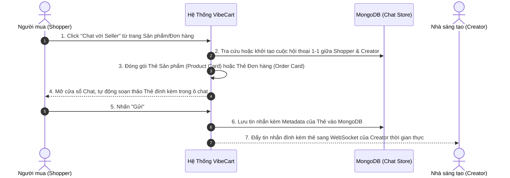
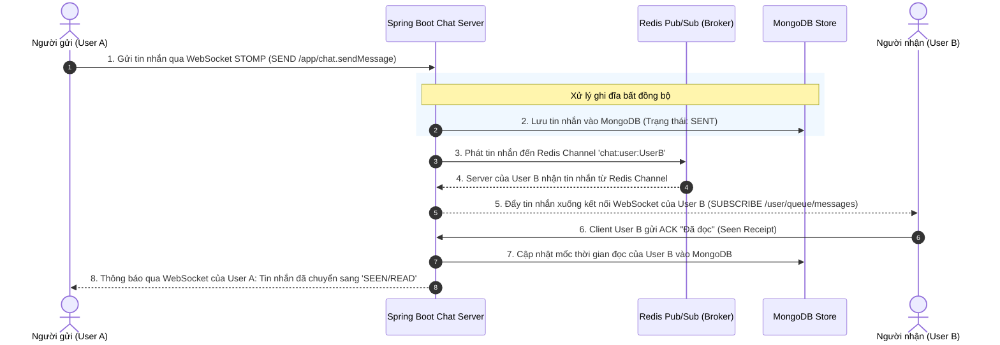
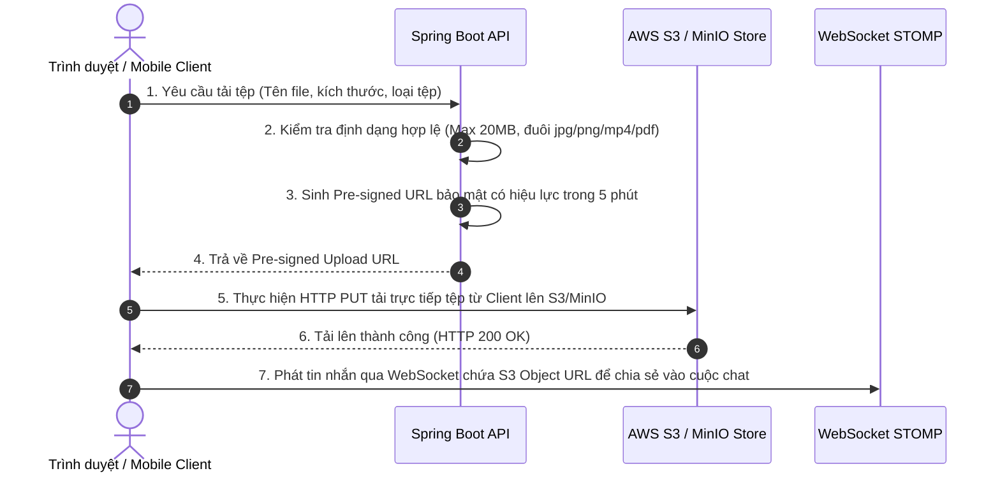

# 💼 Tài liệu Nghiệp vụ - Phân hệ 5: Nhắn tin Thời gian thực (Realtime Chat)

Phân hệ Nhắn tin Thời gian thực (Realtime Chat) đóng vai trò là hạ tầng kết nối, hỗ trợ Shopper và Creator tương tác tức thời về sản phẩm/đơn hàng, đồng thời thúc đẩy tương tác cộng đồng trong các nhóm chat (Group Chat) trên nền tảng mạng xã hội **VibeCart**.

> [!NOTE]
> Để xem thiết kế kiến trúc kỹ thuật (DB Schema, Redis Pub/Sub, Presence Engine), tham khảo: [05_realtime_chat_design.md](../technical/05_realtime_chat_design.md).
> Để xem hợp đồng tích hợp API (REST Endpoints & WebSocket Payloads), tham khảo: [05_chat_websocket_api.md](../api/05_chat_websocket_api.md).

---

## 👥 1. Các Đối Tượng Hệ Thống & Vai trò (System Actors & Roles)

Các chủ thể tham gia tương tác trực tiếp trong không gian hội thoại:

| Vai trò (Role) | Ký hiệu hệ thống | Tương tác Nghiệp vụ Chat & Group Chat |
| :--- | :--- | :--- |
| **Người khởi xướng** | Shopper hoặc Creator | • Bắt đầu cuộc trò chuyện 1-1 từ trang chi tiết sản phẩm hoặc chi tiết đơn hàng. • Tạo phòng chat nhóm mới và đặt tên/ảnh nhóm. |
| **Thành viên Nhóm** | Khách hàng có tài khoản | • Nhận và gửi tin nhắn (văn bản, hình ảnh, tài liệu) thời gian thực. • Tích chọn đính kèm thẻ sản phẩm/đơn hàng để thảo luận chung. • Xem danh sách những người đã đọc tin nhắn trong nhóm. • Rời khỏi nhóm chat. |
| **Trưởng nhóm (Creator/Admin)**| Người sáng lập nhóm | • Quản lý cài đặt nhóm chat. • Thêm thành viên mới hoặc trục xuất thành viên vi phạm khỏi nhóm. |

---

## 🔄 2. Luồng Nghiệp vụ Cốt lõi (Core Business Flows)

### 2.1 Luồng Khởi tạo Hội thoại & Đính kèm Thẻ (Conversation & Card Attachment Flow)
Khi Shopper có thắc mắc về sản phẩm hoặc đơn hàng, họ có thể mở chat trực tiếp, hệ thống tự động đính kèm "Thẻ ngữ cảnh" (Context Card) để cuộc đối thoại diễn ra thuận lợi.

---

### 2.2 Luồng Gửi và Nhận Tin nhắn Thời gian thực (Realtime Send & Receive Flow)
Đảm bảo tốc độ truyền tin tức thời (Sub-100ms) trên các kênh WebSocket/STOMP.

---

### 2.3 Luồng Tải lên tệp trực tiếp lên S3/MinIO qua Pre-signed URL (Client-Direct Upload Flow)
Để Spring Boot Server không bị nghẽn RAM khi nhiều người dùng gửi tệp đa phương tiện (ảnh, video, PDF) cùng lúc, hệ thống áp dụng luồng tải thẳng (Direct Upload):

---

## 🛡️ 3. Ràng buộc Nghiệp vụ & Cơ chế Đồng bộ (Enterprise Chat Rules & Sync Constraints)

### 3.1 Cơ chế Đồng bộ Số lượng tin nhắn chưa đọc (Unread Count Sync)
Để hiển thị huy hiệu đỏ (Badge notification) số lượng tin nhắn chưa đọc trên từng cuộc hội thoại một cách chính xác mà không tốn tài nguyên hệ thống:
*   **Cấu trúc dữ liệu:** Tài liệu Conversation lưu trữ một Map động dạng: `unread_counts: { "userId_1": 3, "userId_2": 0 }`.
*   **Quy tắc cộng dồn:** Khi tin nhắn mới được gửi vào phòng chat, tất cả các thành viên khác trong phòng (ngoại trừ người gửi) sẽ được hệ thống tăng tự động `unread_counts` lên **+1**.
*   **Quy tắc xóa bộ đếm (Reset):** Khi một thành viên nhấp mở cửa sổ phòng chat đó, hệ thống thực hiện reset `unread_counts[userId]` của người đó về **0** ngay lập tức và đồng bộ số liệu qua WebSocket.

### 3.2 Cơ chế Hiện diện Trực tuyến & Chỉ báo Soạn thảo (Presence & Typing Indicators)
*   **Presence (Online/Offline):**
    *   Hệ thống xác định trạng thái Online thông qua việc duy trì kết nối WebSocket. Client gửi gói tin heartbeat ping mỗi 30 giây để duy trì trạng thái.
    *   Khi Shopper mở danh sách tin nhắn, trạng thái Online hiển thị chấm xanh lá. Nếu Offline, hiển thị thời gian hoạt động cuối cùng: *"Hoạt động 10 phút trước"*.
*   **Typing Indicator (Đang soạn thảo):**
    *   Khi người dùng gõ phím trong ô chat, Client gửi sự kiện `TYPING` lên WebSocket `/app/chat.typing`.
    *   Hệ thống phân phối nhanh sự kiện này tới các thành viên khác trong phòng.
    *   Dòng chữ *"Người dùng X đang soạn thảo..."* hiển thị và tự động biến mất sau **3 giây** nếu không nhận được sự kiện gõ phím tiếp theo (Throttle/Debounce mechanism).

### 3.3 Hạn mức Tệp tin đính kèm (Media Upload Constraints)
*   **Kích thước tối đa:** Cho phép tải lên các tệp tin đính kèm có dung lượng tối đa **20MB**.
*   **Định dạng cho phép:**
    *   *Hình ảnh/Video:* JPG, PNG, GIF, WEBP, MP4 (Tự động hiển thị trình xem đa phương tiện trực tiếp trong khung chat).
    *   *Tài liệu:* PDF, DOCX, XLSX, ZIP, RAR (Hiển thị dưới dạng thẻ tải tệp kèm kích thước).
    *   Tất cả các định dạng thực thi (như `.exe`, `.bat`, `.sh`) bị cấm hoàn toàn để đảm bảo an ninh hệ thống.
