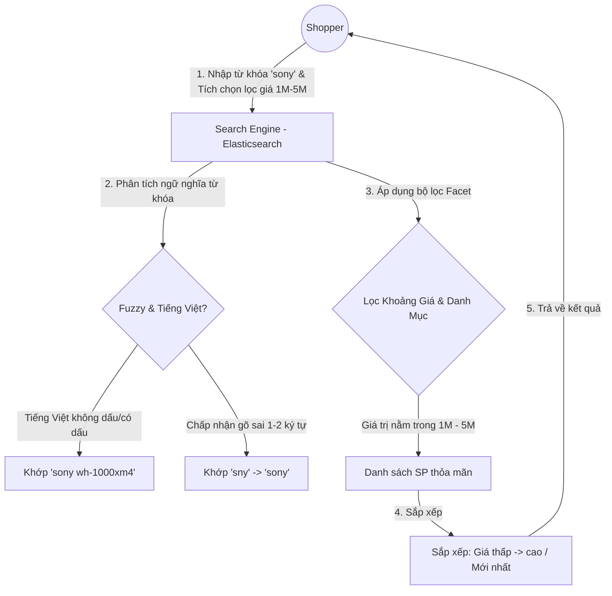
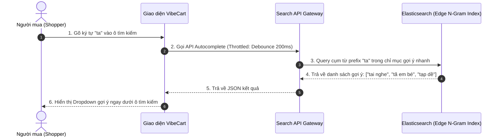
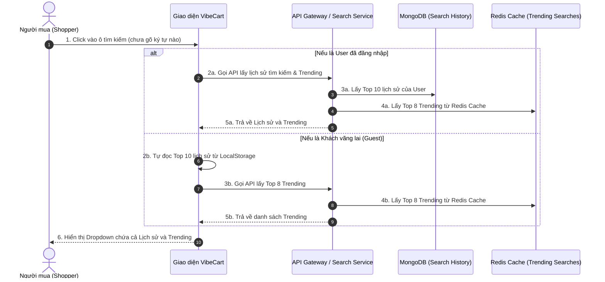
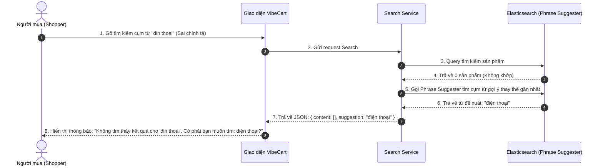
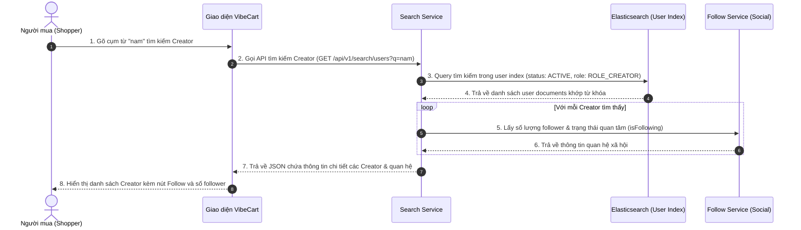

# 💼 Tài liệu Nghiệp vụ - Phân hệ 6: Công cụ Tìm kiếm & Các Tính năng Gợi ý

Phân hệ Công cụ Tìm kiếm (Search Engine) là trung tâm điều hướng và kết nối nhu cầu của Người mua (Shopper) với các sản phẩm của Nhà sáng tạo (Creator) trên nền tảng **VibeCart**. Tài liệu này đặc tả nghiệp vụ tìm kiếm thông minh, gợi ý từ khóa, bộ lọc đa chiều (Faceted Search), luật đồng bộ dữ liệu sản phẩm, **Lịch sử tìm kiếm (Search History)** và các **Tính năng Gợi ý tìm kiếm (Trending, Autocomplete, Spell Check)**.

---

## 👥 1. Các Đối Tượng Hệ Thống & Vai trò (System Actors & Roles)

Các chủ thể tương tác và luật nghiệp vụ áp dụng trên tìm kiếm:

| Vai trò (Role) | Ký hiệu hệ thống | Tương tác Nghiệp vụ Tìm kiếm & Đồng bộ |
| :--- | :--- | :--- |
| **Người mua (Shopper)** | Khách vãng lai / User | • Nhập từ khóa tìm kiếm sản phẩm hoặc Nhà sáng tạo trên thanh tìm kiếm. • Nhận gợi ý từ khóa/Creator thời gian thực (Autocomplete) khi đang gõ chữ. • Áp dụng các bộ lọc đa chiều (Faceted Filters) như khoảng giá, danh mục, đánh giá để thu hẹp phạm vi tìm kiếm sản phẩm. • Xem lại lịch sử tìm kiếm gần đây và danh sách từ khóa phổ biến (Trending Search) khi click vào ô tìm kiếm. • Nhận gợi ý sửa lỗi chính tả khi tìm kiếm không ra kết quả. • Sắp xếp kết quả tìm kiếm theo nhu cầu. |
| **Nhà sáng tạo (Creator)** | `ROLE_CREATOR` | • Xuất hiện trong kết quả tìm kiếm Creator trên sàn dựa trên tên hoặc tên đăng nhập. • Khi thêm, sửa hoặc xóa sản phẩm/biến thể (SPU/SKU), hệ thống tự động đồng bộ hóa thông tin sang Search Engine trong vòng tối đa **3 giây** (SLA đồng bộ). |
| **Quản trị viên (Admin)** | `ROLE_ADMIN` | • Theo dõi các từ khóa được tìm kiếm nhiều nhất (Trending Search) để điều chỉnh danh mục hoặc chiến dịch. • Kích hoạt tính năng đồng bộ lại thủ công (Re-index) toàn sàn trong trường hợp có lỗi dữ liệu. |

---

## 🔄 2. Luồng Nghiệp vụ Cốt lõi (Core Business Flows)

### 2.1 Luồng Tìm kiếm & Lọc Động Đa chiều (Faceted Search & Filter Flow)
Shopper nhập từ khóa và áp dụng các tiêu chí lọc động để tìm chính xác sản phẩm mong muốn.

---

### 2.2 Luồng Gợi ý Từ khóa khi đang gõ (Autocomplete Typeahead Flow)
Hệ thống tự động đưa ra các gợi ý sản phẩm ngay khi Shopper gõ từng ký tự đầu tiên để giảm thiểu thao tác nhập liệu của người dùng.

---

### 2.3 Luồng Trải nghiệm click vào ô Tìm kiếm (Click-on-Search State Flow)
Khi Shopper chỉ click chuột vào ô tìm kiếm (chưa gõ chữ), giao diện cần hiển thị song song hai cấu phần: **Lịch sử tìm kiếm gần đây (Search History)** và **Từ khóa phổ biến toàn sàn (Trending Searches)**.

---

### 2.4 Luồng Đề xuất Sửa lỗi Chính tả (Spell Check & Did-You-Mean Flow)
Khi người dùng gõ sai chính tả trầm trọng dẫn đến không có kết quả tìm kiếm nào thỏa mãn, hệ thống chủ động gợi ý cụm từ đúng nhất.

### 2.5 Luồng Tìm kiếm & Gợi ý Nhà sáng tạo (Creator Search & Autocomplete Flow)
Khi Shopper muốn tìm các nhà sáng tạo (Creator) để theo dõi hoặc xem sản phẩm họ tạo ra, hệ thống hỗ trợ tìm kiếm toàn văn và autocomplete trên tài khoản Creator.

---

## 🛡️ 3. Ràng buộc Nghiệp vụ Tìm kiếm & Đồng bộ (Search & Sync Business Rules)

### 3.1 Quy tắc Tìm kiếm Tiếng Việt có dấu và không dấu (Vietnamese Search Rules)
*   **Hỗ trợ không dấu:** Khi người dùng nhập từ khóa Tiếng Việt không dấu (Ví dụ: `"dien thoai sony"`), hệ thống bắt buộc phải hiển thị các kết quả Tiếng Việt có dấu tương ứng (Ví dụ: `"Điện thoại Sony"`).
*   **Hỗ trợ có dấu:** Ngược lại, khi người dùng nhập cụm từ có dấu (Ví dụ: `"tai nghe chống ồn"`), hệ thống vẫn phải khớp được cả các tài liệu chứa từ khóa viết không dấu (Ví dụ: `"tai nghe chong on"`).
*   **Không phân biệt hoa-thường:** Tất cả các truy vấn đều được xử lý không phân biệt chữ hoa và chữ thường (Case-insensitive).

### 3.2 Quy tắc Sửa lỗi gõ sai (Fuzzy Search - Typo Tolerance)
Để cải thiện tối đa trải nghiệm người dùng, hệ thống chấp nhận các lỗi gõ sai ký tự vật lý dựa trên khoảng cách Levenshtein:
*   **Từ khóa từ 1 - 2 ký tự:** Yêu cầu khớp chính xác tuyệt đối, không chấp nhận lỗi sai (Fuzzy = 0).
*   **Từ khóa từ 3 - 5 ký tự:** Chấp nhận gõ sai tối đa **1 ký tự** (Fuzzy = 1). *Ví dụ: gõ "sny" vẫn khớp ra "sony".*
*   **Từ khóa trên 5 ký tự:** Chấp nhận gõ sai tối đa **2 ký tự** (Fuzzy = 2). *Ví dụ: gõ "telephne" vẫn khớp ra "telephone".*

### 3.3 Quy tắc Hiển thị Giá bán Khoảng trong Tìm kiếm (SPU-level Price Range)
*   Do hệ thống VibeCart thiết kế tách biệt SPU (sản phẩm chung) và SKU (biến thể chi tiết), kết quả tìm kiếm trả về sẽ đại diện cho **SPU**.
*   **Quy tắc hiển thị giá:**
    *   Nếu sản phẩm có nhiều biến thể SKU với các mức giá khác nhau, giá hiển thị trong kết quả tìm kiếm phải là khoảng giá từ thấp nhất đến cao nhất: `[Min_Price - Max_Price]` của các SKU đang hoạt động.
    *   Shopper có thể sử dụng bộ lọc giá (Price Slider) để lọc. Chỉ cần sản phẩm có **ít nhất một biến thể SKU** nằm trong khoảng giá lọc của khách hàng, SPU đó sẽ được hiển thị.

### 3.4 Luật Hiển thị sản phẩm thời gian thực (Visibility Rules)
*   Sản phẩm chỉ được phép xuất hiện trong kết quả tìm kiếm nếu thỏa mãn đồng thời:
    1.  Sản phẩm gốc SPU ở trạng thái hoạt động (`status = 'ACTIVE'`) trong chỉ mục Elasticsearch.
    2.  Có ít nhất một biến thể SKU ở trạng thái hoạt động (`status = 'ACTIVE'` và chưa bị xóa mềm) tại thời điểm đồng bộ lập chỉ mục.
*   **Cơ chế lọc trên Search Engine:** Elasticsearch chỉ lưu trữ các tài liệu sản phẩm hợp lệ. Khi sản phẩm bị xóa mềm (`deleted = true`) ở tầng PostgreSQL, hệ thống phát sự kiện `PRODUCT_DELETED` qua Outbox → Kafka → Consumer sẽ **xóa hoàn toàn** tài liệu đó ra khỏi chỉ mục Elasticsearch. Do đó, truy vấn tìm kiếm chỉ cần lọc theo `status = 'ACTIVE'` mà không cần trường `deleted` trên Elasticsearch Document.
*   **Ẩn sản phẩm lập tức:** Ngay khi Admin hoặc Creator chuyển trạng thái sản phẩm sang ẩn (`deleted = true` hoặc `status = 'INACTIVE'`), hệ thống phải thực hiện cập nhật/xóa chỉ mục (Index) sản phẩm đó khỏi Elasticsearch trong vòng **3 giây** (SLA) để đảm bảo khách hàng không thể tìm kiếm hay nhìn thấy sản phẩm này nữa.

### 3.5 Luật Nghiệp vụ Lịch sử Tìm kiếm (Search History Rules)
*   **Giới hạn lưu trữ:** Mỗi người dùng đã đăng nhập chỉ lưu tối đa **10 từ khóa tìm kiếm gần đây nhất**.
*   **Quy tắc đẩy lên đầu (Recency Priority):** 
    *   Nếu người dùng tìm kiếm một từ khóa hoàn toàn mới $\rightarrow$ Đẩy từ khóa đó vào đầu danh sách (vị trí số 1). Nếu danh sách đã có 10 phần tử, từ khóa cũ nhất ở vị trí cuối cùng sẽ bị loại bỏ (FIFO).
    *   Nếu người dùng tìm kiếm lại một từ khóa đã có sẵn trong lịch sử $\rightarrow$ Không tạo bản ghi mới, mà chỉ cập nhật lại thời gian tìm kiếm (`searchedAt`) của từ khóa đó và đưa nó lên vị trí đầu tiên của danh sách.
*   **Đồng bộ khi đăng nhập (Merge History):** 
    *   Khi người dùng đăng nhập thành công, Frontend có trách nhiệm gửi mảng lịch sử tìm kiếm từ LocalStorage (tối đa 10 phần tử của Guest) lên Server.
    *   Hệ thống Backend sẽ gộp mảng này vào lịch sử hiện tại của User trên MongoDB theo thứ tự thời gian tìm kiếm mới nhất, tự động lọc trùng và loại bỏ các phần tử cũ quá giới hạn 10 từ khóa.
*   **Quyền kiểm soát cá nhân:** Người dùng có quyền xóa từng từ khóa đơn lẻ hoặc chọn xóa sạch toàn bộ lịch sử tìm kiếm của mình bất kỳ lúc nào.

### 3.6 Luật Nghiệp vụ Gợi ý Từ khóa Phổ biến (Trending Search Rules)
*   **Điều kiện ghi nhận:** Từ khóa chỉ được coi là hợp lệ để tính toán xu hướng nếu:
    1.  Độ dài từ khóa $\ge 2$ ký tự.
    2.  Tìm kiếm thực tế trả về ít nhất 1 sản phẩm hoạt động trên sàn (Tránh các từ khóa rác hoặc từ khóa không có sản phẩm).
*   **Cơ chế tính điểm & Lọc ảo:** 
    *   Mỗi lượt tìm kiếm hợp lệ đóng góp 1 điểm vào điểm xu hướng của từ khóa đó.
    *   Mỗi địa chỉ IP/User chỉ được tính tối đa 3 điểm xu hướng cho cùng 1 từ khóa trong vòng 24h để ngăn chặn việc dùng script/bot để thao túng từ khóa phổ biến (Anti-Spam Filter).
*   **Phạm vi thống kê:** Tính toán dựa trên lượng tìm kiếm trong **7 ngày gần nhất** để đảm bảo phản ánh đúng các xu hướng mới và loại bỏ các từ khóa đã hết nhiệt.
*   **Chu kỳ cập nhật:** Dữ liệu lượt tìm kiếm được ghi nhận thời gian thực nhưng bảng xếp hạng Trending chỉ được cập nhật định kỳ mỗi **1 tiếng** một lần để giảm tải CPU hệ thống.

### 3.7 Luật Nghiệp vụ "Did you mean..." (Spell Check Suggestions)
*   **Thời điểm kích hoạt:** Chỉ xuất hiện trên giao diện khi kết quả tìm kiếm chính thức của từ khóa người dùng nhập trả về bằng 0.
*   **Tính hữu dụng:** Từ khóa đề xuất thay thế bắt buộc phải là từ khóa có dấu tiếng Việt chuẩn và đang có sản phẩm thực tế tồn tại trên sàn.
*   **Tương tác:** Khi người dùng click vào cụm từ đề xuất (ví dụ click vào chữ *"điện thoại"*), hệ thống lập tức thực hiện lại lệnh tìm kiếm với cụm từ đó mà không bắt người dùng phải gõ lại.

### 3.8 Luật Nghiệp vụ Tìm kiếm & Gợi ý Creator (Creator Search & Suggestion Rules)
*   **Điều kiện xuất hiện:** Tài khoản chỉ được xuất hiện trong kết quả tìm kiếm Creator nếu thoả mãn đồng thời:
    1. Trạng thái hoạt động là hoạt động (`status = 'ACTIVE'`).
    2. Có vai trò là Nhà sáng tạo (`roles` chứa `'ROLE_CREATOR'`).
*   **Loại trừ bản thân:** Để tối ưu trải nghiệm, khi Shopper đã đăng nhập thực hiện tìm kiếm, hệ thống tự động loại bỏ tài khoản của chính Shopper đó ra khỏi danh sách kết quả tìm kiếm Creator (nếu trùng tên).
*   **Tích hợp mạng xã hội:**
    1. Khi hiển thị thông tin Creator, hệ thống tự động lấy kèm số lượng người theo dõi (`followerCount`) và trạng thái quan tâm (`isFollowing`) từ phân hệ Social để hiển thị trực tiếp nút Follow/Unfollow tương ứng trên danh sách.
