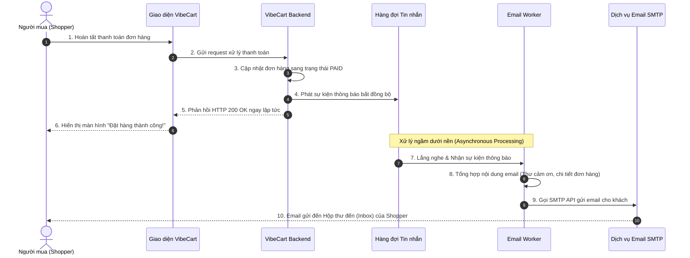
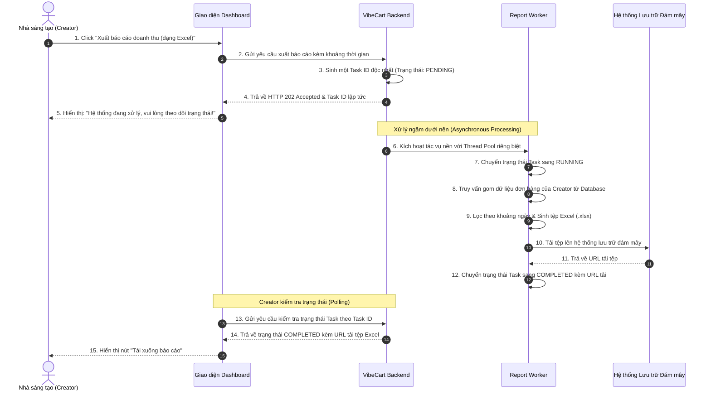
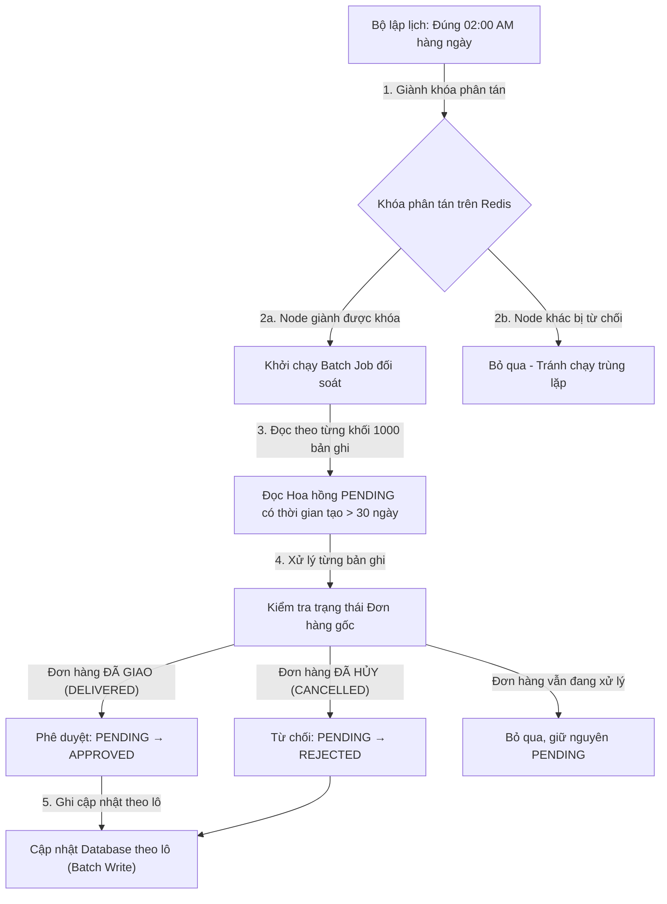

# 💼 Tài liệu Nghiệp vụ - Phân hệ 8: Hàng đợi & Xử lý Nền (Queue & Background Processing)

Phân hệ Hàng đợi và Xử lý Nền (Queue & Background Processing) chịu trách nhiệm tự động hóa toàn bộ các hoạt động bất đồng bộ và định kỳ của hệ thống **VibeCart**. Bằng cách chuyển giao các tác vụ xử lý nặng ra khỏi luồng xử lý yêu cầu chính (Main HTTP Thread), hệ thống đảm bảo trải nghiệm lướt web mượt mà, không bị nghẽn (non-blocking) và có tính chịu lỗi cao.

---

## 👥 1. Các Đối Tượng Hệ Thống & Vai trò (System Actors & Roles)

Các chủ thể tương tác và luật nghiệp vụ áp dụng trên các tác vụ xử lý nền:

| Vai trò (Role) | Ký hiệu hệ thống | Tương tác Nghiệp vụ & Yêu cầu Xử lý nền |
| :--- | :--- | :--- |
| **Người mua (Shopper)** | Khách hàng | • Nhận email xác nhận đơn hàng và các thông báo giao dịch bất đồng bộ mà không cần chờ trang web quay vòng tải. |
| **Nhà sáng tạo (Creator)** | `ROLE_CREATOR` | • Nhận thông báo về đơn hàng mới và biến động doanh thu. • Yêu cầu xuất báo cáo doanh số dạng Excel dung lượng lớn và nhận tệp tin tải về qua liên kết trên hệ thống lưu trữ. |
| **Đối tác Tiếp thị (Affiliate)** | `ROLE_AFFILIATE` | • Nhận thông báo khi hoa hồng được phê duyệt hoặc bị từ chối tự động sau thời gian đối soát. |
| **Quản trị viên (Admin)** | `ROLE_ADMIN` | • Kích hoạt chạy các tác vụ nền (Batch Job) thủ công bất kỳ lúc nào thông qua API quản trị khẩn cấp. • Giám sát lỗi từ các tin nhắn thất bại hoàn toàn (Dead Letter Queue). |
| **Hệ thống ngầm (System Worker)** | Background Workers | • **Notification Consumer:** Lắng nghe hàng đợi tin nhắn để gửi email qua SMTP. • **Batch Processor:** Thực hiện đối soát hoa hồng tiếp thị liên kết định kỳ quy mô lớn. • **Report Engine:** Truy vấn dữ liệu, sinh tệp Excel và tải lên hệ thống lưu trữ đám mây (S3/MinIO). |

---

## 🔄 2. Luồng Nghiệp vụ Cốt lõi (Core Business Flows)

### 2.1 Luồng Gửi Email Bất đồng bộ (Async Email Notification Flow)

Khi một sự kiện nghiệp vụ quan trọng xảy ra (ví dụ: Shopper đặt hàng thành công), luồng HTTP chính phản hồi ngay lập tức cho người dùng. Tác vụ gửi email được đưa vào hàng đợi tin nhắn (Message Queue) để xử lý bất đồng bộ dưới nền, tránh làm người dùng phải chờ đợi.

**Cơ chế chịu lỗi:** Nếu việc gửi email thất bại (do lỗi mạng, SMTP server quá tải...), hệ thống sẽ tự động thử lại nhiều lần với khoảng cách thời gian tăng dần (Exponential Backoff). Nếu tất cả các lần thử lại đều thất bại, tin nhắn sẽ được chuyển vào hàng đợi chết (Dead Letter Queue - DLQ) để quản trị viên kiểm tra và xử lý thủ công.

---

### 2.2 Luồng Kết xuất Báo cáo Doanh thu Bất đồng bộ (Async Report Generation Flow)

Tác vụ truy vấn cơ sở dữ liệu lớn và sinh tệp Excel có thể kéo dài từ vài chục giây đến vài phút. Hệ thống sử dụng mô hình **Yêu cầu Tác vụ Bất đồng bộ (Async Job Request)** để tránh làm nghẽn hoặc timeout kết nối HTTP của Creator.

**Xử lý thất bại:** Nếu quá trình sinh báo cáo gặp lỗi (ví dụ: cạn kiệt bộ nhớ, Database timeout), hệ thống tự động chuyển trạng thái Task sang **FAILED** kèm thông điệp lỗi chi tiết để Creator biết lý do và có thể thử lại.

---

### 2.3 Luồng Đối soát Hoa hồng Tiếp thị định kỳ (Commission Settlement Batch Flow)

Tác vụ đối soát diễn ra định kỳ mỗi ngày vào khung giờ thấp tải (**02:00 AM**) để duyệt các bản ghi hoa hồng đã vượt qua thời gian khiếu nại (30 ngày). Hệ thống xử lý hàng loạt (Batch Processing) hàng triệu bản ghi theo từng khối nhỏ (Chunk) để tối ưu bộ nhớ.

**Điểm quan trọng trong đối soát:**
*   Hệ thống **không phê duyệt tự động toàn bộ** hoa hồng quá 30 ngày. Thay vào đó, mỗi bản ghi hoa hồng được kiểm tra chéo với trạng thái đơn hàng gốc:
    *   Đơn hàng đã giao thành công (`DELIVERED`) → Hoa hồng được **phê duyệt** (`APPROVED`).
    *   Đơn hàng đã hủy (`CANCELLED`) → Hoa hồng bị **từ chối** (`REJECTED`).
    *   Đơn hàng vẫn đang ở trạng thái trung gian (PAID, SHIPPED...) → **Bỏ qua**, giữ nguyên `PENDING` để xử lý ở lần đối soát tiếp theo.
*   **Chống chạy trùng lặp:** Khi hệ thống backend mở rộng thành nhiều node (scale-out), cơ chế khóa phân tán (Distributed Lock) đảm bảo chỉ **duy nhất một node** được phép chạy Batch Job tại một thời điểm.
*   **Chịu lỗi:** Batch Job cho phép bỏ qua tối đa 100 bản ghi lỗi nghiệp vụ trong một lần chạy mà không dừng toàn bộ tiến trình.

---

## 🛡️ 3. Ràng buộc Nghiệp vụ Xử lý Nền (Background Processing Business Rules)

### 3.1 Quy tắc Đối soát & Phê duyệt Hoa hồng (Commission Settlement Rule)
*   **Thời gian chờ (Locking Period):** Hoa hồng tiếp thị liên kết được ghi nhận ở trạng thái tạm giữ (`PENDING`) ngay khi khách hàng thanh toán thành công đơn hàng.
*   **Đối soát tự động:** Sau **30 ngày** (thời gian quy định kết thúc khiếu nại, đổi trả hàng), hệ thống tự động kiểm tra trạng thái đơn hàng gốc để quyết định phê duyệt (`APPROVED`) hoặc từ chối (`REJECTED`) hoa hồng.
*   **Thực thi:** Batch Job chạy lúc **02:00 AM** hàng ngày quét cơ sở dữ liệu để tìm các bản ghi hoa hồng `PENDING` có thời gian tạo vượt quá 30 ngày.

### 3.2 Quy tắc Gửi Email & Thông báo Tin cậy (Reliable Notification Rule)
*   Mọi email giao dịch (xác nhận đơn hàng, thông báo thanh toán...) được gửi bất đồng bộ thông qua hàng đợi tin nhắn để không ảnh hưởng đến trải nghiệm người dùng.
*   **Chính sách thử lại (Retry Policy):** Khi gửi email thất bại, hệ thống thử lại tối đa **3 lần** với khoảng cách thời gian tăng dần (Exponential Backoff) trước khi chuyển tin nhắn sang Dead Letter Queue.
*   **Xác thực dữ liệu:** Trước khi gửi email, hệ thống kiểm tra tính hợp lệ của địa chỉ email người nhận. Nếu email không hợp lệ, tin nhắn bị từ chối sớm và đẩy vào quy trình retry/DLQ.

### 3.3 Quy tắc Xuất Báo cáo Bất đồng bộ (Async Report Rule)
*   Yêu cầu xuất báo cáo Excel được xử lý hoàn toàn bất đồng bộ. Creator nhận ngay mã Task ID để theo dõi tiến trình.
*   Hệ thống giới hạn số lượng tác vụ xuất báo cáo chạy đồng thời để tránh vắt kiệt tài nguyên CPU và bộ nhớ.
*   **Vòng đời trạng thái Task:** `PENDING` → `RUNNING` → `COMPLETED` (kèm URL tải tệp) hoặc `FAILED` (kèm thông điệp lỗi).
*   **Bảo mật:** Chỉ Creator sở hữu Task hoặc Admin mới có quyền truy vấn trạng thái và tải tệp kết quả.

### 3.4 Quy tắc Kích hoạt Batch Job Thủ công (Manual Job Trigger Rule)
*   Admin có quyền kích hoạt cưỡng bức chạy bất kỳ Batch Job nào ngay lập tức thông qua API quản trị, không cần chờ lịch tự động.
*   Tính năng này phục vụ cho các tình huống khẩn cấp cần đối soát dữ liệu ngoài lịch trình thông thường.
