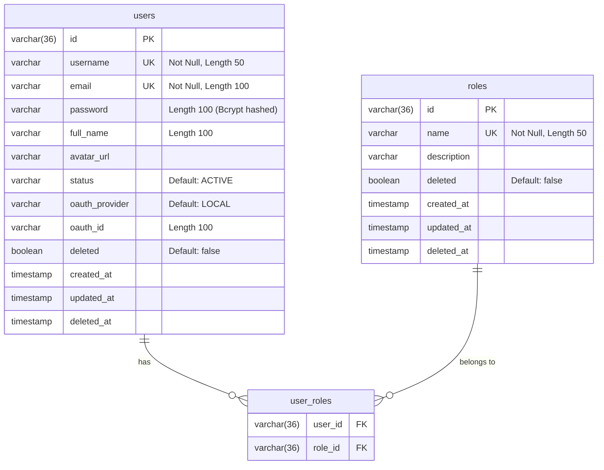
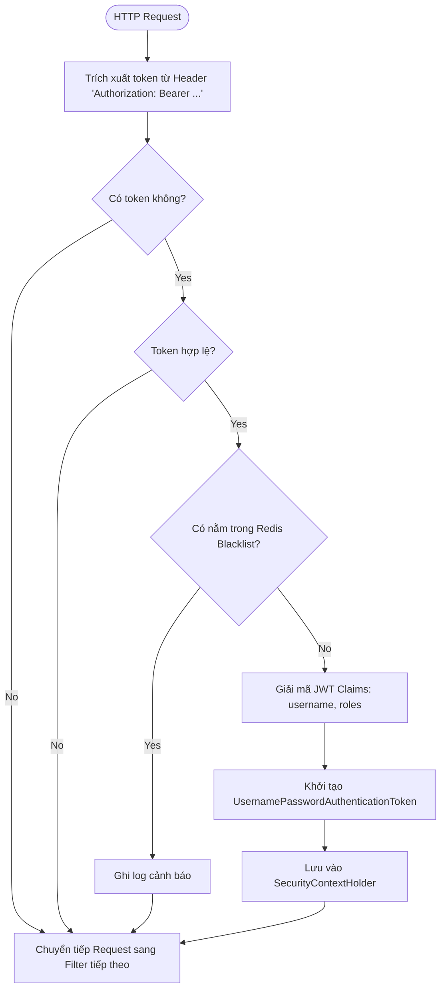
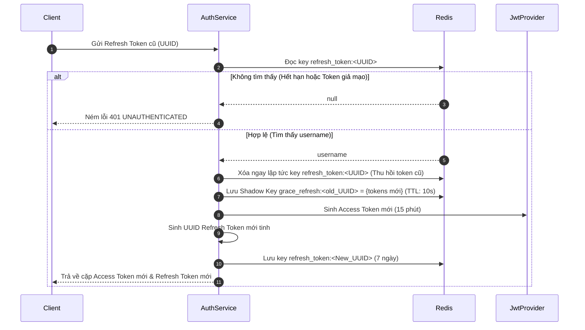
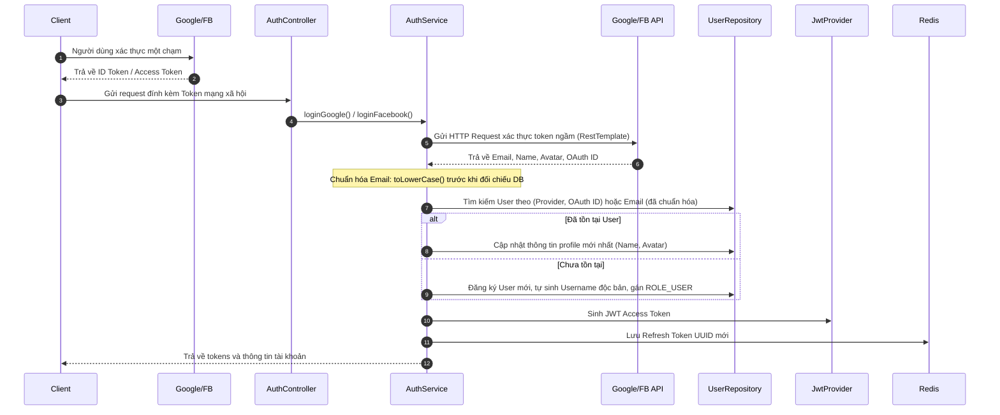
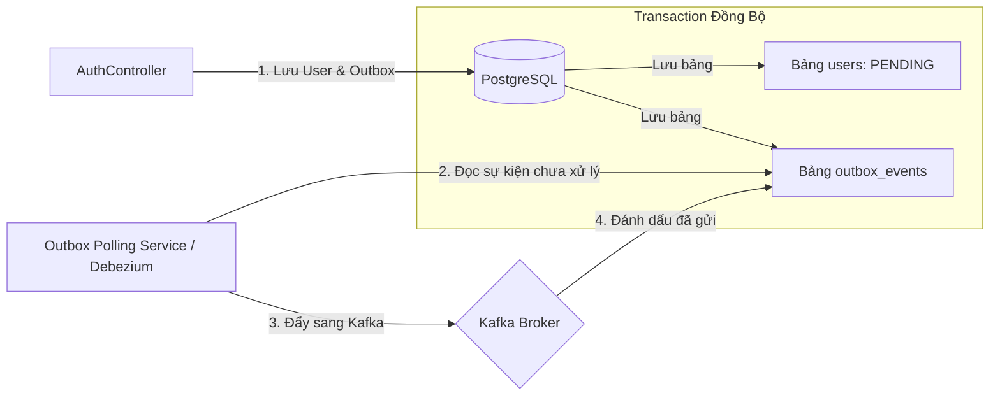

# 🛠️ Thiết kế Kỹ thuật - Phân hệ 1: Hệ thống Tài khoản & Định danh (IAM)

Tài liệu này đặc tả chi tiết kiến trúc kỹ thuật, thiết kế cơ sở dữ liệu, các luồng xử lý và đặc tả API của Phân hệ Tài khoản & Định danh (IAM) trong hệ thống **VibeCart**.

---

## 💾 1. Thiết kế Cơ sở Dữ liệu (Database Design)

Phân hệ sử dụng cơ sở dữ liệu quan hệ **PostgreSQL** để lưu trữ thông tin thực thể người dùng và phân quyền, kết hợp với **Redis** để quản lý trạng thái phiên đăng nhập (Stateless Session management).

### 1.1 Sơ đồ Thực thể (PostgreSQL Schema)



- **Soft Delete (Xóa mềm):** Cả hai thực thể `User` và `Role` đều cấu hình xóa mềm thông qua annotation `@SQLDelete` và bộ lọc `@SQLRestriction("deleted = false")` để đảm bảo an toàn dữ liệu và tối ưu hóa tính toàn vẹn tham chiếu.

### 1.2 Thiết kế Lưu trữ Redis Key-Value

Redis được sử dụng làm bộ lưu trữ hiệu năng cao phi trạng thái nhằm phục vụ các tính năng:

| Họa tiết Key (Redis Key Pattern) | Kiểu dữ liệu      | Giá trị lưu giữ (Value)                   | Thời gian sống (TTL)                   | Mục đích sử dụng                                                                                              |
| :------------------------------- | :---------------- | :---------------------------------------- | :------------------------------------- | :------------------------------------------------------------------------------------------------------------ |
| `refresh_token:<UUID>`           | `String`          | `username`                                | **7 ngày** (`Duration.ofDays(7)`)      | Duy trì phiên gia hạn Access Token, hỗ trợ xoay vòng token.                                                   |
| `blacklist_token:<JWT>`          | `String`          | `"true"`                                  | **Thời gian sống còn lại của JWT**     | Chặn đứng các token đã logout trước khi hết hạn tự nhiên.                                                     |
| `registration_otp:<email>`       | `String`          | `6-digit OTP code`                        | **5 phút** (`Duration.ofMinutes(5)`)   | Lưu trữ mã OTP ngẫu nhiên sinh bằng `SecureRandom` gửi qua email khách hàng.                                  |
| `otp_cooldown:<email>`           | `String`          | `"true"`                                  | **60 giây** (`Duration.ofSeconds(60)`) | Lưu trạng thái cooldown gửi lại mã, chặn spam API.                                                            |
| `otp_attempts:<email>`           | `String`          | `Bộ đếm (1-5)`                            | **5 phút** (bằng TTL của OTP)          | Đếm số lần nhập sai mã để chống tấn công brute-force dò mã.                                                   |
| `login_attempts:<username>`      | `String`          | `Bộ đếm (1-5)`                            | **15 phút** (`Duration.ofMinutes(15)`) | Đếm số lần đăng nhập sai mật khẩu liên tiếp để khóa tài khoản tạm thời.                                       |
| `user_sessions:<username>`       | `Set (Redis Set)` | `Danh sách Refresh Token UUIDs`           | **7 ngày** (bằng hạn Refresh Token)    | Theo dõi danh sách các phiên đăng nhập đang hoạt động để khống chế tối đa 3 phiên.                            |
| `password_reset_token:<UUID>`    | `String`          | `email`                                   | **10 phút** (`Duration.ofMinutes(10)`) | Lưu trữ token khôi phục mật khẩu bảo mật gửi qua email người dùng.                                            |
| `grace_refresh:<old_UUID>`       | `String`          | `JSON: {newAccessToken, newRefreshToken}` | **10 giây** (`Duration.ofSeconds(10)`) | Shadow Key lưu bản sao token cũ sau khi xoay vòng, chống đá phiên nhầm do race condition trên mạng chập chờn. |

---

## ⚙️ 2. Luồng xử lý Kỹ thuật (Technical Flows)

### 2.1 Luồng Xác thực JWT Filter (`JwtAuthenticationFilter`)

Mỗi HTTP request đi vào hệ thống (trừ các route public) đều được chặn lại bởi `JwtAuthenticationFilter` để kiểm tra danh tính bất đồng bộ.



---

### 2.2 Luồng Xoay vòng Token khi Gia hạn (`Token Rotation`)

Khi gia hạn Access Token, hệ thống áp dụng cơ chế **Token Rotation** nhằm triệt tiêu hoàn toàn nguy cơ rò rỉ Token:



> **⚠️ Cơ chế Ân hạn (Grace Period):** Khi token cũ vừa bị xoay vòng, hệ thống lưu một Shadow Key `grace_refresh:<old_UUID>` trên Redis với TTL **10 giây**. Trong 10 giây đó, nếu có request trùng lặp mang Refresh Token cũ (do race condition trên mạng chập chờn), hệ thống sẽ trả về cặp token mới đã sinh ở request đầu tiên thay vì kích hoạt Token Theft Detection.

---

### 2.3 Luồng Đăng nhập Mạng xã hội (OAuth2 Login Processor)

Hỗ trợ đồng bộ đăng nhập qua API của Google và Facebook:



> [!NOTE]
> **Quy tắc liên kết tài khoản (OAuth Account Linker):**
> 1. Nếu email khớp với một tài khoản cục bộ đã kích hoạt (`ACTIVE`), hệ thống tự động liên kết (link) thông tin nhà cung cấp OAuth2 vào tài khoản đó.
> 2. Nếu email khớp với một tài khoản chưa xác thực (`PENDING_VERIFICATION`), để tránh rủi ro bảo mật (như việc kẻ tấn công đăng ký trước email của người khác để chờ nạn nhân liên kết), hệ thống thực hiện **xóa cứng (Hard Delete)** tài khoản chưa xác thực đó cùng các OTP liên quan, sau đó tiến hành tạo mới tài khoản OAuth2 sạch ở trạng thái `ACTIVE`.

---

### 2.4 Cơ chế Bảo mật OTP nâng cao (Advanced OTP Security Mechanisms)

Nhằm đảm bảo hệ thống không bị lạm dụng hoặc bị hacker tấn công qua luồng OTP, backend áp dụng thuật toán xử lý chặt chẽ như sau:

#### A. Thuật toán kiểm soát Spam (Throttling / Cooldown Check)

Khi có yêu cầu phát sinh mã OTP mới (`/register` hoặc `/resend-otp`):

1.  Hệ thống kiểm tra sự tồn tại của key `otp_cooldown:<email>` trên Redis.
2.  Nếu **tồn tại** -> Ném ra lỗi `AppException(ErrorCode.OTP_COOLDOWN)` (HTTP 429 Too Many Requests).
3.  Nếu **không tồn tại** -> Cho phép đi tiếp:
    - Sinh mã OTP mới sử dụng `java.security.SecureRandom`.
    - Lưu key `registration_otp:<email>` với giá trị là mã OTP mới, TTL 5 phút.
    - Lưu key `otp_cooldown:<email>` với giá trị `"true"`, TTL 60 giây.
    - Phát event sang Kafka để gửi mail.

#### B. Thuật toán chống dò mã (Brute-Force Attack Mitigation)

Khi người dùng thực hiện xác thực mã OTP (`/verify-otp`):

1.  Hệ thống đọc bộ đếm từ key `otp_attempts:<email>` trên Redis.
2.  Nếu giá trị đếm **>= 5** -> Khóa tính năng, ném lỗi `AppException(ErrorCode.OTP_ATTEMPTS_EXCEEDED)` (HTTP 423 Locked), đồng thời xóa sạch key `registration_otp:<email>` để vô hiệu hóa mã cũ lập tức.
3.  Nếu giá trị đếm **< 5** -> Kiểm tra mã OTP gửi lên:
    - Nếu **mã chính xác** -> Tiến hành kích hoạt tài khoản, xóa key `registration_otp:<email>`, xóa key `otp_attempts:<email>`.
    - Nếu **mã sai** -> Tăng giá trị key `otp_attempts:<email>` lên 1 đơn vị bằng lệnh `redisTemplate.opsForValue().increment()`, ném ra lỗi `AppException(ErrorCode.INVALID_OTP)` (HTTP 400 Bad Request) kèm số lần thử còn lại cho người dùng.

---

### 2.5 Luồng Đăng nhập nâng cao & Quản lý Phiên (Advanced Login & Session Management)

Hệ thống hiện thực hóa các giải pháp bảo mật đăng nhập cấp doanh nghiệp lớn như sau:

#### A. Thuật toán khóa tài khoản tạm thời (Temporary Account Lockout)

Khi xử lý yêu cầu đăng nhập bằng Email/Password cục bộ:

1.  Hệ thống kiểm tra sự tồn tại của key `login_lockout:<username>` trên Redis.
2.  Nếu **tồn tại** -> Ném ra lỗi `AppException(ErrorCode.ACCOUNT_TEMPORARILY_LOCKED)` (HTTP 423 Locked) với thông điệp: _"Tài khoản tạm thời bị khóa do nhập sai nhiều lần. Vui lòng thử lại sau 15 phút"_.
3.  Nếu **không tồn tại** -> Tiến hành so khớp mật khẩu trong cơ sở dữ liệu:
    - Nếu **khớp mật khẩu** -> Xóa bộ đếm lỗi `login_attempts:<username>`, cho phép cấp token.
    - Nếu **sai mật khẩu** -> Tăng bộ đếm `login_attempts:<username>` lên 1 đơn vị.
      - Nếu bộ đếm đạt mốc **5** -> Tạo khóa `login_lockout:<username>` trên Redis với giá trị `"true"`, TTL 15 phút. Xóa key bộ đếm `login_attempts:<username>`. Ném lỗi khóa tài khoản.
      - Nếu bộ đếm dưới 5 -> Ném lỗi `AppException(ErrorCode.INVALID_CREDENTIALS)` (HTTP 400 Bad Request) kèm số lần thử còn lại.

#### B. Thuật toán kiểm soát phiên đồng thời (Concurrent Session Control)

Khi sinh phiên đăng nhập thành công (`generateAuthResponse`):

1.  Hệ thống sinh Refresh Token mới (`UUID.randomUUID().toString()`).
2.  Lấy danh sách các phiên đang hoạt động của người dùng từ Redis Set `user_sessions:<username>`.
3.  Nếu số lượng phiên **>= 3** (Giới hạn tối đa 3 thiết bị):
    - Lấy ra ID Refresh Token cũ nhất (được theo dõi qua Redis Set hoặc cấu trúc ZSET dựa trên thời gian tạo).
    - Xóa khóa `refresh_token:<Old_UUID>` trong Redis để vô hiệu hóa thiết bị đó ngay lập tức (Session Kick-out).
    - Xóa phần tử `Old_UUID` khỏi Set `user_sessions:<username>`.
4.  Thêm `New_UUID` mới sinh vào Set `user_sessions:<username>`.
5.  Lưu thông tin phiên mới `refresh_token:<New_UUID>` với TTL 7 ngày.

#### C. Thuật toán phát hiện tái sử dụng Token (Token Reuse / Theft Detection)

Khi người dùng gia hạn Access Token qua API `/refresh` bằng Refresh Token cũ:

1.  Hệ thống kiểm tra xem key `refresh_token:<oldRefreshToken>` có tồn tại trong Redis hay không.
2.  Nếu **không tìm thấy**:
    - **Bước 2a — Kiểm tra Grace Period:** Hệ thống kiểm tra xem Shadow Key `grace_refresh:<oldRefreshToken>` có tồn tại trong Redis hay không.
      - Nếu **tồn tại** (trong vòng 10 giây kể từ lần xoay vòng gần nhất) → Đây là request trùng lặp do race condition mạng (không phải tấn công). Hệ thống trả về cặp token mới đã sinh ở request đầu tiên (đọc từ Shadow Key) mà **không kích hoạt cơ chế trừng phạt**.
      - Nếu **không tồn tại** (Shadow Key đã hết hạn hoặc token chưa bao giờ hợp lệ) → Tiếp tục Bước 2b.
    - **Bước 2b — Phát hiện Token Theft:** Hệ thống kiểm tra xem token này đã từng tồn tại trong danh sách lịch sử hoặc cấu trúc giám sát token đã xoay vòng hay chưa.
      - Nếu phát hiện đây là Refresh Token **đã bị sử dụng** (hoặc bị thu hồi do đổi thiết bị/logout) → Nắm chắc nguy cơ **Token đã bị đánh cắp**.
      - **Biện pháp trừng phạt tức thì:** Backend quét và xóa sạch toàn bộ các key bắt đầu bằng `refresh_token:*` của người dùng đó trên Redis, đồng thời xóa Set `user_sessions:<username>`. Ép toàn bộ các phiên hoạt động trên mọi thiết bị của người dùng này phải đăng xuất ngay lập tức để yêu cầu nhập mật khẩu xác thực lại.
3.  Nếu **tìm thấy** → Xử lý xoay vòng token bình thường (Token Rotation): Xóa token cũ, sinh token mới, lưu Shadow Key `grace_refresh:<old_UUID>` với TTL 10 giây, cập nhật danh sách phiên.

---

## 🔌 3. Đặc tả API Phân hệ (API Specifications)

> **📌 Tham chiếu:** Toàn bộ đặc tả chi tiết API (Request/Response JSON, Error Codes, Validation Rules) đã được tách riêng vào file chuyên biệt:
>
> 👉 [01_identity_access_api.md](../api/01_identity_access_api.md)
>
> File trên bao gồm đầy đủ: 14 endpoints người dùng + 3 endpoints quản trị (Admin), bảng mã lỗi hệ thống, và cấu hình chung.

---

## 🔒 4. Thiết kế Kỹ thuật Luồng Validate Dữ liệu (Input Validation Technical Design)

Để hiện thực hóa các quy tắc kiểm tra nghiêm ngặt, hệ thống Spring Boot sử dụng thư viện **Jakarta Validation** để kiểm tra tự động trước khi request đi vào Service layer, kết hợp với các xử lý chuẩn hóa dữ liệu.

### 4.1 Đặc tả Class DTO Validation (`RegisterRequest.java`)

```java
package com.vibecart.api.modules.iam.dto.request;

import jakarta.validation.constraints.*;
import lombok.*;

@Getter
@Setter
@Builder
@NoArgsConstructor
@AllArgsConstructor
public class RegisterRequest {

    @NotBlank(message = "Username không được để trống")
    @Size(min = 5, max = 30, message = "Username phải từ 5 đến 30 ký tự")
    @Pattern(regexp = "^[a-zA-Z0-9._-]+$", message = "Username chỉ chứa chữ cái, số, dấu chấm, dấu gạch dưới hoặc gạch ngang")
    private String username;

    @NotBlank(message = "Email không được để trống")
    @Email(message = "Email không đúng định dạng chuẩn")
    @Size(max = 100, message = "Email không được vượt quá 100 ký tự")
    private String email;

    @NotBlank(message = "Mật khẩu không được để trống")
    @Size(min = 8, max = 100, message = "Mật khẩu phải từ 8 đến 100 ký tự")
    @Pattern(
        regexp = "^(?=.*[0-9])(?=.*[a-z])(?=.*[A-Z])(?=.*[@#$%^&+=!]).*$",
        message = "Mật khẩu phải chứa ít nhất 1 chữ hoa, 1 chữ thường, 1 chữ số và 1 ký tự đặc biệt"
    )
    private String password;

    @NotBlank(message = "Họ tên không được để trống")
    @Size(min = 2, max = 100, message = "Họ tên phải từ 2 đến 100 ký tự")
    @Pattern(regexp = "^[p{L} ]+$", message = "Họ tên chỉ được phép chứa chữ cái và khoảng trắng")
    private String fullName;
}
```

### 4.2 Giải pháp Chống Tấn công DDoS bằng Mật khẩu (Bcrypt CPU Exhaustion Protection)

- **Lỗ hổng (Vulnerability):** BCrypt là một thuật toán băm mật khẩu có độ phức tạp tính toán rất cao (hệ số Cost Factor). Nếu không giới hạn kích thước tối đa của trường `password` trong DTO, hacker có thể gửi một request đăng ký với mật khẩu là một chuỗi văn bản dài **10MB (hoặc 50MB)**. Khi Spring Security cố gắng băm (hash) chuỗi 50MB này bằng BCrypt, CPU của máy chủ sẽ bị vọt lên 100% trong nhiều phút để tính toán. Gửi đồng loạt 10 request như vậy sẽ làm tê liệt toàn bộ hệ thống ngay lập tức.
- **Giải pháp kỹ thuật:** Bắt buộc khai báo giới hạn cứng `@Size(max = 100)` đối với trường `password` trong DTO đầu vào. Do BCrypt thực tế chỉ băm tối đa 72 bytes đầu tiên của chuỗi, giới hạn 100 ký tự hoàn toàn không làm giảm độ an toàn bảo mật mật khẩu mà giúp loại bỏ triệt để nguy cơ tấn công từ chối dịch vụ (DDoS) CPU của Backend.

### 4.3 Chuẩn hóa & Bộ lọc Domain Email (Data Normalization & Blocklist)

1.  **Chuẩn hóa Email (Case Normalization):**
    Để tránh việc đăng ký trùng lặp (ví dụ: `Nam@gmail.com` và `nam@gmail.com` là một email nhưng Postgres coi là 2 chuỗi khác nhau), tại tầng Service (`AuthServiceImpl`), trường `email` bắt buộc phải được chuyển thành chữ thường:
    ```java
    String normalizedEmail = request.getEmail().trim().toLowerCase();
    ```
2.  **Bộ lọc Disposable Domain (Chặn Email Rác):**
    Trước khi kiểm tra trùng lặp DB, hệ thống đối sánh domain của email với một Blocklist lưu trong bộ nhớ đệm:
    ```java
    private static final Set<String> DISPOSABLE_DOMAINS = Set.of(
        "tempmail.com", "10minutemail.com", "yopmail.com", "mailinator.com"
    );

    public void validateEmailDomain(String email) {
        String domain = email.substring(email.indexOf("@") + 1);
        if (DISPOSABLE_DOMAINS.contains(domain)) {
            throw new AppException(ErrorCode.DISPOSABLE_EMAIL_NOT_ALLOWED);
        }
    }
    ```

### 4.4 Phân quyền mức Method (Method-Level Security Design)

Để bảo vệ các endpoints nhạy cảm của Admin hoặc các Creators, hệ thống áp dụng cơ chế phân quyền ở mức phương thức (Method-level security):

*   **Cấu hình kích hoạt:** Định nghĩa `@EnableMethodSecurity` trong `SecurityConfig.java`.
*   **Sử dụng trong Controller:** Dùng annotation `@PreAuthorize` để kiểm tra danh sách quyền hạn (Authorities) trích xuất từ JWT token của request hiện tại trước khi thực thi method:

    ```java
    @RestController
    @RequestMapping("/api/v1/admin/users")
    @RequiredArgsConstructor
    public class AdminUserController {

        private final AdminUserService adminUserService;

        @PutMapping("/{id}/status")
        @PreAuthorize("hasRole('ADMIN')")
        public ResponseEntity<ApiResponse<UserResponse>> changeStatus(
                @PathVariable String id,
                @RequestBody UpdateUserStatusRequest request) {
            // Chỉ tài khoản có Authority 'ROLE_ADMIN' mới đi qua được bộ lọc này
            ...
        }
    }
    ```

---


## 🛡️ 5. Lưu vết & Độ tin cậy Sự kiện (Auditing & Reliable Event Publishing)

Để vận hành an toàn và đảm bảo tính toàn vẹn dữ liệu ở mức tối đa như các công ty lớn, VibeCart thiết kế hệ thống giám sát và đảm bảo đồng bộ trạng thái dữ liệu (Consistency) giữa Database và Kafka.

### 5.1 Cơ chế Tự động Lưu vết Thực thể (JPA Auditing via AuditorAware)

Hệ thống lưu vết tự động thời gian tạo, thời gian sửa và người thực hiện đối với thực thể `User` thông qua cơ chế **JPA Auditing** và lớp `SpringSecurityAuditorAware`:

*   **Nguyên lý hoạt động:** Lớp `User` kế thừa `@MappedSuperclass BaseEntity` có chứa các trường:
    *   `@CreationTimestamp created_at`
    *   `@UpdateTimestamp updated_at`
    *   `@CreatedBy created_by`
    *   `@LastModifiedBy updated_by`
*   **Đặc tả Class `SpringSecurityAuditorAware.java`:**

    ```java
    package com.vibecart.api.common.security;

    import org.springframework.data.domain.AuditorAware;
    import org.springframework.security.core.Authentication;
    import org.springframework.security.core.context.SecurityContextHolder;
    import org.springframework.stereotype.Component;
    import java.util.Optional;

    @Component
    public class SpringSecurityAuditorAware implements AuditorAware<String> {
        @Override
        public Optional<String> getCurrentAuditor() {
            Authentication authentication = SecurityContextHolder.getContext().getAuthentication();
            if (authentication == null || !authentication.isAuthenticated()
                || "anonymousUser".equals(authentication.getPrincipal())) {
                return Optional.of("SYSTEM"); // Ghi nhận tự động đăng ký mới bởi hệ thống
            }
            return Optional.of(authentication.getName());
        }
    }
    ```

### 5.2 Độ tin cậy dữ liệu giữa Database và Kafka (Event Consistency Design)

*   **Bài toán rủi ro (Data Inconsistency):**
    Khi đăng ký, chúng ta ghi nhận đồng thời xuống PostgreSQL và bắn tin nhắn `UserRegisteredEvent` sang Kafka. Nếu Database ghi thành công nhưng Kafka bị lỗi mạng/down -> Transaction bị rollback -> Người dùng báo lỗi nhưng đã mất công. Ngược lại, nếu Kafka bắn thành công nhưng DB bị rollback -> Người dùng nhận được email OTP nhưng không có tài khoản trên hệ thống.
*   **Thiết kế giải pháp chuyên nghiệp (Transactional Outbox Pattern):**
    Để triệt tiêu hoàn toàn bất đồng nhất dữ liệu và tránh việc chặn luồng Database vì kết nối mạng Kafka chậm, chúng ta thiết kế giải pháp **Outbox Pattern**:



    *   *Chi tiết:* Sự kiện đăng ký không được gửi trực tiếp sang Kafka trong `AuthServiceImpl`. Thay vào đó, nó được ghi vào bảng `outbox_events` trong cùng transaction của PostgreSQL. Một luồng chạy nền (Scheduler hoặc Debezium CDC) quét bảng này để đẩy sang Kafka một cách bất đồng bộ. Đảm bảo dữ liệu chỉ được gửi đi khi và chỉ khi PostgreSQL đã ghi nhận thành công (At-Least-Once Delivery).

### 5.3 Thiết kế Quy trình Xóa vĩnh viễn & Ẩn danh hóa (Hard Deletion & Anonymization Pipeline)

Khi tài khoản ở trạng thái `PENDING_DELETION` vượt quá mốc **30 ngày**, hệ thống tự động kích hoạt luồng làm sạch dữ liệu bất đồng bộ qua **Kafka**:

#### A. Scheduler chạy ngầm phát hiện tài khoản hết hạn chờ:

Một CronJob chạy ngầm quét PostgreSQL mỗi ngày vào lúc 3h sáng để tìm ra các tài khoản hết hạn:

```java
@Scheduled(cron = "0 0 3 * * ?")
@Transactional
public void processExpiredAccountDeletions() {
    List<User> expiredUsers = userRepository.findAllExpiredDeletions(LocalDateTime.now().minusDays(30));
    for (User user : expiredUsers) {
        // Ghi nhận Outbox Event để đảm bảo tin cậy trước khi đẩy sang Kafka
        outboxService.saveEvent(new UserHardDeleteEvent(user.getId()));
    }
}
```

#### B. Quy trình xử lý Kafka Consumer tại các Phân hệ:

1.  **Dịch vụ IAM (Phân hệ 1):** Thực thi câu lệnh `UPDATE` ẩn danh hóa thông tin cá nhân (PII) trong PostgreSQL để giữ tính toàn vẹn khóa ngoại của lịch sử hóa đơn mua sắm:

    ```sql
    UPDATE users
    SET
        username = CONCAT('deleted_user_', id),
        email = CONCAT('deleted_', id, '@vibecart.com'),
        password = NULL,
        full_name = 'Người dùng đã xóa',
        avatar_url = NULL,
        status = 'DELETED',
        oauth_id = NULL,
        oauth_provider = NULL,
        updated_at = CURRENT_TIMESTAMP
    WHERE id = :userId;
    ```

2.  **Dịch vụ Lưu trữ (Storage Module - Phân hệ 8):**
    Lắng nghe event để gọi API xóa tệp tin vật lý của Avatar cũ lưu trữ trên S3:

    ```java
    @KafkaListener(topics = "user-hard-delete-topic")
    public void handleUserDelete(UserHardDeleteEvent event) {
        String avatarKey = storageService.getAvatarKeyByUserId(event.getUserId());
        if (avatarKey != null) {
            amazonS3.deleteObject(bucketName, avatarKey); // Giải phóng dung lượng S3 vật lý
        }
    }
    ```

3.  **Dịch vụ Search (Elasticsearch - Phân hệ 6):**
    Xóa bỏ hoàn toàn chỉ mục hồ sơ người dùng khỏi cụm Elasticsearch:

    ```java
    elasticsearchTemplate.delete(String.valueOf(event.getUserId()), UserIndex.class);
    ```

4.  **Dịch vụ Chat (MongoDB - Phân hệ 5):**
    Ẩn danh hóa thông tin người gửi trong các hội thoại chat lịch sử tại MongoDB:

    ```java
    mongoTemplate.updateMulti(
        Query.query(Criteria.where("senderId").is(event.getUserId())),
        new Update().set("senderName", "Người dùng đã xóa"),
        ChatMessage.class
    );
    ```
