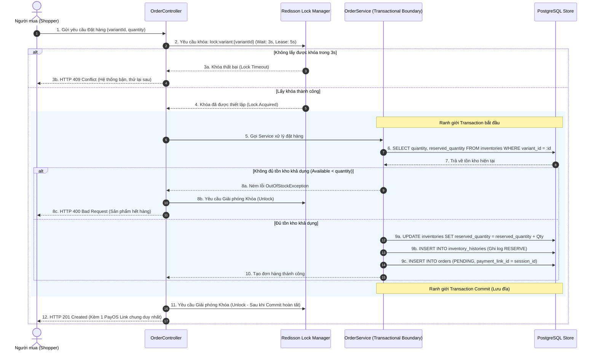

# 🛠️ Thiết kế Kỹ thuật - Phân hệ 2: Cốt lõi Thương mại Điện tử (E-Commerce Core)

Tài liệu này đặc tả chi tiết kiến trúc kỹ thuật, thiết kế cơ sở dữ liệu, mô hình lưu trữ Redis Cache, cơ chế xử lý đồng thời chống overselling, State Machine của đơn hàng và luồng tích hợp cổng thanh toán PayOS thuộc Phân hệ E-Commerce Core theo mô hình **Thu hộ Tập trung (Centralized Escrow Model)**.

---

## 💾 1. Thiết kế Cơ sở Dữ liệu (Database Design)

### 1.1 Sơ đồ Thực thể Phân rã SPU, SKU & Đơn hàng (PostgreSQL Schema)

```mermaid
erDiagram
    categories {
        varchar(36) id PK
        varchar(100) name "Not Null"
        varchar(120) slug "Unique, Not Null"
        varchar(36) parent_id FK "Self-referencing for Hierarchical Tree"
        integer sort_order "Default: 0"
        boolean deleted "Default: false"
    }
    products {
        varchar(36) id PK "SPU ID"
        varchar(255) name "Not Null"
        text description
        varchar(36) category_id FK "Not Null"
        varchar(36) creator_id FK "Not Null"
        varchar(20) status "Default: ACTIVE"
        boolean deleted "Default: false"
        timestamp deleted_at
        timestamp created_at
        timestamp updated_at
    }
    product_images {
        varchar(36) id PK
        varchar(36) product_id FK "Not Null"
        varchar(500) image_url "Not Null"
        boolean is_thumbnail "Default: false"
        integer sort_order "Default: 0"
    }
    product_variants {
        varchar(36) id PK "SKU ID"
        varchar(36) product_id FK "Not Null (SPU link)"
        varchar(50) sku_code UK "Not Null"
        varchar(255) variant_name "Not Null"
        decimal price "Precision 12, Scale 2, Not Null"
        decimal discount_price "Precision 12, Scale 2, Default: 0"
        varchar(20) status "Default: ACTIVE"
        boolean deleted "Default: false"
    }
    inventories {
        varchar(36) id PK
        varchar(36) variant_id FK UK "Not Null (SKU link)"
        integer quantity "Default: 0, Not Null"
        integer reserved_quantity "Default: 0, Not Null"
        boolean deleted "Default: false"
    }
    inventory_histories {
        varchar(36) id PK
        varchar(36) inventory_id FK "Not Null"
        varchar(20) transaction_type "IMPORT, EXPORT, RESERVE, COMMIT, RELEASE, REFUND, ADJUST"
        integer quantity_changed "Not Null"
        varchar(500) reason
        varchar(36) created_by "Creator ID, SYSTEM, or Admin ID"
        timestamp created_at
    }
    orders {
        varchar(36) id PK
        varchar(50) order_code UK "Not Null"
        varchar(36) user_id "Not Null"
        varchar(36) creator_id "Not Null (ROLE_CREATOR link)"
        decimal total_amount "Precision 12, Scale 2, Not Null"
        decimal discount_amount "Precision 12, Scale 2, Default: 0"
        decimal final_amount "Precision 12, Scale 2, Not Null"
        varchar(30) status "Not Null"
        varchar(255) payment_link_id "Stores Aggregated checkoutSessionId"
        varchar(100) tracking_number
        text shipping_address "Not Null"
        varchar(255) customer_note
        boolean deleted "Default: false"
        timestamp created_at
        timestamp updated_at
    }
    order_items {
        varchar(36) id PK
        varchar(36) order_id FK "Not Null"
        varchar(36) variant_id FK "Not Null"
        varchar(255) product_name "Not Null"
        varchar(255) variant_name "Not Null"
        integer quantity "Not Null"
        decimal price "Precision 12, Scale 2, Not Null"
        decimal discount_price "Precision 12, Scale 2, Default: 0"
    }

    categories ||--o{ categories : "parent-child (1-to-Many)"
    categories ||--o{ products : "contains"
    products ||--o{ product_images : "has album"
    products ||--o{ product_variants : "has variants"
    product_variants ||--|| inventories : "has (One-To-One)"
    inventories ||--o{ inventory_histories : "logs"
    orders ||--o{ order_items : "contains"
    product_variants ||--o{ order_items : "ordered-in"
```

### 1.2 DDL Cập nhật Đơn hàng (DDL SQL Store)
```sql
CREATE TABLE orders (
    id VARCHAR(36) PRIMARY KEY,
    order_code VARCHAR(50) UNIQUE NOT NULL,
    user_id VARCHAR(36) NOT NULL REFERENCES users(id),
    creator_id VARCHAR(36) NOT NULL REFERENCES users(id), -- Liên kết đến User sở hữu vai trò CREATOR
    recipient_name VARCHAR(100) NOT NULL,
    recipient_phone VARCHAR(20) NOT NULL,
    shipping_address TEXT NOT NULL,
    customer_note VARCHAR(255),
    total_amount DECIMAL(12,2) NOT NULL,
    discount_amount DECIMAL(12,2) DEFAULT 0.00,
    final_amount DECIMAL(12,2) NOT NULL,
    status VARCHAR(30) NOT NULL DEFAULT 'PENDING', -- PENDING, PAID, CANCELLED, SHIPPED, DELIVERED
    payment_link_id VARCHAR(255), -- Lưu checkoutSessionId số dùng làm orderCode gửi sang PayOS
    tracking_number VARCHAR(100),
    deleted BOOLEAN DEFAULT FALSE NOT NULL,
    deleted_at TIMESTAMP WITH TIME ZONE,
    created_at TIMESTAMP WITH TIME ZONE DEFAULT CURRENT_TIMESTAMP,
    updated_at TIMESTAMP WITH TIME ZONE DEFAULT CURRENT_TIMESTAMP,
    created_by VARCHAR(50) DEFAULT 'system',
    updated_by VARCHAR(50) DEFAULT 'system'
);

CREATE TABLE order_items (
    id VARCHAR(36) PRIMARY KEY,
    order_id VARCHAR(36) NOT NULL REFERENCES orders(id) ON DELETE CASCADE,
    variant_id VARCHAR(36) NOT NULL REFERENCES product_variants(id),
    product_name VARCHAR(255) NOT NULL,
    variant_name VARCHAR(255) NOT NULL,
    quantity INTEGER NOT NULL,
    price DECIMAL(12,2) NOT NULL,
    discount_price DECIMAL(12,2) DEFAULT 0.00
);

-- Index phục vụ tra cứu nhanh đơn hàng theo User & Trạng thái & Link thanh toán
CREATE INDEX idx_orders_user ON orders(user_id);
CREATE INDEX idx_orders_creator ON orders(creator_id);
CREATE INDEX idx_orders_status ON orders(status);
CREATE INDEX idx_orders_code ON orders(order_code);
CREATE INDEX idx_orders_payment_link ON orders(payment_link_id);
```

---

## 💾 2. Thiết kế Bộ nhớ đệm Giỏ hàng (Redis Cart Cache Design)

Để giảm thiểu gánh nặng I/O lên PostgreSQL và mang lại tốc độ phản hồi siêu tốc (<10ms) cho các hành động thay đổi giỏ hàng liên tục, hệ thống lưu trữ Giỏ hàng cá nhân trực tiếp trên **Redis Cache**.

### 2.1 Cấu trúc Lưu trữ (Redis Hash Data Structure)
Mỗi User có một Key riêng dạng Hash trên Redis:
*   **Redis Key:** `cart:{userId}`
*   **Data Type:** `Hash`
*   **Hash Field:** `variantId` (Mã ID biến thể SKU, ví dụ: `"3001"`)
*   **Hash Value:** `quantity` (Số lượng dạng chuỗi số nguyên phẳng, ví dụ: `"2"`)
*   **Time-To-Live (TTL):** **30 ngày** (`2592000` giây). Mỗi khi người dùng thực hiện thêm, sửa hoặc xóa sản phẩm khỏi giỏ hàng, lệnh `EXPIRE cart:{userId} 2592000` được gọi lại để gia hạn thời gian lưu trữ.

> [!NOTE]
> **Quy tắc Xóa Giỏ hàng (Logic tối ưu UX):**
> Để tránh gây mất mát dữ liệu giỏ hàng khi giao dịch thanh toán bị gián đoạn, **hệ thống tuyệt đối không xóa sản phẩm khỏi giỏ hàng khi đơn hàng vừa được tạo ở trạng thái `PENDING`**.
> Thay vào đó, giỏ hàng vẫn giữ nguyên các mặt hàng. Chỉ khi Webhook của PayOS xác nhận giao dịch thành công và đơn hàng chuyển sang trạng thái **`PAID`**, hệ thống mới quét sạch các mặt hàng tương ứng khỏi giỏ hàng trên Redis.

### 2.2 Các Lệnh Tương tác Redis Cốt lõi
*   **Thêm/Cập nhật sản phẩm:** 
    `HSET cart:user_01 variant_501 "2"`
*   **Lấy toàn bộ sản phẩm trong giỏ:**
    `HGETALL cart:user_01`
*   **Xóa một biến thể khỏi giỏ:**
    `HDEL cart:user_01 variant_501`
*   **Xóa sạch giỏ hàng (Sau khi đặt đơn thành công):**
    `DEL cart:user_01`

---

## 🔒 3. Cơ chế Khóa đồng thời tránh Bán âm kho (Place Order Concurrency Control)

Bài toán tranh chấp hàng tồn kho khi hàng ngàn người mua đồng loạt đặt mua một sản phẩm giới hạn (Flash Sale) đòi hỏi giải pháp khóa hiệu quả nhằm triệt tiêu hoàn toàn lỗi **Overselling (Bán âm kho)**.

### 3.1 So sánh 2 Phương án Locking

| Tiêu chí | Phương án 1: PostgreSQL Pessimistic Lock | Phương án 2: Redis Distributed Lock (Redisson) (Được đề xuất) |
| :--- | :--- | :--- |
| **Cơ chế** | Sử dụng câu lệnh `SELECT ... FOR UPDATE` khóa trực tiếp các dòng tồn kho trong DB. | Sử dụng Redis khóa ở tầng bộ nhớ trước khi giao tiếp với PostgreSQL. |
| **Ưu điểm** | • Rất đơn giản để triển khai.<br>• An toàn tuyệt đối dựa trên ACID của cơ sở dữ liệu. | • Tải trọng cực nhẹ lên PostgreSQL DB.<br>• Tốc độ phản hồi cực nhanh (Sub-millisecond).<br>• Rất phù hợp với lượng Traffic khổng lồ (Flash Sale). |
| **Nhược điểm**| • Giữ kết nối DB Connection quá lâu.<br>• Dễ gây nghẽn cổ chai (Connection Pool Exhaustion) when has large traffic. | • Yêu cầu hạ tầng Redis Cluster.<br>• Phức tạp trong việc quản lý phát hành khóa an toàn (Tránh deadlock). |

---

### 3.2 Sơ đồ Tuần tự Luồng Khóa Phân tán Redisson (Sequence Diagram)

> [!CAUTION]
> **Cạm bẫy Giao dịch (Transactional Lock Trap):** 
> Trong Spring Boot, nếu đặt khóa bên trong một method `@Transactional`, khóa Redisson có thể bị giải phóng **trước** khi PostgreSQL thực sự Commit dữ liệu xuống đĩa cứng. Lúc này, luồng thứ hai sẽ vào và đọc phải dữ liệu tồn kho cũ chưa commit, dẫn đến lỗi bán âm kho.
> **Giải pháp:** Khóa Redisson bắt buộc phải được bao bọc **bên ngoài** ranh giới Transaction (ngoài tầng Service, được gọi qua TransactionTemplate hoặc bọc ở tầng trên).



### 3.3 Thuật toán Phòng chống Deadlock khi Đặt nhiều Sản phẩm (Multi-Item Deadlock Prevention)

Khi Shopper đặt đơn hàng chứa nhiều biến thể SKU khác nhau (Multi-Item Checkout), hệ thống sẽ phải thực hiện khóa đồng thời trên nhiều tài nguyên kho. Nếu hai tiến trình đồng thời yêu cầu các khóa giống nhau nhưng theo thứ tự khác nhau, **Deadlock (Bế tắc)** chắc chắn sẽ xảy ra.

*Ví dụ:* 
*   Khách hàng 1 mua SKU A và SKU B $\rightarrow$ Yêu cầu Khóa A, rồi Khóa B.
*   Khách hàng 2 mua SKU B và SKU A $\rightarrow$ Yêu cầu Khóa B, rồi Khóa A.
*   Nếu cả hai thực hiện cùng lúc: Khách 1 giữ Khóa A chờ Khóa B; Khách 2 giữ Khóa B chờ Khóa A $\rightarrow$ Hệ thống bị treo hoàn toàn!

#### Thuật toán Giải quyết Deadlock:
Để phòng chống Deadlock hoàn toàn, VibeCart áp dụng giải pháp **Sắp xếp tài nguyên (Resource Ordering)** trước khi xin khóa:
1.  **Duyệt danh sách:** Lấy tất cả các `variantId` duy nhất từ giỏ hàng được chọn mua.
2.  **Sắp xếp:** Sắp xếp danh sách `variantId` theo thứ tự bảng chữ cái tăng dần.
3.  **Xin khóa tuần tự:** Thực hiện xin khóa theo đúng thứ tự đã sắp xếp. Do mọi luồng đều xin khóa theo cùng một quy trình sắp xếp tăng dần, deadlock bị triệt tiêu hoàn toàn.

---

## 🔌 4. Tích hợp Cổng thanh toán PayOS & Webhook Idempotency

### 4.1 Quy trình Tạo và Xác thực Webhook PayOS (Mô hình Thu hộ Tập trung)
Để tối ưu hóa UX đạt tỷ lệ chuyển đổi tối đa, VibeCart sử dụng **Mô hình Thu hộ Tập trung (Platform Centralized Escrow)**. Khi khách đặt mua giỏ hàng chứa sản phẩm của nhiều Creator:
1. Hệ thống tự động phân tách giỏ hàng thành nhiều **Đơn hàng con (Sub-orders)** trong cơ sở dữ liệu.
2. Tất cả các đơn hàng con này được gán chung một mã **`payment_link_id`** chính là mã phiên thanh toán số phẳng (`checkoutSessionId` có dạng số nguyên, ví dụ: `178041638239065`).
3. Hệ thống tính tổng tiền phải thanh toán của toàn bộ giỏ hàng và chỉ tạo **1 Link thanh toán PayOS duy nhất** đại diện cho cả phiên giao dịch.
4. Khi khách chuyển khoản thành công, PayOS bắn Webhook trả về mã `orderCode` chính là `checkoutSessionId`.

#### Luồng xử lý Webhook an toàn:
1.  **Nhận Webhook:** Endpoint `/api/v1/payments/payos/webhook`.
2.  **Xác thực Chữ ký (Signature Validation):**
    *   **Thuật toán của PayOS:** Sắp xếp tất cả các khóa (keys) của đối tượng data nhận được theo thứ tự bảng chữ cái. Ghép các cặp `key=value` nối với nhau bằng ký tự `&`.
    *   **Mã hóa:** Sử dụng khóa bí mật **Checksum Key** để băm chuỗi này bằng **HMAC-SHA256** tạo ra chữ ký số. Đối chiếu chữ ký, nếu sai lệch từ chối xử lý ngay.
3.  **Xử lý Trùng lặp (Webhook Idempotency) & Cập nhật Trạng thái gộp:**
    *   **Tầng 1 (Tầng Cache):** Chặn xử lý trùng lặp bằng Redis key: `payment:webhook:processed:{checkoutSessionId}` với TTL **5 phút** qua lệnh `SETNX`.
    *   **Tầng 2 (Tầng Database):**
        *   Truy vấn đồng loạt toàn bộ các đơn hàng con có `payment_link_id = checkoutSessionId` bằng câu lệnh eager loading:
            ```sql
            SELECT DISTINCT o FROM Order o LEFT JOIN FETCH o.items WHERE o.paymentLinkId = :checkoutSessionId;
            ```
        *   Nếu không tìm thấy theo `payment_link_id`, hệ thống sẽ tự động chuyển sang chế độ fallback tìm kiếm đơn lẻ theo `order_code` trực tiếp để tương thích ngược.
        *   Duyệt qua từng đơn hàng con, kiểm tra nếu trạng thái chưa là `PAID` $\rightarrow$ Cập nhật trạng thái atomically `PENDING` $\rightarrow$ `PAID`, commit tồn kho vật lý và bắn event `ORDER_PAID` sang Kafka.
4.  **Xóa Giỏ hàng thông minh:** Sau khi cập nhật thành công tất cả các đơn hàng con sang `PAID`, hệ thống thu thập toàn bộ các `variantId` đã mua của phiên giao dịch và thực hiện xóa một lần duy nhất khỏi giỏ hàng Redis của Shopper.

---

> [!NOTE]
> **Đặc tả API chi tiết** (Endpoints, Request/Response Payloads, Error Codes) được tách riêng theo chuẩn tài liệu dự án tại: **[`docs/api/02_ecommerce_api.md`](../api/02_ecommerce_api.md)**
