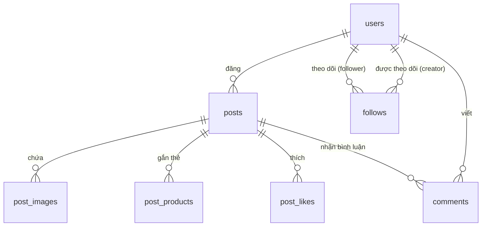
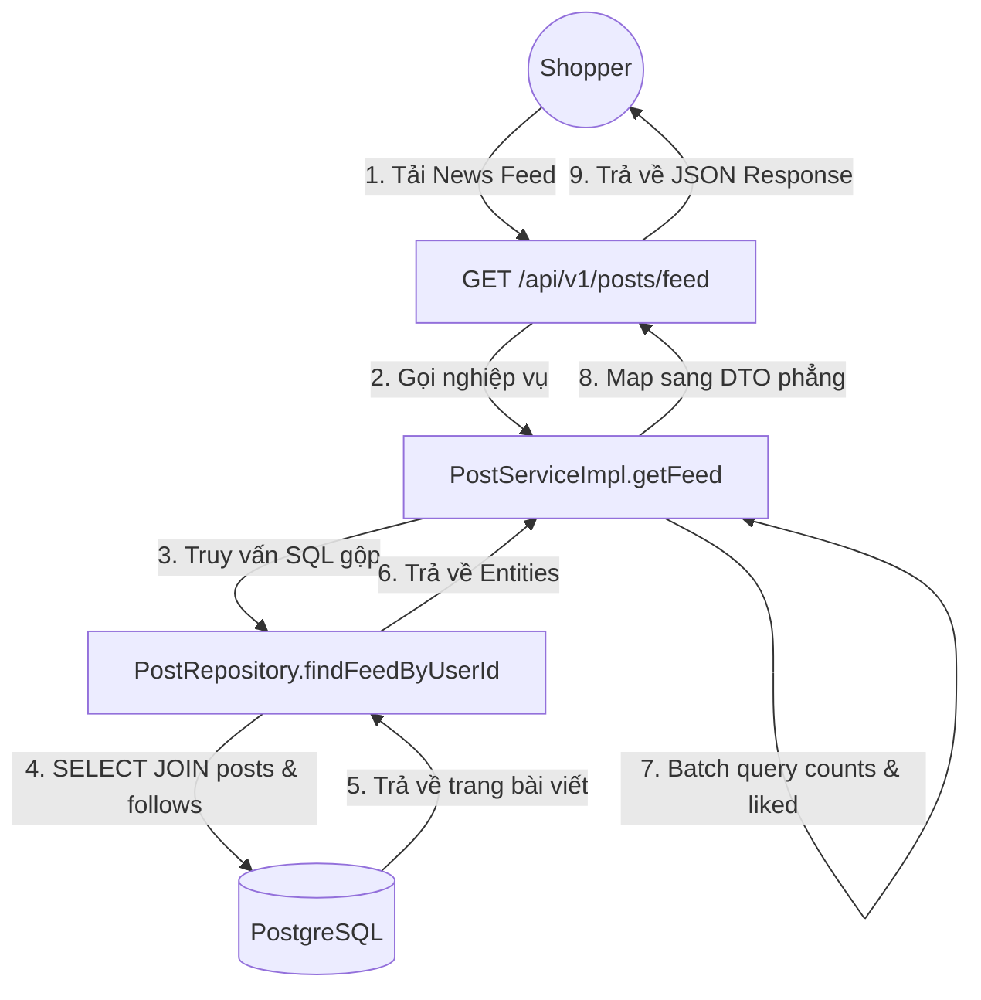
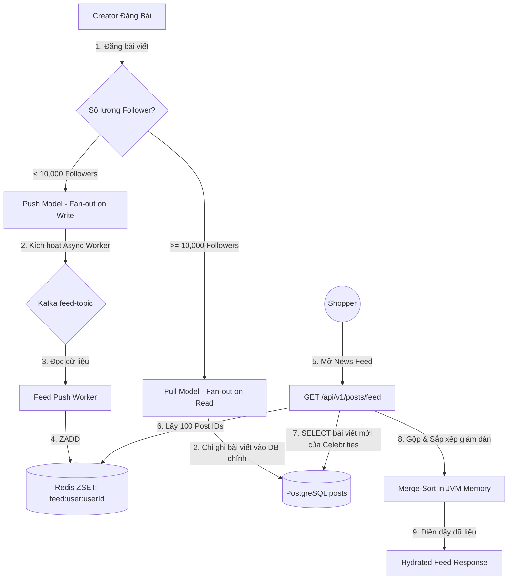
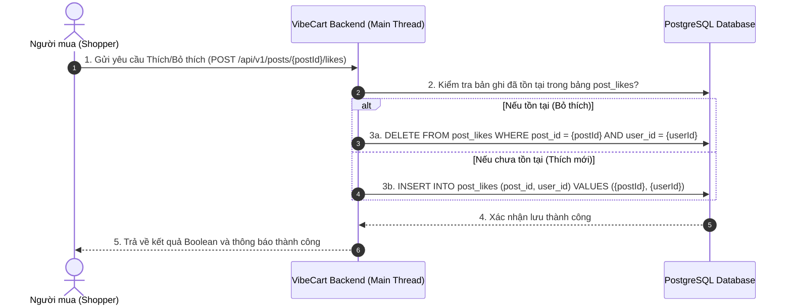
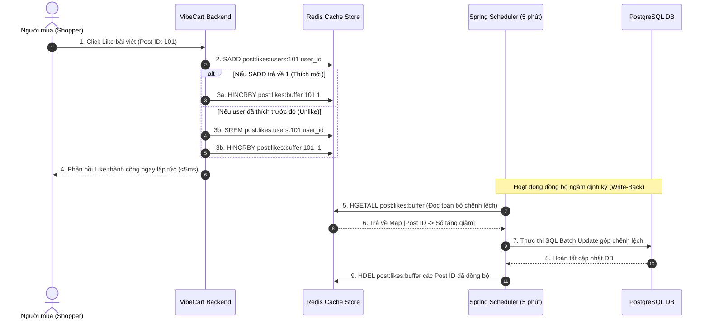

# 🛠️ Thiết kế Kỹ thuật - Phân hệ 3: Mạng xã hội thu nhỏ (Social Mini-Network)

Tài liệu này đặc tả chi tiết kiến trúc kỹ thuật của Phân hệ Mạng xã hội thu nhỏ: Thiết kế cơ sở dữ liệu quan hệ PostgreSQL, thuật toán lan tỏa bảng tin lai (Hybrid Fan-out), cơ chế bộ đệm ghi ngược (Write-Back Cache) cho lượt thích, giải pháp truy vấn bình luận đa cấp lồng nhau (Materialized Path) và đặc tả các REST API.

---

## 💾 1. Thiết kế Cơ sở Dữ liệu Quan hệ (PostgreSQL ERD & DDL)

Hệ thống mạng xã hội VibeCart được xây dựng dựa trên cơ sở dữ liệu quan hệ PostgreSQL để đảm bảo tính toàn vẹn dữ liệu, các ràng buộc khóa ngoại chặt chẽ và khả năng truy vấn tối ưu.



### 1.1 DDL Khởi tạo các Bảng trong PostgreSQL
```sql
-- 1. Bảng Bài viết (Posts)
CREATE TABLE posts (
    id VARCHAR(36) PRIMARY KEY,
    creator_id VARCHAR(36) NOT NULL REFERENCES users(id),
    content TEXT NOT NULL,
    media_urls TEXT, -- Danh sách các đường dẫn ảnh phân tách bằng dấu phẩy
    created_at TIMESTAMP WITH TIME ZONE DEFAULT CURRENT_TIMESTAMP,
    updated_at TIMESTAMP WITH TIME ZONE DEFAULT CURRENT_TIMESTAMP,
    created_by VARCHAR(50) DEFAULT 'system',
    updated_by VARCHAR(50) DEFAULT 'system',
    deleted BOOLEAN DEFAULT FALSE NOT NULL,
    deleted_at TIMESTAMP WITH TIME ZONE
);

CREATE INDEX idx_posts_creator ON posts(creator_id);
CREATE INDEX idx_posts_created_at ON posts(created_at DESC);

-- 2. Bảng Gắn thẻ sản phẩm (Post Products Tagging)
CREATE TABLE post_products (
    post_id VARCHAR(36) NOT NULL REFERENCES posts(id) ON DELETE CASCADE,
    product_id VARCHAR(36) NOT NULL REFERENCES products(id) ON DELETE CASCADE,
    PRIMARY KEY (post_id, product_id)
);

-- 3. Bảng Lượt thích bài viết (Post Likes)
CREATE TABLE post_likes (
    post_id VARCHAR(36) NOT NULL REFERENCES posts(id) ON DELETE CASCADE,
    user_id VARCHAR(36) NOT NULL REFERENCES users(id) ON DELETE CASCADE,
    created_at TIMESTAMP WITH TIME ZONE DEFAULT CURRENT_TIMESTAMP,
    PRIMARY KEY (post_id, user_id)
);

-- 4. Bảng Bình luận (Post Comments)
CREATE TABLE post_comments (
    id VARCHAR(36) PRIMARY KEY,
    post_id VARCHAR(36) NOT NULL REFERENCES posts(id) ON DELETE CASCADE,
    user_id VARCHAR(36) NOT NULL REFERENCES users(id),
    parent_id VARCHAR(36) REFERENCES post_comments(id) ON DELETE CASCADE, -- Hỗ trợ bình luận lồng cấp tự tham chiếu
    content TEXT NOT NULL,
    created_at TIMESTAMP WITH TIME ZONE DEFAULT CURRENT_TIMESTAMP,
    updated_at TIMESTAMP WITH TIME ZONE DEFAULT CURRENT_TIMESTAMP,
    created_by VARCHAR(50) DEFAULT 'system',
    updated_by VARCHAR(50) DEFAULT 'system',
    deleted BOOLEAN DEFAULT FALSE NOT NULL,
    deleted_at TIMESTAMP WITH TIME ZONE
);

CREATE INDEX idx_post_comments_post ON post_comments(post_id);

-- 5. Bảng Theo dõi (Follows)
CREATE TABLE follows (
    follower_id VARCHAR(36) NOT NULL REFERENCES users(id) ON DELETE CASCADE,
    following_id VARCHAR(36) NOT NULL REFERENCES users(id) ON DELETE CASCADE,
    created_at TIMESTAMP WITH TIME ZONE DEFAULT CURRENT_TIMESTAMP,
    PRIMARY KEY (follower_id, following_id)
);

CREATE INDEX idx_follows_follower ON follows(follower_id);
CREATE INDEX idx_follows_following ON follows(following_id);
```

---

## 🔄 2. Giải pháp Bảng tin (News Feed Architecture)

### 2.1 Kiến trúc Hiện tại (Dynamic DB Pull Model)
Để đảm bảo tính nhất quán dữ liệu 100% khi người dùng thay đổi trạng thái theo dõi (Follow/Unfollow) hoặc khi Creator đăng/xóa bài viết mới, hệ thống áp dụng mô hình **Kéo dữ liệu động (Pull Model)** trực tiếp từ cơ sở dữ liệu khi Shopper yêu cầu.



**Mã nguồn truy vấn gộp (JPA Query) trong `PostRepository.java`:**
```java
/** Dùng Slice thay vì Page để triệt tiêu COUNT(*) chí mạng khi bảng posts lớn. */
@Query("SELECT p FROM Post p WHERE p.creator.id = :userId OR p.creator.id IN " +
       "(SELECT f.following.id FROM Follow f WHERE f.follower.id = :userId) " +
       "ORDER BY p.createdAt DESC")
Slice<Post> findFeedByUserId(@Param("userId") String userId, Pageable pageable);
```

**Ưu điểm:**
- Cực kỳ đơn giản, không tốn chi phí quản lý hạ tầng đệm (Redis) và hàng đợi thông điệp (Kafka).
- Đảm bảo tính nhất quán thời gian thực (Real-time Consistency) tuyệt đối. Khi Unfollow, bài viết biến mất ngay tức thì.

---

### 2.2 Kiến trúc Tương lai Đề xuất khi Scale Lớn (Hybrid Fan-out Architecture)
Khi hệ thống đạt quy mô hàng triệu người dùng hoạt động và hàng ngàn Creator lớn (Celebrities) với lượng theo dõi khổng lồ, hệ thống có thể chuyển sang áp dụng mô hình lai **Hybrid Fan-out** để giảm tải tối đa cho cơ sở dữ liệu chính:



#### 2.2.1 Cấu trúc Redis ZSET Feed Cache
Bảng tin của mỗi User hoạt động được lưu dưới dạng **Redis Sorted Set (ZSET)**.
*   **Key:** `feed:user:{userId}`
*   **Value:** `postId` (Long)
*   **Score:** `createdAt` (Định dạng milliseconds epoch) để tự động sắp xếp theo thời gian mới nhất.

#### 2.2.2 Mã nguồn Feed Push Worker minh họa (Fan-out on Write)
```java
@Component
@RequiredArgsConstructor
@Slf4j
public class FeedPushWorker {

    private final RedisTemplate<String, String> redisTemplate;
    private final FollowRepository followRepository;

    @Async("feedExecutor")
    public void pushPostToFollowers(Long postId, Long creatorId, long createdAtEpoch) {
        log.info("Khởi chạy luồng lan tỏa bài viết PostID={} từ CreatorID={}", postId, creatorId);
        
        // 1. Chỉ đẩy tin cho những Follower hoạt động (Ví dụ: Active in 7 days)
        List<Long> activeFollowerIds = followRepository.findActiveFollowers(creatorId, Instant.now().minus(7, ChronoUnit.DAYS));

        // 2. Sử dụng Redis Pipeline để ghi lô hàng loạt siêu tốc
        redisTemplate.executePipelined((RedisCallback<Object>) connection -> {
            for (Long followerId : activeFollowerIds) {
                String feedKey = "feed:user:" + followerId;
                byte[] keyBytes = feedKey.getBytes(StandardCharsets.UTF_8);
                byte[] valBytes = String.valueOf(postId).getBytes(StandardCharsets.UTF_8);
                
                // Thêm PostID vào ZSET
                connection.zAdd(keyBytes, createdAtEpoch, valBytes);
                // Giới hạn độ dài mảng cache chỉ giữ tối đa 100 bài viết mới nhất
                connection.zRemRange(keyBytes, 0, -101);
            }
            return null;
        });
        log.info("Hoàn tất đẩy bài viết PostID={} tới {} followers hoạt động", postId, activeFollowerIds.size());
    }
}
```

#### 2.2.3 Giải pháp Đọc và Gộp Bảng tin (Merge-Sort on Read)
Khi Shopper gửi yêu cầu load trang Bảng tin:
1.  Đọc Top 100 `postId` từ `feed:user:{userId}` trong Redis.
2.  Lấy danh sách các Celebrity ID ($\ge 10,000$ followers) mà User đang theo dõi.
3.  Query từ PostgreSQL danh sách các bài viết trong 7 ngày gần nhất của các Celebrity ID đó.
4.  Gộp hai danh sách bài viết trong bộ nhớ JVM (Merge-Sort theo thời gian) và cắt phân trang (`page`, `size`) trả về cho Client.

---

## 📈 3. Giải pháp Lượt thích (Likes Architecture)

### 3.1 Kiến trúc Hiện tại (PostgreSQL Direct Likes)
Trong giai đoạn hiện tại, để đơn giản hóa vận hành hạ tầng và tránh các bất đồng bộ dữ liệu đệm, lượt thích bài viết được ghi nhận và truy vấn trực tiếp thông qua PostgreSQL.



**Mã nguồn Toggle Like trong `PostServiceImpl.java`:**
```java
@Override
@Transactional
public boolean toggleLike(String postId, String username) {
    if (!postRepository.existsById(postId)) {
        throw new AppException(ErrorCode.POST_NOT_FOUND);
    }

    User user = findUserByUsername(username);
    PostLikeId likeId = PostLikeId.builder()
            .postId(postId)
            .userId(user.getId())
            .build();

    if (postLikeRepository.existsById(likeId)) {
        // Unlike
        postLikeRepository.deleteById(likeId);
        return false;
    } else {
        // Like
        Post post = postRepository.getReferenceById(postId);
        PostLike like = PostLike.builder()
                .id(likeId)
                .post(post)
                .user(user)
                .build();
        postLikeRepository.save(like);
        return true;
    }
}
```

---

### 3.2 Kiến trúc Tương lai Đề xuất khi Scale Lớn (Redis Write-Back Cache for Likes)
Để loại bỏ hoàn toàn hiện tượng khóa hàng (Row Lock) trong cơ sở dữ liệu khi hàng ngàn người dùng bấm Like/Unlike đồng thời trên cùng một bài viết cực hot, hệ thống đề xuất giải pháp sử dụng **Redis Write-Back Cache** khi mở rộng quy mô lớn:



#### 3.2.1 Cấu trúc Lưu trữ trên Redis
*   **Redis Set kiểm trùng:** `post:likes:users:{postId}` (lưu danh sách `userId` đã thích để đảm bảo tính duy nhất, TTL 7 ngày).
*   **Redis Hash bộ đệm tăng số lượng:** `post:likes:buffer`
    *   *Key:* `post:likes:buffer`
    *   *Field:* `{postId}` (Ví dụ: `"101"`)
    *   *Value:* `incrementValue` (Ví dụ: `5` hoặc `-2`)

#### 3.2.2 Mã nguồn Spring Scheduler Đồng bộ ngược minh họa (Write-Back Job)
```java
@Component
@RequiredArgsConstructor
@Slf4j
public class LikeWriteBackScheduler {

    private final RedisTemplate<String, String> redisTemplate;
    private final JdbcTemplate jdbcTemplate;

    @Scheduled(cron = "0 */5 * * * *") // Chạy mỗi 5 phút một lần
    public void syncLikesToDatabase() {
        String bufferKey = "post:likes:buffer";
        Map<Object, Object> buffer = redisTemplate.opsForHash().entries(bufferKey);
        
        if (buffer.isEmpty()) return;
        log.info("Bắt đầu đồng bộ {} yêu cầu lượt Thích từ Redis về PostgreSQL...", buffer.size());

        // Chuẩn bị SQL Batch Update gộp
        String sql = "UPDATE posts SET like_count = like_count + ? WHERE id = ?";
        List<Object[]> batchArgs = new ArrayList<>();
        
        for (Map.Entry<Object, Object> entry : buffer.entrySet()) {
            Long postId = Long.parseLong(entry.getKey().toString());
            Integer increment = Integer.parseInt(entry.getValue().toString());
            
            if (increment != 0) {
                batchArgs.add(new Object[] { increment, postId });
            }
        }

        if (!batchArgs.isEmpty()) {
            jdbcTemplate.batchUpdate(sql, batchArgs);
        }

        // Xóa các key đã đồng bộ thành công khỏi Redis Buffer
        redisTemplate.opsForHash().delete(bufferKey, buffer.keySet().toArray());
        log.info("Hoàn tất đồng bộ ngược lượt Thích thành công!");
    }
}
```

---

## 🌳 4. Giải pháp Cây bình luận lồng cấp (Comments Tree Architecture)

### 4.1 Kiến trúc Hiện tại (JPA Self-Referencing Tree & In-Memory Grouping)
Để tối ưu hóa việc phân trang và duy trì cấu trúc cây phản hồi nhanh chóng mà không làm tăng độ phức tạp của bảng dữ liệu (không cần thêm trường `path` phụ trợ), hệ thống triển khai giải pháp **Self-Referencing Relationship** trong JPA PostgreSQL kết hợp **Gom nhóm đệ quy trong bộ nhớ JVM** để triệt tiêu vấn đề truy vấn N+1 (N+1 Query Problem).

#### 4.1.1 Cấu trúc thực thể tự liên kết
Trong thực thể `PostComment.java`, quan hệ cha-con được biểu diễn thông qua chính nó:
```java
@ManyToOne(fetch = FetchType.LAZY)
@JoinColumn(name = "parent_id")
private PostComment parent;

@OneToMany(mappedBy = "parent", cascade = CascadeType.ALL, orphanRemoval = true)
private List<PostComment> replies;
```

#### 4.1.2 Thuật toán Batch Replies theo Root Page O(3) truy vấn SQL
Khi Shopper lấy danh sách bình luận của bài viết:
1. **Lấy các bình luận gốc (Root Comments):** Truy vấn phân trang (`page`, `size`) các bình luận có `parent_id IS NULL` của bài viết đó.
2. **Batch Query Depth 1:** Lấy replies trực tiếp của các root comments trong trang hiện tại (thay vì bốc toàn bộ replies của bài viết):
   ```java
   List<String> rootIds = rootComments.stream().map(PostComment::getId).toList();
   List<PostComment> depth1Replies = commentRepository
           .findRepliesByPostIdAndParentIds(postId, rootIds);
   ```
3. **Batch Query Depth 2:** Lấy sub-replies (cấp 3 cuối cùng) của các depth-1 replies:
   ```java
   List<String> depth1Ids = depth1Replies.stream().map(PostComment::getId).toList();
   List<PostComment> depth2Replies = commentRepository
           .findRepliesByPostIdAndParentIds(postId, depth1Ids);
   ```
4. **Gom nhóm in-memory:** Gom nhóm tất cả replies (depth 1 + depth 2) theo `parentId` và xây dựng cây đệ quy DTO.

**Ưu điểm so với cách làm cũ:**
- Triệt tiêu rủi ro OOM: Chỉ load replies của root comments trong trang hiện tại thay vì toàn bộ bài viết.
- Vẫn giữ nguyên lý 0 truy vấn N+1: Tối đa 3 câu SQL (1 root page + 1 depth-1 + 1 depth-2).
- Khớp chuẩn với cơ chế chặn cứng lồng sâu 3 cấp (`calculateDepth` đếm ngược liên kết cha).

---

### 4.2 Kiến trúc Tương lai Đề xuất khi Scale Lớn (Materialized Path Pattern)
Khi hệ thống có số lượng bình luận cực kỳ lớn trên các bài viết viral và nhu cầu hiển thị phẳng nhanh chóng từ cơ sở dữ liệu, hệ thống đề xuất giải pháp **Materialized Path**:

#### 4.2.1 Cơ chế chuỗi Path
Mỗi bình luận sở hữu trường `path` ghi lại toàn bộ chuỗi ID tổ tiên của nó.
*   Bình luận gốc cấp 1 (ID = 10):
    *   `parent_id` = `NULL`
    *   `path` = `/00000010/` (ID được pad 0 để đạt độ dài cố định 8 ký tự, giúp sắp xếp chuỗi chính xác).
*   Bình luận con phản hồi cho bình luận ID 10 (ID = 15):
    *   `parent_id` = `10`
    *   `path` = `/00000010/00000015/`
*   Bình luận cháu phản hồi cho bình luận ID 15 (ID = 23):
    *   `parent_id` = `15`
    *   `path` = `/00000010/00000015/00000023/`

#### 4.2.2 Thuật toán Lấy Cây Bình luận tốc độ O(1) JOIN
Để hiển thị toàn bộ cây bình luận xếp lồng chính xác theo thứ tự phân nhánh và thời gian, hệ thống chỉ cần thực hiện 1 câu lệnh SQL duy nhất sắp xếp chuỗi:
```sql
SELECT c.id, c.user_id, c.parent_id, c.path, c.content, c.created_at
FROM comments c
WHERE c.post_id = :postId AND c.status = 'ACTIVE'
ORDER BY c.path ASC, c.created_at ASC;
```
*   **Tại sao tối ưu?**
    *   Sắp xếp theo thứ tự bảng chữ cái của trường `path` tự động gom nhóm tất cả các con, cháu, chắt đứng ngay sau cha của chúng theo đúng cấu trúc chiều sâu (Depth-First Traversal).
    *   Không cần sử dụng truy vấn đệ quy `WITH RECURSIVE` gây tốn tài nguyên DB.

---

## 🔌 5. Đặc tả API Phân hệ (API Specifications)

Để tránh trùng lặp nội dung và duy trì nguyên lý nguồn sự thật duy nhất (Single Source of Truth), chi tiết các endpoints REST API của Phân hệ Mạng xã hội thu nhỏ đã được di chuyển và đặc tả toàn diện tại tệp:

👉 **[Tài liệu Đặc tả API - Phân hệ Mạng xã hội thu nhỏ (docs/api/03_social_api.md)](file:///d:/Learning/vibecart/docs/api/03_social_api.md)**

Vui lòng tham chiếu tệp trên để xem chi tiết các API hợp đồng tích hợp bao gồm: Tạo bài viết, Xem chi tiết, Xóa bài viết, Tải Bảng tin, Thích/Bỏ thích, Thêm/Xóa bình luận, Theo dõi/Hủy theo dõi, và Lấy thông tin Profile.

---

## 🛡️ 6. Mô hình Phân quyền & Bảo mật tại tầng Service (BOLA/IDOR Protection)

Hệ thống triển khai kiểm tra quyền sở hữu (Ownership Verification) tại tầng **Service Layer** để ngăn chặn tấn công BOLA/IDOR (Broken Object Level Authorization), đảm bảo người dùng không thể thao tác trên tài nguyên không thuộc quyền sở hữu.

### 6.1 Ma trận Phân quyền Tài nguyên

| Thao tác | Điều kiện Cho phép | ErrorCode khi Vi phạm |
| :--- | :--- | :--- |
| Cập nhật bài viết (`updatePost`) | `post.creator.username == currentUser` | `POST_ACCESS_DENIED (3002)` |
| Xóa bài viết (`deletePost`) | `post.creator.username == currentUser` HOẶC `isAdmin` | `POST_ACCESS_DENIED (3002)` |
| Xóa bình luận (`deleteComment`) | `comment.user == currentUser` HOẶC `post.creator == currentUser` HOẶC `isAdmin` | `COMMENT_ACCESS_DENIED (3004)` |
| Gắn media vào bài viết | `media.uploadedBy == currentUser` VÀ `media.status == VERIFIED` | `MEDIA_ACCESS_DENIED (4006)` / `MEDIA_NOT_VERIFIED (4005)` |

### 6.2 Mã nguồn Ownership Check trong `PostServiceImpl.java`
```java
// updatePost — Kiểm tra quyền sở hữu chính chủ
if (!post.getCreator().getUsername().equals(username)) {
    throw new AppException(ErrorCode.POST_ACCESS_DENIED);
}

// deletePost — Kiểm tra quyền sở hữu hoặc Admin
if (!isAdmin && !post.getCreator().getUsername().equals(username)) {
    throw new AppException(ErrorCode.POST_ACCESS_DENIED);
}
```

### 6.3 Mã nguồn Phân quyền 3 lớp trong `CommentServiceImpl.java`
```java
// deleteComment — Phân quyền 3 lớp
boolean isCommentOwner = comment.getUser().getUsername().equals(username);
boolean isPostCreator = comment.getPost().getCreator().getUsername().equals(username);

if (!isAdmin && !isCommentOwner && !isPostCreator) {
    throw new AppException(ErrorCode.COMMENT_ACCESS_DENIED);
}
```

### 6.4 Cơ chế Kiểm duyệt Media URL (S3 Key Validation)
Trước khi lưu bài viết mới hoặc cập nhật bài viết, mỗi URL trong `mediaUrls` được đối chiếu với bảng `media_metadata`:
```java
// [SEC-4] Validate media URLs — chống chèn link ngoài & bypass S3
for (String url : mediaUrls) {
    String s3Key = extractS3Key(url);
    MediaMetadata media = mediaMetadataRepository.findByS3Key(s3Key)
            .orElseThrow(() -> new AppException(ErrorCode.MEDIA_NOT_FOUND));

    if (!"VERIFIED".equals(media.getStatus())) {
        throw new AppException(ErrorCode.MEDIA_NOT_VERIFIED);
    }

    // Chống Creator A dùng file S3 đã VERIFIED của Creator B
    if (!media.getUploadedBy().equals(username)) {
        throw new AppException(ErrorCode.MEDIA_ACCESS_DENIED);
    }
}
```

