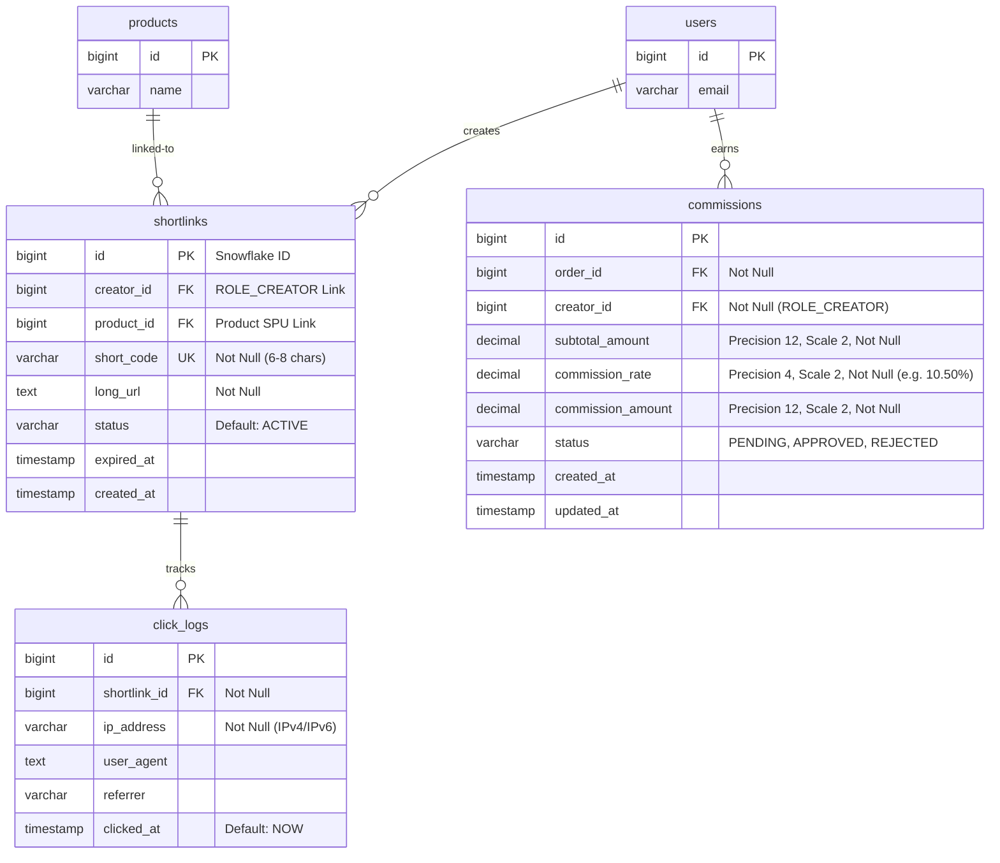
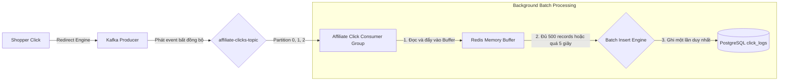

# 🛠️ Thiết kế Kỹ thuật - Phân hệ 4: Tiếp thị & Rút gọn Link (Shortlink & Affiliate)

Tài liệu này đặc tả kiến trúc cơ sở dữ liệu, mô hình lưu trữ Redis Cache để lookup siêu tốc, thuật toán mã hóa Base62 kết hợp Snowflake ID, cơ chế thu thập click bất đồng bộ qua Kafka và chi tiết đặc tả API của Phân hệ Tiếp thị & Rút gọn Link.

---

## 💾 1. Thiết kế Cơ sở Dữ liệu (Database Design)

### 1.1 Sơ đồ Thực thể (PostgreSQL Schema ERD)



---

### 1.2 DDL Dữ liệu Tiếp thị (DDL SQL Store)
```sql
CREATE TABLE shortlinks (
    id BIGINT PRIMARY KEY, -- Sử dụng Snowflake ID ngẫu nhiên không trùng lặp
    creator_id BIGINT NOT NULL,
    product_id BIGINT NOT NULL,
    short_code VARCHAR(10) UNIQUE NOT NULL,
    long_url TEXT NOT NULL,
    status VARCHAR(20) DEFAULT 'ACTIVE' NOT NULL,
    expired_at TIMESTAMP,
    created_at TIMESTAMP DEFAULT CURRENT_TIMESTAMP NOT NULL
);

CREATE TABLE click_logs (
    id BIGSERIAL PRIMARY KEY,
    shortlink_id BIGINT NOT NULL REFERENCES shortlinks(id) ON DELETE CASCADE,
    ip_address VARCHAR(45) NOT NULL,
    user_agent TEXT,
    referrer VARCHAR(255),
    clicked_at TIMESTAMP DEFAULT CURRENT_TIMESTAMP NOT NULL
);

CREATE TABLE commissions (
    id BIGSERIAL PRIMARY KEY,
    order_id BIGINT NOT NULL,
    creator_id BIGINT NOT NULL,
    subtotal_amount DECIMAL(12,2) NOT NULL,
    commission_rate DECIMAL(4,2) NOT NULL, -- Ví dụ: 10.00 đại diện cho 10%
    commission_amount DECIMAL(12,2) NOT NULL,
    status VARCHAR(30) DEFAULT 'PENDING' NOT NULL, -- PENDING, APPROVED, REJECTED
    created_at TIMESTAMP DEFAULT CURRENT_TIMESTAMP NOT NULL,
    updated_at TIMESTAMP DEFAULT CURRENT_TIMESTAMP NOT NULL
);

-- Chỉ mục tối ưu hóa tốc độ tra cứu
CREATE INDEX idx_shortlinks_code ON shortlinks(short_code);
CREATE INDEX idx_click_logs_shortlink_id ON click_logs(shortlink_id);
CREATE INDEX idx_commissions_creator_status ON commissions(creator_id, status);
```

---

## 🚀 2. Thuật toán Rút gọn Link Base62 & Lookup Redis (Shortcode & Fast Redirect)

### 2.1 Thuật toán Base62 kết hợp Snowflake ID (Deadlock & Guess Prevention)
*   **Vấn đề:** Nếu chúng ta lấy ID tuần tự tăng dần từ database (ví dụ: `1`, `2`, `3`) để mã hóa Base62, đối thủ có thể dễ dàng đoán được các link tiếp thị khác bằng cách thay đổi ký tự cuối cùng.
*   **Giải pháp:** 
    1.  Sử dụng **Snowflake ID Generator** để tạo ra một số nguyên `BIGINT` 64-bit ngẫu nhiên không trùng lặp theo thời gian (Thời gian + Node ID + Sequence).
    2.  Tiến hành mã hóa số nguyên này sang hệ cơ số 62 (Base62) sử dụng bảng chữ cái:
        `0123456789abcdefghijklmnopqrstuvwxyzABCDEFGHIJKLMNOPQRSTUVWXYZ`
    3.  Kết quả thu được là một chuỗi ngắn bảo mật (Shortcode) có độ dài 7-8 ký tự (Ví dụ: `1890812398712398` $\rightarrow$ Base62: `7jK9d2`).

#### Minh họa code Java chuyển đổi Base62:
```java
public class Base62Encoder {
    private static final String BASE62_CHARACTERS = "0123456789abcdefghijklmnopqrstuvwxyzABCDEFGHIJKLMNOPQRSTUVWXYZ";

    public static String encode(long number) {
        StringBuilder sb = new StringBuilder();
        while (number > 0) {
            sb.append(BASE62_CHARACTERS.charAt((int) (number % 62)));
            number /= 62;
        }
        return sb.reverse().toString();
    }
}
```

---

### 2.2 Bộ điều hướng siêu tốc Redis Caching
Để đạt độ trễ Redirect dưới **20ms**, hệ thống cấm truy cập PostgreSQL trực tiếp trên luồng chuyển hướng chính.

*   **Redis Key:** `shortlink:cache:{shortcode}`
*   **Redis Data Type:** `String`
*   **Redis Value (JSON String):**
    ```json
    {
      "shortlinkId": 1890812398712398,
      "longUrl": "https://vibecart.com/products/sony-xm4?variant=501",
      "creatorId": 1002,
      "productId": 201
    }
    ```
*   **TTL (Time-To-Live):** **30 ngày** (`2592000` giây).
*   **Cơ chế luồng chính:**
    1.  Trình duyệt truy cập `GET /v/{shortcode}`.
    2.  Hệ thống gọi lệnh `GET shortlink:cache:{shortcode}` từ Redis.
    3.  *Cache Hit:* Giải mã JSON, lập tức phát Kafka click event bất đồng bộ và trả về **HTTP 302 (Header Location: longUrl)**.
    4.  *Cache Miss:* Đọc PostgreSQL, lưu thông tin vào Redis Cache, rồi mới trả về HTTP 302.

---

## 🔄 3. Xử lý Click Tracking bất đồng bộ qua Kafka (Async Click Ingestion)

Mỗi click chuột của người dùng là một tác vụ I/O ghi đĩa rất đắt đỏ. Hệ thống tách biệt hoàn toàn luồng ghi nhận Click khỏi luồng chuyển hướng chính bằng **Apache Kafka** để triệt tiêu độ trễ.

### 3.1 Cấu hình Kafka Topic
*   **Topic Name:** `affiliate-clicks-topic`
*   **Partitions:** **3 partitions** (Đảm bảo khả năng scale-out nhiều Consumer song song).
*   **Key:** `shortcode` (Đảm bảo các click của cùng một shortlink sẽ luôn về cùng một partition để dễ dàng xử lý tổng hợp dữ liệu).

### 3.2 Sơ đồ Luồng Ingestion (Gom lô ghi Database)


*   **Cơ chế Batching của Consumer:**
    *   Consumer thu thập dữ liệu từ Kafka và đưa vào hàng đợi bộ nhớ.
    *   Khi hàng đợi đạt **500 bản ghi** hoặc thời gian chờ đạt **5 giây**, Consumer kích hoạt lệnh `INSERT` dạng Batch SQL ghi đồng loạt xuống PostgreSQL một lần duy nhất để tối ưu hóa hiệu năng Database:
        ```sql
        INSERT INTO click_logs (shortlink_id, ip_address, user_agent, referrer) VALUES (?, ?, ?, ?), (?, ?, ?, ?)...;
        ```

---

## 🔌 4. Đặc tả API Phân hệ (API Specifications)

### 4.1 Tạo Shortlink tiếp thị mới (Create Shortlink)
*   **Method:** `POST`
*   **Path:** `/api/v1/affiliate/shortlinks`
*   **Mức độ bảo mật:** `PreAuthorize("hasRole('CREATOR')")`
*   **Request Body (`ShortlinkCreateRequest`):**
    ```json
    {
      "productId": 201,
      "longUrl": "https://vibecart.com/products/sony-xm4?variant=501"
    }
    ```
*   **Response Success (HTTP 201 Created):**
    ```json
    {
      "code": 1000,
      "message": "Tạo liên kết tiếp thị rút gọn thành công",
      "result": {
        "shortcode": "7jK9d2",
        "shortlink": "https://vibe.ly/7jK9d2",
        "longUrl": "https://vibecart.com/products/sony-xm4?variant=501",
        "createdAt": "2026-05-27T17:25:00Z"
      }
    }
    ```

### 4.2 Lấy báo cáo hiệu suất tiếp thị (Get Affiliate Dashboard Metrics)
*   **Method:** `GET`
*   **Path:** `/api/v1/affiliate/dashboard`
*   **Mức độ bảo mật:** `PreAuthorize("hasRole('CREATOR')")`
*   **Response Success (HTTP 200 OK):**
    ```json
    {
      "code": 1000,
      "result": {
        "creatorId": 1002,
        "totalClicks": 12054,
        "totalOrders": 142,
        "conversionRate": 1.18,
        "pendingCommission": 2489000.00,
        "approvedCommission": 18450000.00
      }
    }
    ```

### 4.3 Endpoint Điều hướng công cộng (Public Redirect Engine)
*   **Method:** `GET`
*   **Path:** `/v/{shortcode}`
*   **Mức độ bảo mật:** `PermitAll`
*   **Response Success (HTTP 302 Found):**
    *   *Headers:*
        *   `Location`: `https://vibecart.com/products/sony-xm4?variant=501`
        *   `Set-Cookie`: `affiliate_creator_id=1002; Max-Age=2592000; Path=/; HttpOnly; Secure` *(Lưu Cookie tiếp thị 30 ngày bảo mật)*
