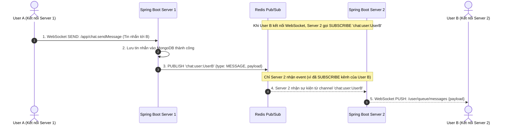
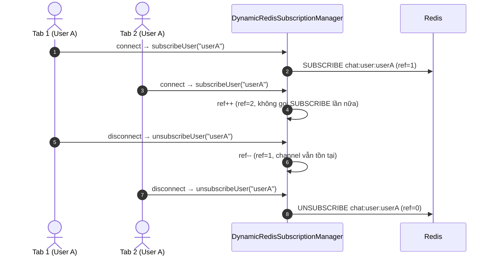
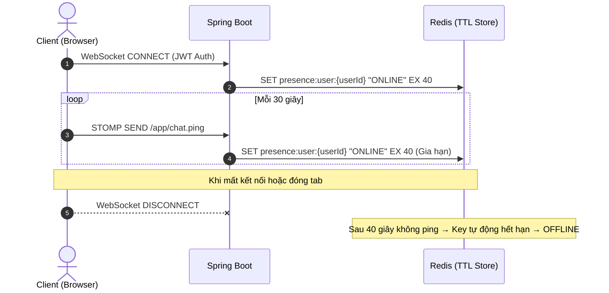
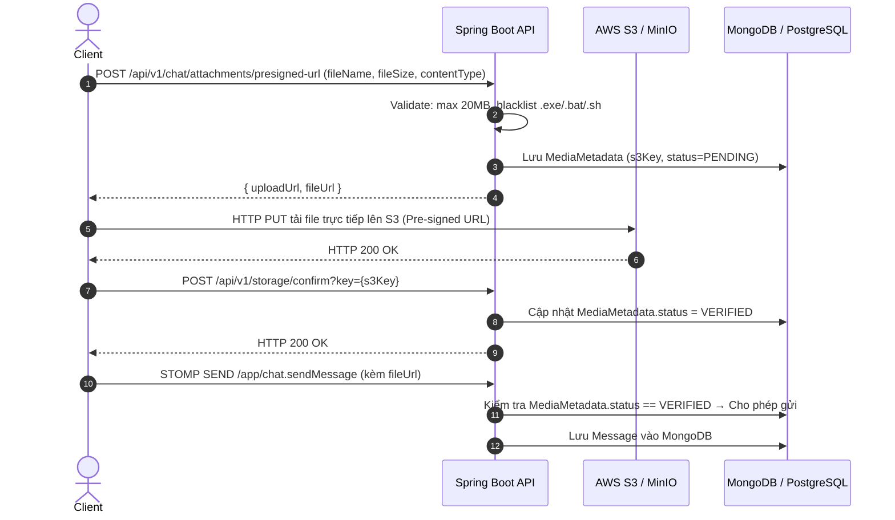

# 🛠️ Thiết kế Kỹ thuật - Phân hệ 5: Nhắn tin Thời gian thực (Realtime Chat)

Tài liệu này đặc tả kiến trúc cơ sở dữ liệu NoSQL (MongoDB), thiết kế định tuyến thời gian thực WebSocket/STOMP kết hợp Redis Pub/Sub Dynamic Channels, cơ chế kiểm tra Presence thời gian thực, và luồng xử lý tải tệp trực tiếp lên S3/MinIO qua Pre-signed URL.

> [!NOTE]
> Để xem hợp đồng tích hợp API (REST Endpoints & WebSocket Payloads), tham khảo: [05_chat_websocket_api.md](../api/05_chat_websocket_api.md).
> Để xem đặc tả nghiệp vụ (User Flows & Business Rules), tham khảo: [05_realtime_chat.md](../business/05_realtime_chat.md).

---

## 💾 1. Thiết kế Cơ sở Dữ liệu NoSQL (MongoDB Collections)

Để đáp ứng khối lượng tin nhắn cực lớn và cấu trúc tin nhắn động (Dynamic Payload), hệ thống sử dụng **MongoDB** làm kho lưu trữ lịch sử trò chuyện chính.

### 1.1 Collection `conversations` (Danh sách Hội thoại)
Mỗi document đại diện cho một phòng chat 1-1 hoặc chat nhóm:
```json
{
  "_id": {"$oid": "60b8d29f8f3b2c12a45d8b8a"},
  "type": "GROUP", // DIRECT đại diện cho chat 1-1, GROUP đại diện cho chat nhóm
  "name": "Nhóm Creator Sáng Tạo VibeCart", // null nếu là DIRECT
  "avatarUrl": "https://vibecart.com/assets/group-avatar.jpg", // null nếu là DIRECT
  "memberIds": ["1001", "1002", "2005"], // Mảng chứa ID (String) của các thành viên tham gia
  "unreadCounts": {
    "1001": 2, // Số lượng tin nhắn chưa đọc của User 1001
    "1002": 0,
    "2005": 5
  },
  "lastMessage": {
    "messageId": "60b8d2a18f3b2c12a45d8b8b",
    "senderId": "1002",
    "content": "Chào cả nhà, em gửi file thiết kế sản phẩm mới nhé!",
    "type": "DOCUMENT",
    "createdAt": {"$date": "2026-05-27T15:30:00Z"}
  },
  "createdAt": {"$date": "2026-05-27T15:00:00Z"},
  "updatedAt": {"$date": "2026-05-27T15:30:00Z"}
}
```

### 1.2 Collection `messages` (Chi tiết Tin nhắn)
Mỗi document đại diện cho một tin nhắn đơn lẻ trong phòng chat:
```json
{
  "_id": {"$oid": "60b8d2a18f3b2c12a45d8b8b"},
  "conversationId": "60b8d29f8f3b2c12a45d8b8a",
  "senderId": "1002",
  "content": "https://vibecart-s3.s3.ap-southeast-1.amazonaws.com/files/proposal.pdf",
  "type": "DOCUMENT", // TEXT, IMAGE, VIDEO, DOCUMENT, PRODUCT, ORDER
  "attachmentMetadata": {
    "fileUrl": "https://vibecart-s3.s3.ap-southeast-1.amazonaws.com/files/proposal.pdf",
    "fileName": "proposal.pdf",
    "fileSize": 1548200, // bytes (~1.48 MB)
    "mimeType": "application/pdf",
    "cardId": "prod_201" // Gắn ID sản phẩm hoặc ID đơn hàng nếu type là PRODUCT/ORDER
  },
  "readBy": [
    {
      "userId": "1002",
      "readAt": {"$date": "2026-05-27T15:30:00Z"}
    },
    {
      "userId": "1001",
      "readAt": {"$date": "2026-05-27T15:31:00Z"}
    }
  ],
  "createdAt": {"$date": "2026-05-27T15:30:00Z"}
}
```

---

## 🚀 2. Giao thức WebSocket STOMP & Redis Cluster Routing (Pub/Sub)

Để hỗ trợ scale-out (chạy cụm Spring Boot phía sau Load Balancer), hệ thống sử dụng **Redis Pub/Sub** với **Dynamic User-Specific Channels** để định tuyến tin nhắn chính xác tới instance đang chứa người nhận, loại bỏ hoàn toàn hiện tượng Fan-out lãng phí.

**Quy ước Channel:** `chat:user:{username}` — mỗi user có một channel riêng trên Redis.

**Cơ chế Dynamic Subscription:**
1.  Khi user **kết nối** WebSocket → `DynamicRedisSubscriptionManager` gọi `SUBSCRIBE chat:user:{username}` trên instance đó.
2.  Khi user **ngắt kết nối** (tab cuối cùng) → `UNSUBSCRIBE chat:user:{username}`.
3.  Mỗi instance chỉ nhận event dành cho users đang kết nối trên chính nó → tối ưu CPU/Bandwidth.



### 2.1 Cấu hình WebSocket Endpoints
*   **Connection URL:** `ws://vibecart.com/ws-chat`
*   **Xác thực bảo mật:** Kiểm tra JWT Token tại sự kiện CONNECT của STOMP:
    ```javascript
    stompClient.connect({ 'Authorization': 'Bearer ' + jwtToken }, connectCallback);
    ```

### 2.2 Kiến trúc Multi-Tab & Reference Counting

Khi cùng một user mở nhiều tab trên cùng một server instance, `DynamicRedisSubscriptionManager` sử dụng **Reference Counter** (`AtomicInteger`) để chỉ thực sự UNSUBSCRIBE Redis channel khi tab cuối cùng đóng:



### 2.3 Danh sách STOMP Topics & Destinations

> [!NOTE]
> Xem đặc tả payload chi tiết tại [05_chat_websocket_api.md](../api/05_chat_websocket_api.md#-2-đặc-tả-kênh-đăng-ký-stomp-subscribe-destinations).

| Hướng | Destination | Mô tả |
|---|---|---|
| Client → Server | `/app/chat.sendMessage` | Gửi tin nhắn mới |
| Client → Server | `/app/chat.typing` | Chỉ báo đang gõ phím |
| Client → Server | `/app/chat.ping` | Heartbeat duy trì Presence (30s) |
| Client → Server | `/app/chat.seen` | Báo nhận đã xem tin nhắn |
| Server → Client | `/user/queue/messages` | Tin nhắn cá nhân / 1-1 |
| Server → Client | `/topic/chat.{conversationId}` | Tin nhắn nhóm (Group Chat) |
| Server → Client | `/user/queue/typing` | Trạng thái soạn thảo cá nhân |
| Server → Client | `/topic/chat.{conversationId}/typing` | Trạng thái soạn thảo nhóm |
| Server → Client | `/user/queue/seen` | Trạng thái đã xem cá nhân |
| Server → Client | `/topic/chat.{conversationId}/seen` | Trạng thái đã xem nhóm |

---

## 🔒 3. Presence Engine & Heartbeat trên Redis

Hệ thống quản lý trạng thái Online/Offline thời gian thực của người dùng bằng **Redis** để đạt tốc độ xử lý nhanh nhất:

*   **Redis Key:** `presence:user:{userId}`
*   **Redis Value:** `ONLINE`
*   **Thời gian sống (TTL):** **40 giây**.
*   **Cơ chế hoạt động:**
    1.  **Heartbeat Ping:** Khi kết nối WebSocket hoạt động, Client gửi gói tin heartbeat ping `/app/chat.ping` mỗi **30 giây** một lần.
    2.  **Cập nhật Redis:** Mỗi khi nhận ping, Spring Boot gọi lệnh `SET presence:user:{userId} "ONLINE" EX 40` để gia hạn thời gian trực tuyến.
    3.  **Ngắt kết nối:** Khi Client chủ động đóng WebSocket hoặc mất mạng (quá 40 giây không gửi ping) → Key tự động biến mất trên Redis. Hệ thống coi người dùng đó là `OFFLINE`.



---

## 🔌 4. Luồng tải tệp trực tiếp lên S3/MinIO (Pre-signed URL Flow)

Hệ thống cấm tải file đa phương tiện trực tiếp qua API của Spring Boot. Thay vào đó, Server sinh ra một URL đã được ký và cấp quyền (Pre-signed URL) để Client tự đẩy file thẳng lên AWS S3 hoặc cụm MinIO.

### 4.1 Luồng Upload & Xác nhận (Upload Confirmation Workflow)



### 4.2 Snippet sinh Pre-signed URL (S3 SDK v2)

```java
// Logic sinh Pre-signed URL trong Backend Java (S3 SDK v2)
public String generatePresignedUploadUrl(String bucketName, String objectKey, String contentType, long contentLength) {
    PutObjectRequest putObjectRequest = PutObjectRequest.builder()
            .bucket(bucketName)
            .key(objectKey)
            .contentType(contentType)
            .contentLength(contentLength) // Khóa kích thước tệp tin thực tế trên S3
            .build();

    PutObjectPresignRequest presignRequest = PutObjectPresignRequest.builder()
            .signatureDuration(Duration.ofMinutes(5)) // Hết hạn sau 5 phút
            .putObjectRequest(putObjectRequest)
            .build();

    PresignedPutObjectRequest presignedRequest = s3Presigner.presignPutObject(presignRequest);
    return presignedRequest.url().toString();
}
```

---

## 🛡️ 5. Bảo mật tầng Service (BOLA/IDOR Protection)

### 5.1 Kiểm tra quyền truy cập Conversation (Membership Check)

Tất cả các API truy xuất dữ liệu conversation (GET messages, markAsRead, sendMessage, typing) đều thực hiện kiểm tra membership **tại tầng Service**, không chỉ dựa vào `@PreAuthorize`:

```java
// Tại ChatServiceImpl.java
Conversation conversation = conversationRepository.findById(conversationId)
        .orElseThrow(() -> new AppException(ErrorCode.CONVERSATION_NOT_FOUND));

boolean isAdmin = currentUser.getRoles() != null && currentUser.getRoles().stream()
        .anyMatch(role -> "ADMIN".equals(role.getName()) || "ROLE_ADMIN".equals(role.getName()));

if (!conversation.getMemberIds().contains(currentUserId) && !isAdmin) {
    throw new AppException(ErrorCode.CONVERSATION_ACCESS_DENIED);
}
```

**Nguyên tắc:**
*   `@PreAuthorize("hasAnyRole('USER', 'CREATOR', 'ADMIN')")` chỉ kiểm tra user đã đăng nhập.
*   Tầng Service **bắt buộc** kiểm tra `currentUserId ∈ conversation.memberIds`.
*   Role `ADMIN` được bypass membership check để hỗ trợ moderation.

### 5.2 Xác nhận tệp đính kèm S3 (Attachment Verification)

Trước khi broadcast tin nhắn có tệp đính kèm, hệ thống kiểm tra trạng thái `MediaMetadata`:
*   S3 Key phải tồn tại trong bảng `media_metadata`.
*   Trạng thái phải là `VERIFIED` (đã qua luồng `/confirm`).
*   Nếu không hợp lệ → reject tin nhắn với `ErrorCode.INVALID_INPUT`.
