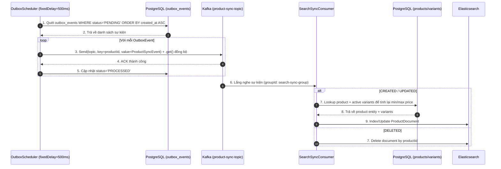
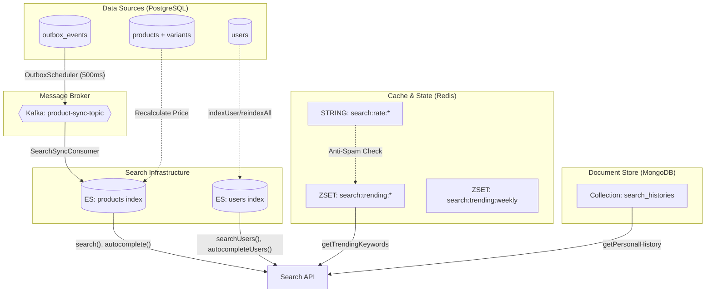

# 🛠️ Thiết kế Kỹ thuật - Phân hệ 6: Công cụ Tìm kiếm & Các Tính năng Gợi ý

Tài liệu này đặc tả cấu hình chỉ mục (Mapping & Analyzers) trong Elasticsearch hỗ trợ Tiếng Việt và Autocomplete, giải pháp đồng bộ bất đồng bộ Transactional Outbox, các mẫu truy vấn nâng cao (bao gồm gợi ý sửa lỗi Spell Check), cơ chế chống Spam xu hướng (Anti-Spam Trending), kiến trúc lưu trữ MongoDB & Redis cho Lịch sử tìm kiếm & Xu hướng tìm kiếm, thiết kế Tìm kiếm & Gợi ý Creator, và quy trình đồng bộ dữ liệu qua Kafka Consumer.

---

## 💾 1. Thiết kế Chỉ mục Elasticsearch (Product Document Mapping)

Để hỗ trợ tìm kiếm Tiếng Việt có dấu/không dấu và autocomplete, chỉ mục `products` trong Elasticsearch được cấu hình các bộ phân tích từ vựng (Analyzers) chuyên biệt:
*   **Bộ phân tích tiếng Việt (`vi_analyzer`):** Sử dụng bộ lọc `icu_folding` (hoặc `asciifolding`) kết hợp bộ tách từ Tiếng Việt để chuẩn hóa chuỗi về dạng viết thường, loại bỏ hoàn toàn dấu tiếng Việt để đối chiếu không dấu.
*   **Bộ phân tích Edge N-Gram (`autocomplete_analyzer`):** Chia nhỏ từ khóa từ ký tự đầu tiên để phục vụ tính năng autocomplete gõ đến đâu hiển thị gợi ý đến đấy.

### 1.1 Cấu hình Settings và Analyzers Chỉ mục
```json
{
  "settings": {
    "analysis": {
      "analyzer": {
        "vi_analyzer": {
          "type": "custom",
          "tokenizer": "standard",
          "filter": ["lowercase", "asciifolding"]
        },
        "autocomplete_analyzer": {
          "type": "custom",
          "tokenizer": "autocomplete_tokenizer",
          "filter": ["lowercase", "asciifolding"]
        }
      },
      "tokenizer": {
        "autocomplete_tokenizer": {
          "type": "edge_ngram",
          "min_gram": 2,
          "max_gram": 10,
          "token_chars": ["letter", "digit"]
        }
      }
    }
  }
}
```

### 1.2 Elasticsearch Mapping cho `ProductDocument`

Ánh xạ Java Entity: `com.vibecart.api.modules.ecommerce.document.ProductDocument`

```json
{
  "mappings": {
    "properties": {
      "id": { "type": "keyword" },
      "name": {
        "type": "text",
        "analyzer": "vi_analyzer",
        "fields": {
          "suggest": {
            "type": "text",
            "analyzer": "autocomplete_analyzer",
            "search_analyzer": "vi_analyzer"
          },
          "keyword": { "type": "keyword" }
        }
      },
      "description": {
        "type": "text",
        "analyzer": "vi_analyzer"
      },
      "categoryId": { "type": "keyword" },
      "categoryName": { "type": "keyword" },
      "creatorId": { "type": "keyword" },
      "thumbnailUrl": { "type": "keyword" },
      "minPrice": { "type": "double" },
      "maxPrice": { "type": "double" },
      "status": { "type": "keyword" },
      "createdAt": { "type": "date" },
      "updatedAt": { "type": "date" }
    }
  }
}
```

> **Lưu ý:** Trường `thumbnailUrl` được đánh `keyword` nhưng không cần index vì chỉ dùng để hiển thị. Trong Spring Data Elasticsearch Java annotation hiện tại chưa đặt `index = false` nhưng ý đồ thiết kế là không cần tìm kiếm trên trường này.

### 1.3 Elasticsearch Mapping cho `UserDocument`

Ánh xạ Java Entity: `com.vibecart.api.modules.iam.document.UserDocument`

```json
{
  "mappings": {
    "properties": {
      "id": { "type": "keyword" },
      "username": {
        "type": "text",
        "analyzer": "vi_analyzer",
        "fields": {
          "suggest": {
            "type": "text",
            "analyzer": "autocomplete_analyzer",
            "search_analyzer": "vi_analyzer"
          },
          "keyword": { "type": "keyword" }
        }
      },
      "fullName": {
        "type": "text",
        "analyzer": "vi_analyzer",
        "fields": {
          "suggest": {
            "type": "text",
            "analyzer": "autocomplete_analyzer",
            "search_analyzer": "vi_analyzer"
          },
          "keyword": { "type": "keyword" }
        }
      },
      "email": { "type": "keyword" },
      "avatarUrl": { "type": "keyword" },
      "status": { "type": "keyword" },
      "roles": { "type": "keyword" },
      "createdAt": { "type": "date" },
      "updatedAt": { "type": "date" }
    }
  }
}
```

---

## 🔄 2. Giải pháp Đồng bộ Bất đồng bộ qua Transactional Outbox Pattern

Mỗi hành động thay đổi dữ liệu sản phẩm trong PostgreSQL bắt buộc phải được đồng bộ hóa sang Elasticsearch theo cách đáng tin cậy nhất để đảm bảo tính nhất quán dữ liệu (Data Consistency).

### 2.1 DDL Bảng Outbox trong PostgreSQL
Mọi tác vụ ghi nhận sự kiện được thực hiện trong cùng một Database Transaction của luồng lưu sản phẩm.

**Migration V1 (Tạo bảng cốt lõi):**
```sql
CREATE TABLE outbox_events (
    id VARCHAR(36) PRIMARY KEY,
    aggregate_type VARCHAR(50) NOT NULL, -- e.g. 'PRODUCT'
    aggregate_id VARCHAR(36) NOT NULL, -- UUID of product
    event_type VARCHAR(50) NOT NULL, -- 'PRODUCT_CREATED', 'PRODUCT_UPDATED', 'PRODUCT_DELETED'
    payload TEXT NOT NULL, -- JSON payload of the sync event
    status VARCHAR(20) DEFAULT 'PENDING' NOT NULL, -- PENDING, PROCESSED, FAILED
    created_at TIMESTAMP DEFAULT CURRENT_TIMESTAMP NOT NULL,
    updated_at TIMESTAMP DEFAULT CURRENT_TIMESTAMP NOT NULL
);

-- Optimize polling query performance for pending events
CREATE INDEX idx_outbox_pending ON outbox_events(status, created_at);
```

**Migration V2 (Bổ sung trường kiểm toán BaseEntity):**
```sql
ALTER TABLE outbox_events
    ADD COLUMN created_by VARCHAR(50),
    ADD COLUMN updated_by VARCHAR(50),
    ADD COLUMN deleted BOOLEAN DEFAULT FALSE NOT NULL,
    ADD COLUMN deleted_at TIMESTAMP;
```

> **Ánh xạ Java Entity:** `OutboxEvent` extends `BaseEntity` (UUID auto-generated, auditing fields `created_by`, `updated_by`, `deleted`, `deleted_at` do `BaseEntity` cung cấp).

### 2.2 Luồng hoạt động của Outbox Publisher & Kafka Consumer



### 2.3 Thiết kế SearchSyncConsumer (Kafka Consumer)

**Class:** `com.vibecart.api.modules.ecommerce.event.SearchSyncConsumer`

*   **Kafka Topic:** `product-sync-topic` (Group ID: `search-sync-group`)
*   **Event Model:** `ProductSyncEvent` chứa: `eventType` (`CREATED`/`UPDATED`/`DELETED`), `productId`, `name`, `description`, `categoryId`, `categoryName`, `creatorId`, `thumbnailUrl`, `minPrice`, `maxPrice`, `status`, `timestamp`.
*   **Logic xử lý sự kiện:**
    *   `CREATED` / `UPDATED`: Truy vấn trực tiếp `ProductRepository` để lấy danh sách biến thể hoạt động (`status = ACTIVE` và `deleted = false`) → Tính lại `minPrice` và `maxPrice` dựa trên giá thực tế (ưu tiên `discountPrice` nếu > 0, ngược lại dùng `price`) → Build `ProductDocument` và lưu vào Elasticsearch.
    *   `DELETED`: Gọi `productSearchRepository.deleteById(productId)` để xóa hoàn toàn khỏi chỉ mục.

> **Lý do tính lại giá từ DB:** Event payload có thể chứa giá không chính xác (ví dụ khi SKU bị xóa sau khi event được tạo). Truy vấn trực tiếp PostgreSQL đảm bảo min/max price phản ánh đúng trạng thái hiện tại của các biến thể sản phẩm.

### 2.4 Thiết kế ReindexAll (Admin Manual Sync)

**Logic:** Phương thức `reindexAll()` trong `SearchServiceImpl` thực hiện đồng bộ lại toàn bộ dữ liệu:
1.  **Reindex Products:** Truy vấn tất cả `Product` từ PostgreSQL → Map sang `ProductDocument` (tính min/max price từ variants, lấy thumbnail từ danh sách ảnh) → Bulk save vào Elasticsearch.
2.  **Reindex Users:** Truy vấn tất cả `User` từ PostgreSQL → Map sang `UserDocument` (gồm `roles`, `status`, `avatarUrl`,...) → Bulk save vào Elasticsearch.

---

## 🔍 3. Đặc tả các Elasticsearch Query Templates (Query Templates)

### 3.1 Truy vấn gợi ý từ khóa nhanh - Product (Instant Autocomplete Query)
Tìm kiếm gợi ý khi người dùng gõ từng ký tự (Ví dụ: Shopper đang gõ cụm từ gợi ý `"ta"`):
```json
{
  "query": {
    "match": {
      "name.suggest": {
        "query": "ta",
        "operator": "and"
      }
    }
  },
  "size": 20
}
```
*   **Post-processing:** Kết quả trả về từ Elasticsearch chứa tối đa 20 hits, sau đó Backend lọc `distinct` tên sản phẩm và giới hạn lại **top 5** gợi ý duy nhất.

### 3.2 Truy vấn tìm kiếm đầy đủ kết hợp Fuzzy & Tiếng Việt
Xử lý tìm kiếm chính của Shopper:
```json
{
  "query": {
    "bool": {
      "must": [
        {
          "multi_match": {
            "query": "dien thoai sny",
            "fields": ["name^3", "description"],
            "fuzziness": "AUTO",
            "prefix_length": 2,
            "max_expansions": 50,
            "operator": "and"
          }
        }
      ],
      "filter": [
        { "term": { "status": "ACTIVE" } },
        { "range": { "maxPrice": { "gte": 1000000.00 } } },
        { "range": { "minPrice": { "lte": 5000000.00 } } }
      ]
    }
  },
  "sort": [
    { "minPrice": { "order": "asc" } }
  ]
}
```

> **Giải thích bộ lọc giá:** Thay vì lọc trên cùng một trường, hệ thống sử dụng `maxPrice >= clientMinPrice` VÀ `minPrice <= clientMaxPrice` để đảm bảo **bất kỳ biến thể SKU nào** có giá nằm trong khoảng lọc của khách hàng đều được hiển thị. Đây là logic **range overlap** chuẩn.

### 3.3 Truy vấn Sửa lỗi chính tả & Đề xuất cụm từ đúng (Phrase Suggester)
Khi kết quả tìm kiếm trả về bằng 0, hệ thống sử dụng Phrase Suggester để tìm gợi ý thay thế chuẩn nhất từ ngữ cảnh của trường `name`:
```json
{
  "suggest": {
    "spelling-suggestion": {
      "text": "đin thoại sony",
      "phrase": {
        "field": "name",
        "confidence": 1.0,
        "size": 1,
        "direct_generator": [
          {
            "field": "name",
            "suggest_mode": "popular",
            "min_word_length": 2
          }
        ]
      }
    }
  }
}
```
*   **Giải thích:** Hệ thống gọi `ElasticsearchClient.search()` với `suggest` mode. Nếu có gợi ý cụm từ thay thế, trả về cho Client hiển thị "Có phải bạn muốn tìm: ...".

### 3.4 Truy vấn Tìm kiếm Nhà sáng tạo (Creator Search Query)
Tìm kiếm Creator hỗ trợ Fuzzy trên `username` và `fullName`:
```json
{
  "query": {
    "bool": {
      "must": [
        {
          "multi_match": {
            "query": "nam",
            "fields": ["username^3", "fullName^2"],
            "fuzziness": "AUTO",
            "prefix_length": 2,
            "max_expansions": 50
          }
        }
      ],
      "filter": [
        { "term": { "status": "ACTIVE" } },
        { "term": { "roles": "ROLE_CREATOR" } }
      ],
      "must_not": [
        { "term": { "username.keyword": "current_username" } }
      ]
    }
  }
}
```
*   **Loại bỏ bản thân:** Mệnh đề `must_not` trên trường `username.keyword` chỉ được kích hoạt khi người dùng đã đăng nhập, tự động loại bỏ tài khoản hiện tại ra khỏi kết quả.
*   **Tích hợp Follow:** Sau khi nhận kết quả từ ES, Backend gọi `FollowService` để bổ sung `isFollowing` và `followerCount` cho mỗi Creator trước khi trả về Client.

### 3.5 Truy vấn Gợi ý nhanh Creator (Creator Autocomplete Query)
```json
{
  "query": {
    "bool": {
      "should": [
        { "match": { "username.suggest": "na" } },
        { "match": { "fullName.suggest": "na" } }
      ]
    }
  },
  "size": 20
}
```
*   **Post-processing:** Kết quả sau khi trả về sẽ lọc `distinct` username và giới hạn **top 5** gợi ý duy nhất.

### 3.6 Truy vấn Sửa lỗi chính tả Creator (Creator Spell Check)
Tương tự Phrase Suggester của Product, nhưng thực hiện trên index `users` và trường `fullName`:
```json
{
  "suggest": {
    "user-spelling-suggestion": {
      "text": "nguyn",
      "phrase": {
        "field": "fullName",
        "confidence": 1.0,
        "size": 1,
        "direct_generator": [
          {
            "field": "fullName",
            "suggest_mode": "popular",
            "min_word_length": 2
          }
        ]
      }
    }
  }
}
```

---

## 💾 4. Thiết kế Kỹ thuật Lịch sử Tìm kiếm (MongoDB Search History Design)

Dữ liệu lịch sử tìm kiếm được lưu tại MongoDB nhằm đáp ứng nhu cầu chịu tải cao, đọc-ghi liên tục và dễ dàng giới hạn kích thước danh mục.

### 4.1 MongoDB Schema cho `search_histories`
Lưu trữ theo mô hình **Document-per-User** để đảm bảo hiệu năng tối ưu, mỗi User là một Document chứa mảng từ khóa.

*   **Collection:** `search_histories`
*   **Java Entity:** `com.vibecart.api.modules.search.entity.SearchHistory`
*   **Document Schema:**
```json
{
  "_id": "e917575f-a3f2-4b43-b9be-d0cf65663155", // userId (String UUID) - Được đánh index chính
  "items": [
    {
      "keyword": "tai nghe sony",
      "searchedAt": ISODate("2026-05-27T17:22:00Z")
    },
    {
      "keyword": "iphone 15 pro max",
      "searchedAt": ISODate("2026-05-27T17:15:30Z")
    }
  ],
  "updatedAt": ISODate("2026-05-27T17:22:00Z")
}
```

### 4.2 Thuật toán Cập nhật Mảng Nguyên tử (Atomic Update Logic)
Để ghi nhận từ khóa mới, gộp trùng lặp, đẩy lên đầu danh sách và cắt mảng chỉ giữ tối đa 10 phần tử, Spring Boot sử dụng **Spring Data MongoDB** thực hiện 2 bước trong 1 luồng xử lý:

*   **Bước 1 (Deduplicate - Xóa từ khóa trùng cũ nếu có):**
```java
Query query = Query.query(Criteria.where("id").is(userId));
Update pullUpdate = new Update().pull("items", Query.query(Criteria.where("keyword").is(keyword)));
mongoTemplate.updateFirst(query, pullUpdate, SearchHistory.class);
```

*   **Bước 2 (Push & Slice - Chèn lên đầu mảng và cắt mảng ở kích thước 10):**
```java
SearchItem newItem = new SearchItem(keyword, LocalDateTime.now());
Update pushUpdate = new Update()
        .push("items")
        .atPosition(Update.Position.FIRST) // Đưa lên đầu mảng
        .slice(10)                         // Giữ lại 10 phần tử đầu tiên
        .value(newItem)
        .set("updatedAt", LocalDateTime.now());

mongoTemplate.upsert(query, pushUpdate, SearchHistory.class);
```
*Ưu điểm:* Thao tác chạy 100% trên MongoDB Server qua toán tử nguyên thủy, triệt tiêu race condition và không tốn chi phí tải mảng lên RAM của Backend.

---

## 📈 5. Thiết kế Kỹ thuật Từ khóa Xu hướng (Redis Trending Searches Design)

Tính năng tổng hợp từ khóa phổ biến được vận hành bằng **Redis Sorted Set (ZSET)** để duy trì hiệu năng cao nhất dưới áp lực hàng triệu lượt tìm kiếm.

### 5.1 Cơ chế Chống Spam Điểm ảo (Anti-Spam Rate Limiting)

Trước khi tăng điểm xu hướng cho một từ khóa, hệ thống kiểm tra giới hạn tần suất sử dụng Redis String:

```text
Key Pattern: search:rate:{yyyyMMdd}:{identifier}:{keyword}
TTL:         24 giờ (tự động hết hạn)
```

*   **Logic kiểm tra:**
```java
String rateKey = "search:rate:" + todayStr + ":" + identifier + ":" + cleanKeyword;

Long currentRate = redisTemplate.opsForValue().increment(rateKey, 1);
if (currentRate != null) {
    if (currentRate == 1) {
        redisTemplate.expire(rateKey, Duration.ofHours(24)); // Set TTL lần đầu
    }
    if (currentRate > 3) {
        return; // Vượt quá 3 lần/24h → Bỏ qua, không tăng điểm ZINCRBY
    }
}
```

*   **Xác định `identifier`:**
    *   Nếu người dùng **đã đăng nhập** → Dùng `userId` (lấy từ `SecurityContext.getAuthentication().getName()`).
    *   Nếu là **khách vãng lai (Guest)** → Resolve IP client qua header `X-Forwarded-For` (nếu có proxy) hoặc `request.getRemoteAddr()`.

### 5.2 Cấu trúc Key và cơ chế Tăng lượt tìm kiếm
Khi một truy vấn tìm kiếm được thực hiện thành công (số lượng sản phẩm trả về $>0$) VÀ qua được bộ lọc Anti-Spam, hệ thống tăng điểm số cho từ khóa đó.
*   **Key ZSET ngày:** `search:trending:yyyyMMdd`
*   **Lệnh tăng điểm:**
```text
ZINCRBY search:trending:20260527 1 "tai nghe sony"
```
*   **TTL cho key ngày:** 10 ngày (để tự động thu hồi bộ nhớ, dư thêm 3 ngày buffer so với 7 ngày thống kê).
*   **Điều kiện ghi nhận:** Từ khóa phải có độ dài ≥ 2 ký tự (sau khi `trim().toLowerCase()`).

### 5.3 Thuật toán Gom cụm & Tính Trending Tuần (Union Aggregation)
Mỗi giờ một lần, hệ thống chạy một Spring Scheduler để gom tổng lượt tìm kiếm của 7 ngày gần nhất nhằm đưa ra bảng xếp hạng xu hướng thực tế của tuần.

*   **Quy trình Spring Scheduler:**
```java
@Scheduled(cron = "0 0 * * * *") // Chạy mỗi giờ một lần
public void aggregateWeeklyTrending() {
    String destinationKey = "search:trending:weekly";
    List<String> lastSevenDaysKeys = IntStream.range(0, 7)
        .mapToObj(i -> "search:trending:" + LocalDate.now().minusDays(i).format(DateTimeFormatter.ofPattern("yyyyMMdd")))
        .collect(Collectors.toList());

    // Gom dữ liệu 7 ngày vào một key tuần duy nhất
    redisTemplate.opsForZSet().unionAndStore(
        lastSevenDaysKeys.get(0), // Key gốc
        lastSevenDaysKeys.subList(1, lastSevenDaysKeys.size()), // Các key kết hợp
        destinationKey
    );

    // Set TTL cho key tuần để tối ưu hóa bộ nhớ
    redisTemplate.expire(destinationKey, Duration.ofDays(8));
}
```

*   **API Query (Đọc Top 8 Trending):**
```text
ZREVRANGE search:trending:weekly 0 7 WITHSCORES
```
Độ trễ khi đọc chỉ mục cache ZSET của Redis là **O(log(N) + M)** với $N$ là tổng số từ khóa và $M=8$, phản hồi siêu tốc (<1ms) dưới mọi mức tải.

*   **Fallback khi key rỗng:** Nếu API `getTrendingKeywords()` phát hiện key `search:trending:weekly` rỗng hoặc hết hạn, hệ thống tự động kích hoạt `aggregateWeeklyTrending()` ngay lập tức trước khi trả kết quả.

---

## 👥 6. Thiết kế Kỹ thuật Tìm kiếm & Gợi ý Creator (Creator Search & Suggestion Design)

### 6.1 Kiến trúc Tổng quan

Tính năng tìm kiếm Creator sử dụng chung Elasticsearch infrastructure với tìm kiếm Product nhưng hoạt động trên index `users` riêng biệt:

| Thành phần | Mô tả |
| :--- | :--- |
| **Index ES** | `users` (ánh xạ `UserDocument`) |
| **Repository** | `UserSearchRepository` (Spring Data Elasticsearch) |
| **Source of Truth** | PostgreSQL `users` table → `UserRepository` |
| **Indexing Trigger** | Gọi `SearchService.indexUser()` / `deleteUser()` khi User đăng ký, cập nhật profile, hoặc bị vô hiệu hóa. |
| **Cross-Module** | Tích hợp `FollowService` (Social Module) để bổ sung `isFollowing` & `followerCount`. |

### 6.2 Luồng Tìm kiếm Creator (SearchUsers)

1.  Nhận query từ Client → Build `BoolQuery` với `multi_match` trên `username^3`, `fullName^2` (Fuzzy AUTO).
2.  Áp dụng filter: `status = ACTIVE`, `roles = ROLE_CREATOR`.
3.  Loại bỏ bản thân (`must_not` trên `username.keyword`) nếu đã đăng nhập.
4.  Thực thi query trên Elasticsearch → Nhận danh sách `UserDocument`.
5.  Với mỗi kết quả, gọi `FollowService.isFollowing()` và `FollowService.getFollowerCount()` để bổ sung thông tin xã hội.
6.  Nếu không có kết quả → Gọi Phrase Suggester trên trường `fullName` (index `users`).
7.  Ghi nhận trending keyword + personal history (nếu có kết quả).

### 6.3 Luồng Gợi ý nhanh Creator (AutocompleteUsers)

1.  Nhận `prefix` từ Client → Build `BoolQuery` với `should` trên `username.suggest` và `fullName.suggest`.
2.  Lấy tối đa 20 kết quả từ ES → Lọc `distinct` username → Giới hạn **top 5** gợi ý.

### 6.4 Đồng bộ User vào Elasticsearch

*   **Phương thức `indexUser(User user)`:** Map entity `User` → `UserDocument` (bao gồm `roles`, `status`, `avatarUrl`,...) → Lưu vào `UserSearchRepository`.
*   **Phương thức `deleteUser(String userId)`:** Xóa document khỏi ES index `users` theo `userId`.
*   **Bulk Reindex:** Được thực hiện cùng lúc với product reindex trong `reindexAll()` khi Admin kích hoạt manual sync.

---

## 📊 7. Tổng quan Kiến trúc Kỹ thuật Phân hệ (Architecture Summary)


