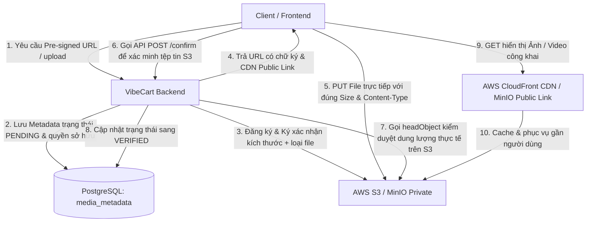

# Hướng dẫn Triển khai & Kiến trúc Lưu trữ S3 (S3 & MinIO Integration Guide)

Tài liệu này mô tả chi tiết giải pháp lưu trữ tệp tin đa phương tiện (Media Storage) của dự án **VibeCart**, bao gồm cấu hình phát triển ở môi trường Local (giả lập bằng MinIO) và cấu hình vận hành thực tế ở môi trường Production (AWS S3 kết hợp CloudFront CDN), cùng các biện pháp bảo mật nâng cao chống lỗi IDOR, chiếm quyền, lạm dụng dung lượng và cơ chế Xác nhận tải lên tự động dọn dẹp tệp tin rác.

---

## 1. Tổng quan Kiến trúc Lưu trữ

Hệ thống lưu trữ của VibeCart hỗ trợ hai chiến lược tải tệp (Upload Strategies):
1. **Server-side Upload**: Frontend gửi file lên Backend $\rightarrow$ Backend upload lên S3 $\rightarrow$ Trả về URL. (Thích hợp cho các file kích thước nhỏ, tệp tin do hệ thống sinh ra như Excel Báo cáo).
2. **Pre-signed URL (Khuyên dùng)**: Backend tạo chữ ký an toàn có thời hạn $\rightarrow$ Trả URL chữ ký cho Frontend $\rightarrow$ Frontend đẩy file trực tiếp từ trình duyệt lên S3 $\rightarrow$ Frontend gọi API xác nhận tải lên để kích hoạt sử dụng. (Tối ưu băng thông, tránh nghẽn cổ chai tại Backend).

Để đảm bảo tính an toàn dữ liệu, toàn bộ cấu trúc được thiết kế như sau:



---

## 2. Các cơ chế Bảo mật & Vận hành Chí mạng

Hệ thống VibeCart đã được gia cố toàn diện chống lại các lỗi bảo mật điển hình của hệ thống lưu trữ đám mây:

### A. Phòng chống IDOR (Insecure Direct Object Reference) tại API Xóa file
* **Vấn đề**: Do các tệp media có thể xem công khai qua CDN, bất kỳ ai cũng có thể biết khóa lưu trữ (`s3Key`). Nếu không phân quyền, một người dùng đăng nhập có thể gửi yêu cầu xóa tệp của người khác.
* **Giải pháp**: 
  * Sử dụng bảng `media_metadata` để lưu giữ thông tin `uploaded_by` (chính là username của người upload tệp).
  * Khi nhận yêu cầu xóa tệp qua API `DELETE`, Backend tiến hành truy vấn DB để đối chiếu. Chỉ cho phép **Chủ sở hữu tệp** hoặc tài khoản có vai trò **`ROLE_ADMIN`** thực hiện hành vi xóa. Nếu không khớp, trả về lỗi `403 Forbidden` (`ErrorCode.UNAUTHORIZED`).
  * Tích hợp cơ chế tương thích ngược (Graceful Legacy Fallback) để cho phép xóa và cảnh báo đối với các tệp cũ không có siêu dữ liệu (metadata) lưu trong DB.

### B. Chống giả mạo đuôi file (Spoofing File Extension)
* **Vấn đề**: Kẻ xấu gửi yêu cầu upload tệp tin với `contentType = image/png` để vượt qua bộ lọc nhưng đặt tên file là `malware.php`. Khi lưu trữ trên S3 dưới đuôi `.php`, một số trình duyệt hoặc proxy có thể thực thi mã độc đó trực tiếp (lỗi XSS hoặc Remote Code Execution).
* **Giải pháp**: Đuôi file khi lưu trên S3 được Backend sinh tự động dựa trên `Content-Type` đã qua kiểm duyệt kỹ càng trên máy chủ thông qua ánh xạ:
  * `image/jpeg` $\rightarrow$ `.jpg`
  * `image/png` $\rightarrow$ `.png`
  * `image/webp` $\rightarrow$ `.webp`
  * `video/mp4` $\rightarrow$ `.mp4`
  * Tuyệt đối không trích xuất đuôi từ tham số `originalFilename` do client tự gửi lên.

### C. Khóa dung lượng tối đa trên Pre-signed URL
* **Vấn đề**: Client xin Pre-signed URL để upload ảnh đại diện (nhỏ hơn 5MB) nhưng sau đó tận dụng URL này để tải tệp phim 50GB lên S3, làm tràn dung lượng và phát sinh chi phí khổng lồ ngoài ý muốn.
* **Giải pháp**: 
  * Bắt buộc Frontend gửi kèm tham số kích thước tệp tin dự kiến (`fileSize`).
  * Thực hiện kiểm duyệt tính hợp lệ của `fileSize` ngay trên Server.
  * Khi tạo yêu cầu cấp URL có chữ ký từ AWS S3 SDK, thiết lập `.contentLength(fileSize)`. S3 sẽ nhúng và mã hóa dung lượng này vào chữ ký. Nếu phía Frontend cố tình tải lên tệp có dung lượng sai lệch dù chỉ 1 byte, S3 sẽ lập tức từ chối với mã lỗi `403 Forbidden` (`SignatureDoesNotMatch`).

### D. Chu trình Tải lên theo lô Chống lỗi (Fault-Tolerant Batch Upload)
* **Vấn đề**: Khi tải lên một lô gồm 5 tệp tin, nếu đến tệp thứ 4 bị lỗi mạng, các tệp 1, 2, 3 đã nằm trên S3 và bị bỏ hoang (Zombie files).
* **Giải pháp**: 
  * Validate cấu trúc và định dạng của toàn bộ lô tệp tin trước khi bắt đầu tải tệp đầu tiên.
  * Nếu quá trình tải tệp lên S3 gặp lỗi giữa chừng, Backend kích hoạt quy trình dọn dẹp **Rollback**: tự động xóa bỏ toàn bộ các tệp tin đã tải lên thành công trước đó trong lô.
  * Từng lệnh xóa trong rollback được bao bọc trong một khối `try-catch` riêng biệt (Fault Tolerance), đảm bảo việc dọn dẹp diễn ra trọn vẹn ngay cả khi kết nối mạng chập chờn.
  * Chỉ thực hiện lưu siêu dữ liệu (metadata) của lô vào cơ sở dữ liệu sau khi toàn bộ tệp tin trong lô đã tải lên S3 thành công.

### E. Quy trình Xác nhận tải lên & Dọn dẹp tệp tin rác (Solution A)
* **Vấn đề**: Người dùng xin Pre-signed URL nhưng không thực hiện upload hoặc hủy giữa chừng, gây ra hàng loạt tệp rác "mồ côi" không thể kiểm soát trên S3. Đồng thời tệp chưa upload vẫn có thể bị tái sử dụng.
* **Giải pháp**:
  * **Trạng thái tệp**: Khi xin Pre-signed URL (cho cả Media thông thường và Chat Attachment), tệp tin được lưu vào cơ sở dữ liệu với trạng thái ban đầu là **`PENDING`**. Các API upload trực tiếp phía server-side sẽ được gán trạng thái **`VERIFIED`** ngay lập tức.
  * **API POST `/api/v1/media/confirm`**: Frontend bắt buộc phải gọi API này sau khi upload thành công lên S3. Backend sẽ gửi lệnh `headObject` trực tiếp đến S3 qua hàm `verifyFile` để kiểm tra sự tồn tại và đối chiếu kích thước byte chuẩn xác trước khi chuyển đổi trạng thái tệp sang **`VERIFIED`**.
  * **Tác vụ dọn dẹp định kỳ (MediaCleanupScheduler)**: Một Background Job chạy định kỳ mỗi 15 phút sẽ tự động tìm tất cả các bản ghi có trạng thái `PENDING` được tạo cách đây quá 15 phút, tiến hành xóa tệp tin trên S3 và xóa bản ghi DB tương ứng một cách an toàn.

---

## 3. Cấu hình chi tiết mã nguồn

### A. Cơ sở dữ liệu (PostgreSQL DDL)
Bảng `media_metadata` theo dõi quyền sở hữu và trạng thái của tệp tin:
```sql
CREATE TABLE media_metadata (
    id VARCHAR(36) PRIMARY KEY,
    s3_key VARCHAR(255) UNIQUE NOT NULL,
    uploaded_by VARCHAR(50) NOT NULL,
    file_size BIGINT NOT NULL,
    status VARCHAR(20) DEFAULT 'PENDING' NOT NULL, -- Trạng thái PENDING / VERIFIED
    created_at TIMESTAMP WITH TIME ZONE DEFAULT CURRENT_TIMESTAMP,
    updated_at TIMESTAMP WITH TIME ZONE DEFAULT CURRENT_TIMESTAMP,
    created_by VARCHAR(50) DEFAULT 'system',
    updated_by VARCHAR(50) DEFAULT 'system',
    deleted BOOLEAN DEFAULT FALSE NOT NULL,
    deleted_at TIMESTAMP WITH TIME ZONE
);

CREATE INDEX idx_media_metadata_key ON media_metadata(s3_key);
CREATE INDEX idx_media_metadata_uploader ON media_metadata(uploaded_by);
```

### B. Cấu hình tệp `application.yaml`
Cấu hình thuộc tính `app.storage` phân chia rõ ràng theo các môi trường:

#### Môi trường Local (`application-local.yaml`):
Sử dụng **MinIO** được cài đặt dưới máy local giả lập S3. Link đọc file sẽ được trỏ trực tiếp đến MinIO (đã mở Public Read để tiện phát triển).
```yaml
app:
  storage:
    endpoint: ${STORAGE_ENDPOINT:http://localhost:9000}
    bucket-name: ${STORAGE_BUCKET_NAME:vibecart-media}
    access-key: ${STORAGE_ACCESS_KEY:minio_admin}
    secret-key: ${STORAGE_SECRET_KEY:minio_password}
    region: ${STORAGE_REGION:us-east-1}
    public-url-prefix: ${STORAGE_PUBLIC_URL_PREFIX:}
```

#### Môi trường Production (`application-prod.yaml`):
Sử dụng **AWS S3** bảo mật 100% Private (Block Public Access = true). Liên kết đọc file sẽ được phục vụ qua **AWS CloudFront CDN** bảo mật và nhanh chóng.
```yaml
app:
  storage:
    endpoint: ${AWS_S3_ENDPOINT:https://s3.amazonaws.com}
    bucket-name: ${AWS_S3_BUCKET_NAME}
    access-key: ${AWS_ACCESS_KEY_ID}
    secret-key: ${AWS_SECRET_ACCESS_KEY}
    region: ${AWS_REGION:us-east-1}
    public-url-prefix: ${STORAGE_PUBLIC_URL_PREFIX:} # Ví dụ: https://media.vibecart.com
```

### C. Logic xử lý S3 & Xác minh tệp tin (`S3StorageService.java`)
```java
@Override
public String getFileUrl(String key) {
    String publicUrlPrefix = storageProperties.getPublicUrlPrefix();
    if (publicUrlPrefix != null && !publicUrlPrefix.isEmpty()) {
        String prefix = publicUrlPrefix.endsWith("/") 
                ? publicUrlPrefix.substring(0, publicUrlPrefix.length() - 1) 
                : publicUrlPrefix;
        return String.format("%s/%s", prefix, key);
    }

    String endpoint = storageProperties.getEndpoint();
    String bucket = storageProperties.getBucketName();
    
    // Fall-back dùng link trực tiếp của MinIO local khi chạy dev
    if (endpoint != null && !endpoint.isEmpty()) {
        return String.format("%s/%s/%s", endpoint, bucket, key);
    }
    
    // Định dạng link S3 AWS tiêu chuẩn
    return String.format("https://%s.s3.%s.amazonaws.com/%s", 
            bucket, storageProperties.getRegion(), key);
}

@Override
public boolean verifyFile(String key, long expectedSize) {
    try {
        HeadObjectRequest headObjectRequest = HeadObjectRequest.builder()
                .bucket(storageProperties.getBucketName())
                .key(key)
                .build();
        HeadObjectResponse headObjectResponse = s3Client.headObject(headObjectRequest);
        return headObjectResponse.contentLength() == expectedSize;
    } catch (NoSuchKeyException e) {
        log.warn("Tệp tin '{}' không tồn tại trên S3.", key);
        return false;
    } catch (Exception e) {
        log.error("Không thể xác minh tệp tin '{}' trên S3: {}", key, e.getMessage(), e);
        return false;
    }
}
```

### D. Tác vụ dọn dẹp định kỳ chạy ngầm (`MediaCleanupScheduler.java`)
```java
package com.vibecart.api.common.scheduler;

import com.vibecart.api.common.entity.MediaMetadata;
import com.vibecart.api.common.repository.MediaMetadataRepository;
import com.vibecart.api.common.service.StorageService;
import lombok.RequiredArgsConstructor;
import lombok.extern.slf4j.Slf4j;
import org.springframework.scheduling.annotation.Scheduled;
import org.springframework.stereotype.Component;

import java.time.ZonedDateTime;
import java.util.List;

@Component
@RequiredArgsConstructor
@Slf4j
public class MediaCleanupScheduler {

    private final MediaMetadataRepository mediaMetadataRepository;
    private final StorageService storageService;

    @Scheduled(cron = "0 */15 * * * *")
    public void cleanupOrphanedPendingUploads() {
        ZonedDateTime cutoffTime = ZonedDateTime.now().minusMinutes(15);
        log.info("Bắt đầu tác vụ dọn dẹp tệp tin rác trên S3. Thời gian giới hạn: {}", cutoffTime);

        try {
            List<MediaMetadata> expiredPendingFiles = mediaMetadataRepository
                    .findByStatusAndCreatedAtBefore("PENDING", cutoffTime);

            if (expiredPendingFiles.isEmpty()) {
                log.info("Không tìm thấy tệp tin PENDING quá hạn nào cần dọn dẹp.");
                return;
            }

            log.info("Tìm thấy {} tệp tin PENDING quá hạn. Bắt đầu tiến trình xóa...", expiredPendingFiles.size());

            for (MediaMetadata metadata : expiredPendingFiles) {
                String key = metadata.getS3Key();
                
                try {
                    storageService.deleteFile(key);
                    log.info("Đã xóa thành công tệp rác quá hạn trên S3: {}", key);
                } catch (Exception e) {
                    log.error("Lỗi khi xóa tệp rác quá hạn '{}' trên S3: {}", key, e.getMessage());
                }

                try {
                    mediaMetadataRepository.delete(metadata);
                    log.info("Đã xóa bản ghi metadata tương ứng trong DB cho key: {}", key);
                } catch (Exception e) {
                    log.error("Lỗi khi xóa bản ghi metadata trong DB cho key '{}': {}", key, e.getMessage());
                }
            }

            log.info("Hoàn tất tác vụ dọn dẹp định kỳ tệp tin rác S3.");
        } catch (Exception e) {
            log.error("Đã xảy ra lỗi nghiêm trọng trong tác vụ dọn dẹp định kỳ tệp tin S3", e);
        }
    }
}
```

---

## 4. Hướng dẫn Tích hợp & Vận hành Hệ thống

### A. Ràng buộc tích hợp cho Frontend (Frontend Integration)
Khi Frontend nhận được `uploadUrl` từ API `/api/v1/media/presigned-url` hoặc API chat attachment, quá trình gửi `PUT` request trực tiếp lên S3 cần tuân thủ nghiêm ngặt:
* **Headers**: Phải đính kèm chính xác 2 headers trùng khớp tuyệt đối với thông tin đã đăng ký với Backend:
  * `Content-Type`: Định dạng MIME chính xác (ví dụ: `image/png`).
  * `Content-Length`: Kích thước tệp tin chính xác tính theo Byte.
* **Ví dụ thực thi bằng Axios (JS)**:
  ```javascript
  // 1. Xin Presigned URL từ Backend
  const { data } = await axios.post('/api/v1/media/presigned-url', null, {
      params: {
          fileName: file.name,
          contentType: file.type,
          fileSize: file.size, // fileSize bắt buộc
          folder: 'products'
      }
  });

  const { uploadUrl, key, publicUrl } = data.result;

  // 2. PUT trực tiếp lên S3/MinIO
  await axios.put(uploadUrl, file, {
      headers: {
          'Content-Type': file.type,
          'Content-Length': file.size // Bắt buộc trùng khớp để không bị lỗi 403
      }
  });

  // 3. Gọi API POST confirm để Backend chuyển trạng thái sang VERIFIED
  await axios.post(`/api/v1/media/confirm`, null, {
      params: {
          key: key
      }
  });
  ```

### B. Nguyên tắc Ràng buộc Nghiệp vụ đối với Backend (Chốt chặn cuối)
Để ngăn chặn hoàn toàn việc người dùng lách luật sử dụng S3 Key chưa upload hoặc tệp rác `PENDING`, toàn bộ đội ngũ phát triển Backend cần tuân thủ nguyên tắc:
* **Tại các API nghiệp vụ**: Khi lưu trữ hình ảnh sản phẩm (SPU), biến thể sản phẩm (SKU), ảnh avatar người dùng, ảnh bài viết (Posts)... nhận được S3 Key từ Frontend:
  * **Bắt buộc** phải truy vấn bảng `media_metadata` theo S3 Key đó.
  * **Kiểm duyệt**: Nếu bản ghi không tồn tại hoặc cột `status` mang giá trị khác **`VERIFIED`**, hệ thống **phải từ chối lưu** và lập tức ném lỗi dữ liệu đầu vào không hợp lệ (`ErrorCode.INVALID_INPUT`).

### C. Danh mục kiểm tra Hạ tầng cho DevOps (DevOps Checklist)
Trước khi triển khai mã nguồn lên môi trường Production, đội ngũ DevOps/Hạ tầng cần đảm bảo hoàn tất các thiết lập sau:

1. **Cấu hình AWS S3 Bucket**:
   * Tạo S3 bucket và kích hoạt tính năng **Block Public Access = true** ở cả cấp độ Bucket lẫn Tài khoản.
2. **Cấu hình AWS CloudFront CDN**:
   * Tạo một phân phối AWS CloudFront Distribution đứng trước S3 Bucket trên.
   * Cấu hình tính năng **Origin Access Control (OAC)** để cho phép CloudFront đọc tệp một cách bảo mật từ S3 Private này.
   * Gán tên miền tùy chỉnh (ví dụ: `https://media.vibecart.com`) về CloudFront Distribution.
3. **Cấu hình Biến môi trường**:
   * Thiết lập biến môi trường `STORAGE_PUBLIC_URL_PREFIX=https://media.vibecart.com` để Backend tự động sinh đường dẫn tải ảnh tĩnh thông qua mạng lưới CDN.
4. **Cấu hình CORS Policy trên S3 Bucket**:
   Thiết lập CORS để cho phép Frontend upload trực tiếp lên S3:
   ```json
   [
       {
           "AllowedOrigins": ["https://vibecart.com", "https://localhost:3000"],
           "AllowedMethods": ["PUT", "GET", "DELETE"],
           "AllowedHeaders": ["Content-Type", "Content-Length", "Authorization", "x-amz-*"],
           "ExposedHeaders": ["ETag"]
       }
   ]
   ```
