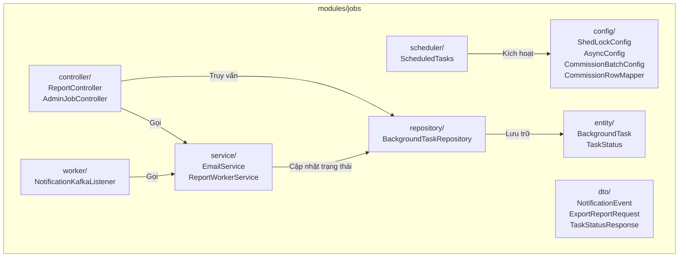
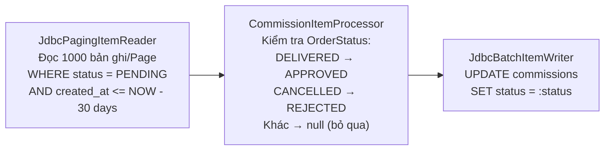
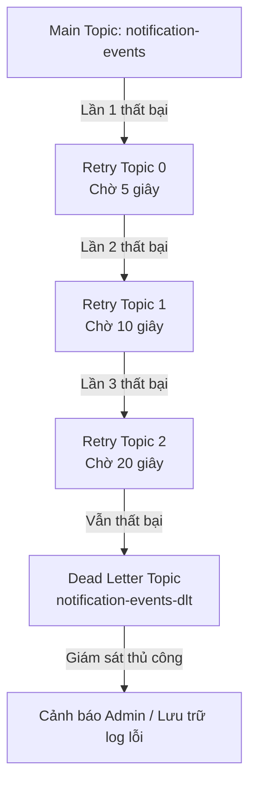
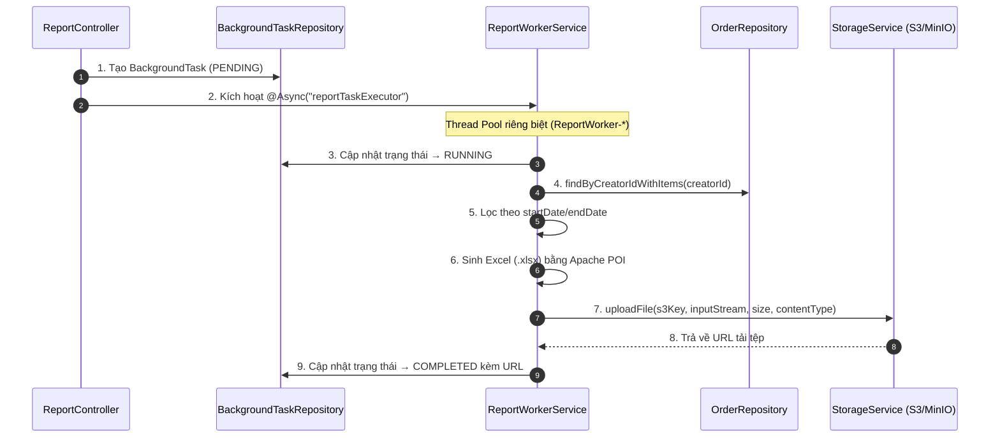

# 🛠️ Thiết kế Kỹ thuật - Phân hệ 8: Hàng đợi & Xử lý Nền (Queue & Background Processing)

Tài liệu này đặc tả chi tiết kiến trúc kỹ thuật của hệ thống xử lý nền VibeCart: cấu trúc package module `jobs`, cấu hình gửi email qua Gmail SMTP, giải pháp khóa lập lịch ShedLock trên Redis chống chạy trùng trong môi trường cụm, thiết kế Spring Batch đối soát hoa hồng quy mô lớn (Chunk-oriented Processing), chính sách hàng đợi tin cậy Kafka Retry/DLQ, cơ chế kết xuất tệp tin bất đồng bộ qua Executor Thread Pool và DDL Database Schema.

---

## 📦 1. Kiến trúc Tổng quan Module & Cấu trúc Package (Module Architecture)

### 1.1 Sơ đồ Cấu trúc Package



### 1.2 Mô tả Vai trò Từng Package

| Package | Vai trò | Các Class chính |
| :--- | :--- | :--- |
| `config/` | Cấu hình Spring Batch, ShedLock, Thread Pool cho tác vụ nền | `ShedLockConfig`, `AsyncConfig`, `CommissionBatchConfig`, `CommissionRowMapper` |
| `scheduler/` | Định nghĩa lịch chạy định kỳ với `@Scheduled` và khóa phân tán `@SchedulerLock` | `ScheduledTasks` |
| `service/` | Logic nghiệp vụ xử lý nền: gửi email SMTP, sinh báo cáo Excel và upload S3 | `EmailService`, `ReportWorkerService` |
| `worker/` | Kafka Consumer lắng nghe hàng đợi tin nhắn, xử lý retry và DLQ | `NotificationKafkaListener` |
| `entity/` | JPA Entity và Enum lưu vết tiến trình tác vụ nền trong PostgreSQL | `BackgroundTask`, `TaskStatus` |
| `dto/` | Data Transfer Objects cho Kafka event payload và HTTP request/response | `NotificationEvent`, `ExportReportRequest`, `TaskStatusResponse` |
| `repository/` | Spring Data JPA Repository truy cập bảng `background_tasks` | `BackgroundTaskRepository` |
| `controller/` | REST API endpoints: xuất báo cáo, kiểm tra trạng thái Task, kích hoạt Batch Job thủ công | `ReportController`, `AdminJobController` |

---

## 📬 2. Tích hợp Dịch vụ Email qua SMTP (Email Service Integration)

Hệ thống sử dụng kết nối SMTP chuẩn thông qua Spring `JavaMailSender` để gửi email giao dịch. Nhà cung cấp SMTP được cấu hình linh hoạt qua `application.yaml` (Môi trường local sử dụng Gmail SMTP, production có thể chuyển sang Resend/SES chỉ bằng cấu hình).

### 2.1 Cấu hình `application-local.yaml`
```yaml
spring:
  mail:
    host: smtp.gmail.com
    port: 587
    username: ${MAIL_USERNAME:no-reply@vibecart.com}
    password: ${MAIL_PASSWORD:password}
    properties:
      mail:
        smtp:
          auth: true
          starttls:
            enable: true
```

### 2.2 Java Mail Service (`EmailService`)
```java
@Service
public class EmailService {

    private final JavaMailSender mailSender;

    @Value("${spring.mail.username:no-reply@vibecart.com}")
    private String fromEmail;

    public void sendEmail(String to, String subject, String htmlContent) {
        try {
            MimeMessage message = mailSender.createMimeMessage();
            MimeMessageHelper helper = new MimeMessageHelper(message, true, "UTF-8");

            helper.setFrom("VibeCart <" + fromEmail + ">");
            helper.setTo(to);
            helper.setSubject(subject);
            helper.setText(htmlContent, true); // HTML true

            mailSender.send(message);
        } catch (MessagingException e) {
            throw new RuntimeException("Lỗi gửi email bất đồng bộ: " + e.getMessage(), e);
        }
    }
}
```

---

## 🔒 3. Khóa Lập lịch Phân tán với ShedLock (Distributed Scheduler Lock)

Để ngăn chặn tác vụ chạy trùng lặp đồng thời trên nhiều nodes Backend khi scale-up ứng dụng, hệ thống cấu hình **ShedLock** kết hợp **Redis** làm Lock Provider.

### 3.1 Cấu hình ShedLock (`ShedLockConfig`)
```java
@Configuration
@EnableScheduling
@EnableSchedulerLock(defaultLockAtMostFor = "PT30M") // Auto-release lock after 30 minutes if node dies
public class ShedLockConfig {

    @Bean
    public LockProvider lockProvider(RedisConnectionFactory connectionFactory) {
        // Redis Lock Provider with namespace "vibecart:lock"
        return new RedisLockProvider(connectionFactory, "vibecart:lock");
    }
}
```

**Cơ chế hoạt động:**
*   Redis Key Pattern: `vibecart:lock:{jobName}` (ví dụ: `vibecart:lock:commissionJobLock`)
*   Khi một node giành được lock, các node khác gọi cùng task sẽ bị ShedLock bỏ qua.
*   Lock tự động giải phóng sau thời gian `lockAtMostFor` nếu node bị sập đột ngột.

### 3.2 Sử dụng ShedLock trên Scheduler Task (`ScheduledTasks`)
```java
@Component
public class ScheduledTasks {

    private final JobLauncher jobLauncher;
    private final Job commissionSettlementJob;

    // Runs every day at 02:00 AM
    @Scheduled(cron = "0 0 2 * * *")
    @SchedulerLock(
            name = "commissionJobLock",
            lockAtMostFor = "PT25M", // Release lock after 25 minutes max
            lockAtLeastFor = "PT5M"   // Keep lock for at least 5 minutes to prevent multiple runs
    )
    public void runCommissionSettlementJob() {
        JobParameters params = new JobParametersBuilder()
                .addLong("time", System.currentTimeMillis())
                .toJobParameters();
        jobLauncher.run(commissionSettlementJob, params);
    }
}
```

---

## 🔄 4. Thiết kế Đối soát Hoa hồng Tiếp thị (Spring Batch Commission Settlement)

Để xử lý số lượng lớn bản ghi hoa hồng `PENDING` chuyển sang `APPROVED` hoặc `REJECTED`, hệ thống sử dụng **Spring Batch 5** với luồng xử lý định hướng Chunk-oriented.

### 4.1 Sơ đồ Luồng xử lý Chunk



### 4.2 Cấu hình Spring Batch Job (`CommissionBatchConfig`)

```java
@Configuration
public class CommissionBatchConfig {

    private final DataSource dataSource;
    private final OrderRepository orderRepository;

    // === Job Definition ===
    @Bean
    public Job commissionSettlementJob(JobRepository jobRepository, Step processCommissionsStep) {
        return new JobBuilder("commissionSettlementJob", jobRepository)
                .incrementer(new RunIdIncrementer())
                .start(processCommissionsStep)
                .build();
    }

    // === Step Definition (Chunk size = 1000) ===
    @Bean
    public Step processCommissionsStep(JobRepository jobRepository, PlatformTransactionManager transactionManager) {
        return new StepBuilder("processCommissionsStep", jobRepository)
                .<Commission, Commission>chunk(1000, transactionManager)
                .reader(commissionReader())
                .processor(commissionProcessor())
                .writer(commissionWriter())
                .faultTolerant()
                .skip(Exception.class)
                .skipLimit(100) // Chấp nhận tối đa 100 dòng lỗi nghiệp vụ
                .build();
    }

    // === Reader: Đọc hoa hồng PENDING > 30 ngày ===
    @Bean
    public JdbcPagingItemReader<Commission> commissionReader() {
        // QueryProvider: SELECT 8 cột từ bảng commissions
        // WHERE status = 'PENDING' AND created_at <= CURRENT_DATE - INTERVAL '30 days'
        // ORDER BY id ASC, Page Size = 1000
        // RowMapper: CommissionRowMapper
    }

    // === Processor: Kiểm tra trạng thái đơn hàng gốc ===
    @Bean
    public ItemProcessor<Commission, Commission> commissionProcessor() {
        return commission -> {
            Optional<Order> orderOpt = orderRepository.findById(commission.getOrderId());

            if (orderOpt.isEmpty()) {
                commission.setStatus("REJECTED"); // Đơn hàng không tồn tại → Từ chối
                return commission;
            }

            Order order = orderOpt.get();
            if (order.getStatus() == OrderStatus.DELIVERED) {
                commission.setStatus("APPROVED"); // Đơn hàng giao thành công → Phê duyệt
                return commission;
            } else if (order.getStatus() == OrderStatus.CANCELLED) {
                commission.setStatus("REJECTED"); // Đơn hàng bị hủy → Từ chối
                return commission;
            }

            return null; // Đơn hàng chưa hoàn tất → Bỏ qua, giữ PENDING
        };
    }

    // === Writer: Cập nhật trạng thái theo lô ===
    @Bean
    public ItemWriter<Commission> commissionWriter() {
        JdbcBatchItemWriter<Commission> writer = new JdbcBatchItemWriter<>();
        writer.setDataSource(dataSource);
        writer.setSql("UPDATE commissions SET status = :status, updated_at = NOW() WHERE id = :id");
        writer.setItemSqlParameterSourceProvider(new BeanPropertyItemSqlParameterSourceProvider<>());
        return writer;
    }
}
```

### 4.3 Row Mapper (`CommissionRowMapper`)

```java
public class CommissionRowMapper implements RowMapper<Commission> {
    @Override
    public Commission mapRow(ResultSet rs, int rowNum) throws SQLException {
        Commission commission = new Commission();
        commission.setId(rs.getString("id"));
        commission.setOrderId(rs.getString("order_id"));
        commission.setCreatorId(rs.getString("creator_id"));
        commission.setSubtotalAmount(rs.getBigDecimal("subtotal_amount"));
        commission.setCommissionRate(rs.getBigDecimal("commission_rate"));
        commission.setCommissionAmount(rs.getBigDecimal("commission_amount"));
        commission.setStatus(rs.getString("status"));

        java.sql.Timestamp ts = rs.getTimestamp("created_at");
        if (ts != null) {
            commission.setCreatedAt(ZonedDateTime.ofInstant(ts.toInstant(), ZoneId.systemDefault()));
        }
        return commission;
    }
}
```

---

## 🛡️ 5. Khả năng Chịu lỗi: Kafka Retry Policy & Dead Letter Queue

Để đảm bảo mọi tin nhắn thông báo, email không bao giờ bị mất mát khi gặp sự cố, hệ thống cấu hình hàng đợi tin cậy (Resilient Queues) thông qua Spring Kafka `@RetryableTopic`.

### 5.1 Sơ đồ Luồng Retry & DLQ



### 5.2 Cấu hình Kafka Consumer với Retry (`NotificationKafkaListener`)

```java
@Component
public class NotificationKafkaListener {

    private final EmailService emailService;

    @RetryableTopic(
            attempts = "4", // 1 lần chính + 3 lần retry
            backOff = @BackOff(delay = 5000, multiplier = 2.0), // Exponential Backoff: 5s, 10s, 20s
            dltStrategy = DltStrategy.FAIL_ON_ERROR, // Chuyển vào DLT khi thất bại hoàn toàn
            topicSuffixingStrategy = TopicSuffixingStrategy.SUFFIX_WITH_INDEX_VALUE
    )
    @KafkaListener(topics = "notification-events", groupId = "vibecart-notification-group")
    public void consumeNotificationEvent(@Payload NotificationEvent event) {
        // Validate email trước khi gửi
        if (event.getRecipientEmail() == null || !event.getRecipientEmail().contains("@")) {
            throw new IllegalArgumentException("Địa chỉ email người nhận không hợp lệ");
        }

        emailService.sendEmail(event.getRecipientEmail(), event.getSubject(), event.getBody());
    }

    // Dead Letter Topic Handler
    @DltHandler
    public void handleDeadLetterMessage(NotificationEvent event,
                                        @Header(KafkaHeaders.RECEIVED_TOPIC) String topic,
                                        @Header(KafkaHeaders.EXCEPTION_MESSAGE) String exceptionMessage) {
        log.error("CRITICAL - Message failed all retries. DLT topic='{}', Event ID='{}', Error: {}",
                topic, event.getEventId(), exceptionMessage);
        // Lưu vào cơ sở dữ liệu lỗi hoặc gửi cảnh báo Slack
    }
}
```

### 5.3 Kafka Topic & Consumer Group

| Cấu hình | Giá trị |
| :--- | :--- |
| Main Topic | `notification-events` |
| Consumer Group ID | `vibecart-notification-group` |
| Retry Topics (tự động tạo) | `notification-events-0`, `notification-events-1`, `notification-events-2` |
| Dead Letter Topic (tự động tạo) | `notification-events-dlt` |
| Retry Strategy | Exponential Backoff: 5s → 10s → 20s |
| Max Attempts | 4 (1 chính + 3 retry) |

### 5.4 DTO Kafka Event (`NotificationEvent`)

```java
@Data
@Builder
@NoArgsConstructor
@AllArgsConstructor
public class NotificationEvent {
    private String eventId;
    private String recipientEmail;
    private String subject;
    private String body;
}
```

---

## 📈 6. Thiết kế Sinh Báo cáo Bất đồng bộ (Async Report Generation)

Để sinh báo cáo dung lượng lớn mà không chặn luồng HTTP, hệ thống sử dụng `@Async` Thread Pool riêng biệt và lưu vết tiến trình qua bảng `background_tasks`.

### 6.1 Cấu hình Thread Pool (`AsyncConfig`)

```java
@Configuration
@EnableAsync
public class AsyncConfig {

    @Bean(name = "reportTaskExecutor")
    public Executor reportTaskExecutor() {
        ThreadPoolTaskExecutor executor = new ThreadPoolTaskExecutor();
        executor.setCorePoolSize(4);   // Giới hạn tối đa 4 tác vụ đồng thời
        executor.setMaxPoolSize(8);    // Tối đa 8 thread khi queue đầy
        executor.setQueueCapacity(50); // Hàng đợi chờ 50 task
        executor.setThreadNamePrefix("ReportWorker-");
        executor.initialize();
        return executor;
    }
}
```

### 6.2 Sơ đồ Luồng xử lý Report Worker



### 6.3 Triển khai Report Worker (`ReportWorkerService`)

```java
@Service
public class ReportWorkerService {

    private final BackgroundTaskRepository taskRepository;
    private final OrderRepository orderRepository;
    private final StorageService storageService;

    @Async("reportTaskExecutor")
    public void executeExportReportTask(String taskId, String creatorId,
                                         ZonedDateTime startDate, ZonedDateTime endDate) {
        // 1. Cập nhật trạng thái sang RUNNING
        updateTaskStatus(taskId, TaskStatus.RUNNING, null, null);

        try {
            // 2. Fetch Creator Orders
            List<Order> orders = orderRepository.findByCreatorIdWithItems(creatorId);

            // 3. Lọc theo khoảng thời gian
            if (startDate != null) {
                orders = orders.stream().filter(o -> o.getCreatedAt().isAfter(startDate)).toList();
            }
            if (endDate != null) {
                orders = orders.stream().filter(o -> o.getCreatedAt().isBefore(endDate)).toList();
            }

            // 4. Sinh Excel bằng Apache POI (XSSFWorkbook)
            ByteArrayOutputStream outputStream = generateExcelReport(orders);

            // 5. Upload lên S3/MinIO
            String s3Key = "reports/" + creatorId + "/" + UUID.randomUUID() + ".xlsx";
            byte[] bytes = outputStream.toByteArray();
            String downloadUrl = storageService.uploadFile(
                    s3Key,
                    new ByteArrayInputStream(bytes),
                    bytes.length,
                    "application/vnd.openxmlformats-officedocument.spreadsheetml.sheet"
            );

            // 6. Cập nhật COMPLETED kèm URL tải
            updateTaskStatus(taskId, TaskStatus.COMPLETED, downloadUrl, null);
        } catch (Exception e) {
            updateTaskStatus(taskId, TaskStatus.FAILED, null, e.getMessage());
        }
    }
}
```

**Cấu trúc cột Excel sinh ra:**

| # | Tên Cột | Nguồn dữ liệu |
| :--- | :--- | :--- |
| 1 | Mã Đơn Hàng | `order.getOrderCode()` |
| 2 | Tên Người Nhận | `order.getRecipientName()` |
| 3 | Số Điện Thoại | `order.getRecipientPhone()` |
| 4 | Địa Chỉ Giao Hàng | `order.getShippingAddress()` |
| 5 | Trạng Thái | `order.getStatus().name()` |
| 6 | Tổng Tiền | `order.getTotalAmount()` |
| 7 | Giảm Giá | `order.getDiscountAmount()` |
| 8 | Thanh Toán Thực Tế | `order.getFinalAmount()` |
| 9 | Thời Gian Tạo | `order.getCreatedAt()` (format: `yyyy-MM-dd HH:mm:ss`) |

---

## 💾 7. Thiết kế Cơ sở Dữ liệu (Database Schema)

### 7.1 DDL Bảng `background_tasks`

Flyway migration: `V20260528150600__create_background_tasks.sql`

```sql
CREATE TABLE background_tasks (
    id VARCHAR(36) PRIMARY KEY,
    user_id VARCHAR(36) NOT NULL,
    task_type VARCHAR(50) NOT NULL,    -- 'EXCEL_EXPORT'
    status VARCHAR(20) NOT NULL,       -- 'PENDING', 'RUNNING', 'COMPLETED', 'FAILED'
    result_url TEXT,                    -- Link tải tệp tin trên S3
    error_message TEXT,                -- Mô tả lỗi nếu FAILED
    created_at TIMESTAMP DEFAULT CURRENT_TIMESTAMP NOT NULL,
    updated_at TIMESTAMP DEFAULT CURRENT_TIMESTAMP NOT NULL
);

CREATE INDEX idx_bg_task_user ON background_tasks(user_id);
```

### 7.2 JPA Entity (`BackgroundTask`)

```java
@Entity
@Table(name = "background_tasks")
@Getter @Setter
public class BackgroundTask extends BaseEntity {

    @Column(name = "user_id", nullable = false, length = 36)
    private String userId;

    @Column(name = "task_type", nullable = false, length = 50)
    private String taskType; // e.g. "EXCEL_EXPORT"

    @Enumerated(EnumType.STRING)
    @Column(name = "status", nullable = false, length = 20)
    private TaskStatus status = TaskStatus.PENDING;

    @Column(name = "result_url", columnDefinition = "TEXT")
    private String resultUrl;

    @Column(name = "error_message", columnDefinition = "TEXT")
    private String errorMessage;
}
```

> **Lưu ý:** `BackgroundTask` kế thừa `BaseEntity` cung cấp sẵn các trường audit: `id` (UUID v4), `createdAt`, `updatedAt`, `createdBy`, `updatedBy`, `deleted`, `deletedAt`.

### 7.3 Enum Trạng thái Task (`TaskStatus`)

```java
public enum TaskStatus {
    PENDING,    // Tác vụ đã được tạo, chờ xử lý
    RUNNING,    // Đang được thread pool xử lý
    COMPLETED,  // Hoàn thành, có resultUrl
    FAILED      // Thất bại, có errorMessage
}
```
