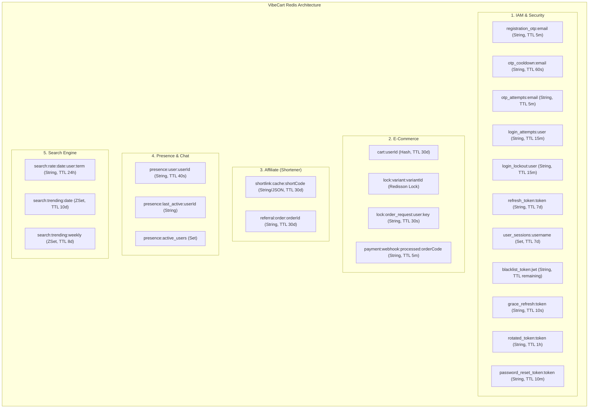

# Thiết kế Kiến trúc Tích hợp Redis trong VibeCart

Tài liệu này mô tả chi tiết hạ tầng, cấu hình và toàn bộ các chức năng đang sử dụng Redis làm bộ nhớ đệm (Cache), khóa phân tán (Distributed Lock), quản lý trạng thái phiên (Session/Presence) và chống spam (Anti-spam/Idempotency) trong dự án **VibeCart**.

---

## 1. Tổng quan Hạ tầng Redis

*   **Phiên bản:** Redis 7.x.
*   **Thư viện tích hợp (Spring Boot):**
    *   `spring-boot-starter-data-redis` (Sử dụng `StringRedisTemplate` và `RedisTemplate<String, String>` làm client giao tiếp chính).
    *   `Redisson` (`RedissonClient` cấu hình riêng để phục vụ cơ chế **Distributed Lock** trong xử lý đồng thời).
*   **Cấu hình Môi trường:**
    *   **Local (`application-local.yaml`):** Chạy trên `localhost:6379`.
    *   **Production (`application-prod.yaml`):** Load cấu hình động thông qua các biến môi trường `${SPRING_DATA_REDIS_HOST}`, `${SPRING_DATA_REDIS_PORT}` và `${SPRING_DATA_REDIS_PASSWORD}`.

---

## 2. Bức tranh Tổng thể các Key Redis trong Hệ thống

Sơ đồ dưới đây thể hiện tất cả các Key, kiểu dữ liệu tương ứng và các Module nghiệp vụ tương tác với Redis:

---

## 3. Chi tiết các Chức năng & Logic xử lý theo từng Module

### 3.1. Module Identity & Access Management (IAM / Auth)
Redis đóng vai trò là lõi bảo mật trạng thái (stateful security) hỗ trợ cho cơ chế xác thực phi trạng thái (stateless JWT).

| Key Pattern | Kiểu Dữ Liệu | TTL | Chức năng & Mô tả chi tiết |
| :--- | :---: | :---: | :--- |
| `registration_otp:<email>` | **String** | 5 phút | Lưu trữ mã OTP 6 chữ số ngẫu nhiên sinh ra khi đăng ký tài khoản. |
| `otp_cooldown:<email>` | **String** | 60 giây | Khóa cooldown ngăn người dùng yêu cầu gửi lại OTP dồn dập trong khoảng thời gian ngắn. |
| `otp_attempts:<email>` | **String** | 5 phút | Đếm số lần nhập sai mã OTP của người dùng. Nếu số lần thử vượt quá **5 lần**, hệ thống sẽ xóa ngay mã OTP tương ứng để chống tấn công dò số (Brute-force protection). |
| `login_attempts:<identifier>` | **String** | 15 phút | Đếm số lần đăng nhập thất bại của tài khoản/email. |
| `login_lockout:<identifier>` | **String** | 15 phút | Khi số lần login sai đạt mức tối đa **5 lần**, hệ thống kích hoạt key này để tạm khóa đăng nhập trong vòng 15 phút. |
| `refresh_token:<token>` | **String** | 7 ngày | Lưu mapping giữa `refreshToken` (dạng UUID) và `username` để xác thực phiên khi yêu cầu gia hạn Access Token. |
| `user_sessions:<username>` | **Set** | 7 ngày | Lưu tập hợp các `refreshToken` đang hoạt động của người dùng để kiểm soát phiên đồng thời (**Concurrent Sessions**). Tối đa cho phép **3 sessions**. Khi đăng nhập phiên thứ 4, session cũ nhất sẽ bị thu hồi (Session Kick-out). |
| `blacklist_token:<jwt>` | **String** | Theo tuổi thọ JWT còn lại | Khi người dùng Đăng xuất (Logout), Access Token (JWT) hiện tại của họ sẽ bị đưa vào Blacklist. `JwtAuthenticationFilter` sẽ kiểm tra key này ở mỗi request, nếu tồn tại sẽ từ chối truy cập ngay lập tức. |
| `rotated_token:<token>` | **String** | 1 giờ | Lưu lịch sử các Refresh Token đã bị xoay vòng (đã được sử dụng để lấy token mới) nhằm **phát hiện hành vi trộm cắp Token (Token Theft Detection)**. Nếu phát hiện token cũ nằm trong key này được dùng lại, hệ thống lập tức thu hồi toàn bộ session đang online của người dùng (`purgeAllSessions`). |
| `grace_refresh:<token>` | **String (JSON)** | 10 giây | Shadow key chứa thông tin cặp token mới tạo. Trong khoảng thời gian ân hạn 10 giây, nếu có request trùng lặp gửi lên cùng Refresh Token cũ (do mạng chập chờn), hệ thống sẽ trả về luôn cặp token cũ/mới đã cache thay vì kích hoạt Token Theft. |
| `password_reset_token:<token>` | **String** | 10 phút | Lưu token reset mật khẩu (dạng UUID) trỏ đến email của người dùng phục vụ chức năng Quên mật khẩu. |

> [!NOTE]
> Khi người dùng đổi mật khẩu, đặt lại mật khẩu, hoặc bị Admin khóa tài khoản (`BANNED`), hệ thống sẽ gọi phương thức `purgeAllSessions` để tìm kiếm toàn bộ Refresh Token trong Set `user_sessions:<username>`, xóa toàn bộ chúng khỏi Redis, hủy toàn bộ phiên làm việc của user đó ngay lập tức.

---

### 3.2. Module E-Commerce (Giỏ hàng & Đặt hàng)
Redis giúp tối ưu hóa trải nghiệm mua sắm bằng cách tăng tốc giỏ hàng và đảm bảo tính nhất quán dữ liệu khi thanh toán.

| Key Pattern | Kiểu Dữ Liệu | TTL | Chức năng & Mô tả chi tiết |
| :--- | :---: | :---: | :--- |
| `cart:<userId>` | **Hash** | 30 ngày (Gia hạn khi cập nhật) | Lưu thông tin giỏ hàng của người dùng dưới dạng hash map với: `field = variantId` và `value = quantity`. Giúp lấy thông tin giỏ hàng với độ trễ phản hồi cực thấp (<10ms). Hỗ trợ logic merge giỏ hàng ẩn danh (Guest) từ Local Storage vào Redis Hash khi đăng nhập. |
| `lock:variant:<variantId>` | **Redisson Lock** | Chờ 3s, giữ lock 5s | Khóa phân tán được Redisson quản lý nhằm bảo vệ dữ liệu tồn kho của từng SKU hàng hóa. Lock được áp dụng khi tạo đơn hàng (`placeOrder`), danh sách variant được sắp xếp theo bảng chữ cái trước khi lock để tránh **Deadlock**. |
| `lock:order_request:<userId>:<idempotencyKey>` | **String** | 30 giây | Cơ chế chống gửi yêu cầu đặt hàng trùng lặp (Idempotency) khi người dùng click nút đặt hàng nhiều lần liên tục. |
| `payment:webhook:processed:<orderCode>` | **String** | 5 phút | Tránh xử lý trùng lặp webhook thông báo thanh toán thành công gửi từ cổng thanh toán PayOS. |

---

### 3.3. Module Affiliate (Rút gọn liên kết)
Redis giúp chuyển hướng người dùng siêu tốc thông qua cache và lưu vết hoa hồng đơn hàng.

| Key Pattern | Kiểu Dữ Liệu | TTL | Chức năng & Mô tả chi tiết |
| :--- | :---: | :---: | :--- |
| `shortlink:cache:<shortCode>` | **String (JSON)** | 30 ngày | Lưu cache thông tin của shortcode (`id`, `originalUrl`, `creatorId`, `productId`). Khi người dùng truy cập link rút gọn, hệ thống đọc trực tiếp từ Redis để thực hiện HTTP 302 Redirect trong dưới 20ms mà không cần chạm vào DB (Fast Redirect Cache). Áp dụng mô hình **Write-through** để nạp cache khi miss. |
| `referral:order:<orderId>` | **String** | 30 ngày | Lưu liên kết giữa Đơn hàng (`orderId`) và KOL giới thiệu (`affiliateCreatorId`) được đọc ra từ cookie trình duyệt lúc đặt hàng. Khi nhận sự kiện Kafka `ORDER_PAID`, consumer sẽ lấy ID này từ Redis để ghi nhận doanh số và hoa hồng (Commission) cho KOL. |

---

### 3.4. Module Presence (Trạng thái hoạt động & Chat)
Quản lý trạng thái online/offline thời gian thực của người dùng trong hệ thống chat.

| Key Pattern | Kiểu Dữ Liệu | TTL | Chức năng & Mô tả chi tiết |
| :--- | :---: | :---: | :--- |
| `presence:user:<userId>` | **String** | 40 giây | Lưu trạng thái `"ONLINE"` của user. Khi người dùng thao tác hoặc ping, key này được reset TTL về 40s. Hết hạn TTL đồng nghĩa với việc user chuyển sang OFFLINE. |
| `presence:last_active:<userId>` | **String** | Không giới hạn | Lưu timestamp dạng Unix epoch milliseconds đánh dấu thời gian hoạt động cuối cùng của người dùng. |
| `presence:active_users` | **Set** | Không giới hạn | Lưu danh sách ID của tất cả người dùng đang online. Việc sử dụng cấu trúc **Set** giúp lấy danh sách user online với độ phức tạp $O(1)$ thay vì scan qua lệnh `KEYS` vốn gây nghẽn và treo hệ thống Redis. Hệ thống tự động filter dọn dẹp các ID hết hạn TTL khỏi Set này khi lấy danh sách. |

---

### 3.5. Module Search (Xu hướng tìm kiếm)
Sử dụng cấu trúc dữ liệu Sorted Set để tạo bảng xếp hạng từ khóa tìm kiếm thịnh hành.

| Key Pattern | Kiểu Dữ Liệu | TTL | Chức năng & Mô tả chi tiết |
| :--- | :---: | :---: | :--- |
| `search:rate:<yyyyMMdd>:<user/IP>:<keyword>` | **String** | 24 giờ | Đếm số lượt tìm kiếm của một user (hoặc IP khách vãng lai) với một từ khóa trong ngày. Nếu vượt quá **3 lần/ngày**, lượt tìm kiếm đó sẽ không được cộng điểm trending nhằm chống spam thao túng bảng xếp hạng (Anti-spam protection). |
| `search:trending:<yyyyMMdd>` | **ZSet** | 10 ngày | Lưu điểm số (score) tìm kiếm của từng từ khóa theo từng ngày. Score tăng 1 đơn vị cho mỗi lượt tìm kiếm hợp lệ. |
| `search:trending:weekly` | **ZSet** | 8 ngày | Lưu bảng xếp hạng từ khóa xu hướng trong vòng 7 ngày gần nhất. |

> [!TIP]
> Hệ thống sử dụng một tác vụ ngầm định kỳ hàng giờ/hàng ngày (`@Scheduled(cron = "0 0 * * * *")` trong `SearchServiceImpl.java`) để tổng hợp xu hướng tuần bằng cách gộp (Union) điểm của 7 ngày gần nhất từ các key `search:trending:yyyyMMdd` vào key `search:trending:weekly` thông qua lệnh `unionAndStore` của Redis, giúp truy xuất bảng xếp hạng trending với hiệu năng tối ưu $O(1)$.

---

## 4. Lưu ý về Sự khác biệt giữa Thiết kế Lý thuyết và Code Thực tế

Trong tài liệu hướng dẫn tổng quan của dự án, có đề cập đến một số thiết kế sử dụng Redis nhưng trong mã nguồn thực tế hiện tại (source code backend) đang được xử lý bằng giải pháp khác:

1.  **News Feed (Fan-out Timelines):**
    *   *Tài liệu lý thuyết:* Đề xuất sử dụng mô hình Fan-out đẩy ID bài viết mới vào Redis Timeline của các Follower.
    *   *Mã nguồn thực tế:* Hiện tại class `PostServiceImpl.java` (hàm `getFeed`) đang truy vấn trực tiếp cơ sở dữ liệu quan hệ thông qua phương thức `postRepository.findFeedByUserId` sử dụng phân trang `Slice`.

> [!NOTE]
> Các thiết kế lý thuyết khác đã được triển khai đầy đủ trong mã nguồn:
> *   **Rate Limiting API:** Đã triển khai `RateLimiterFilter` sử dụng `Bucket4j` (Token Bucket Algorithm) với 2 tầng giới hạn: Global (100 req/phút/IP) và Sensitive (10 req/phút/IP cho các endpoint xác thực). Cấu hình tại `application.yaml` dưới prefix `app.rate-limiter`.
> *   **Chat Message Sync (Redis Pub/Sub):** Đã triển khai đầy đủ qua `DynamicRedisSubscriptionManager`, `RedisChatConfig` và `ChatServiceImpl`. Chi tiết tại tài liệu `11_realtime_websocket_design.md`.
