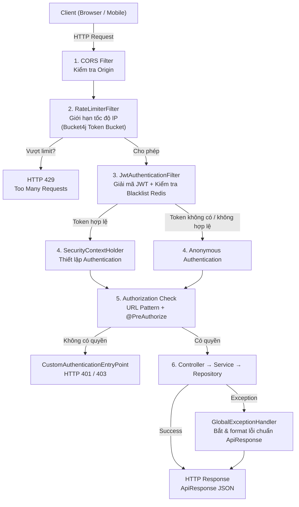
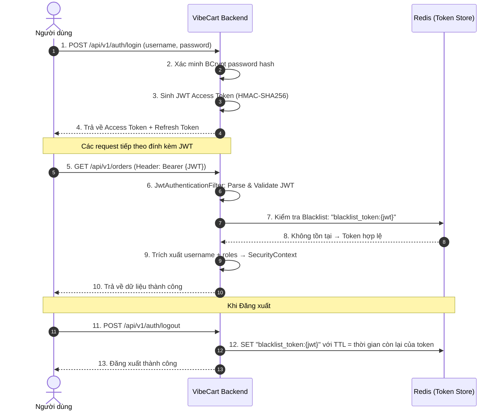
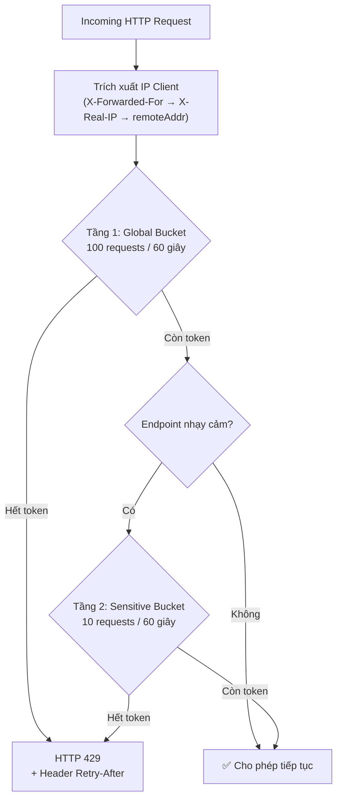
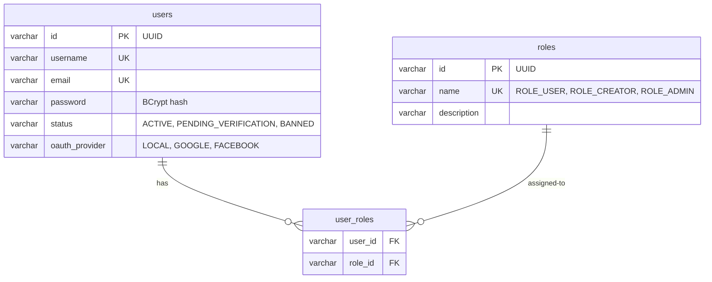
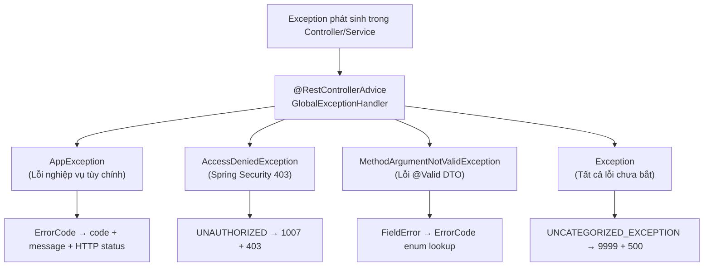

# 🛠️ Thiết kế Kỹ thuật - Phân hệ 9: Bảo mật & Middleware (Security & Middleware Architecture)

Tài liệu này đặc tả chi tiết kiến trúc bảo mật và các tầng middleware xuyên suốt (Cross-cutting Concerns) của hệ thống **VibeCart**: Chuỗi bộ lọc Spring Security (Filter Chain), cơ chế xác thực JWT với Token Blacklist trên Redis, thuật toán Token Bucket giới hạn tốc độ truy cập (Rate Limiting), hệ thống xử lý ngoại lệ tập trung (Global Exception Handling), kiểm soát truy cập đa nguồn gốc (CORS), cơ chế kiểm toán dữ liệu tự động (JPA Auditing) và phân quyền dựa trên vai trò (RBAC).

---

## 🏗️ 1. Kiến trúc Tổng quan Middleware & Security Filter Chain

### 1.1 Sơ đồ Luồng Xử lý Request (Request Processing Pipeline)

Mọi HTTP Request gửi đến VibeCart Backend đều đi qua một chuỗi bộ lọc (Filter Chain) tuần tự trước khi đến Controller xử lý nghiệp vụ:



### 1.2 Thứ tự Đăng ký Filter trong `SecurityConfig`

```java
// Thứ tự thực thi trong SecurityFilterChain:
// 1. CorsFilter (tự động bởi .cors(Customizer.withDefaults()))
// 2. RateLimiterFilter (addFilterAfter SecurityContextHolderFilter)
// 3. JwtAuthenticationFilter (addFilterBefore UsernamePasswordAuthenticationFilter)
// 4. Authorization (authorizeHttpRequests rules)
// 5. ExceptionHandling (customAuthenticationEntryPoint)

http
    .cors(Customizer.withDefaults())
    .csrf(AbstractHttpConfigurer::disable)
    .addFilterAfter(rateLimiterFilter, SecurityContextHolderFilter.class)
    .addFilterBefore(jwtAuthenticationFilter, UsernamePasswordAuthenticationFilter.class)
    .exceptionHandling(exception -> exception
        .authenticationEntryPoint(customAuthenticationEntryPoint)
    );
```

---

## 🔐 2. Xác thực JWT (JSON Web Token Authentication)

### 2.1 Kiến trúc JWT của VibeCart



### 2.2 JWT Token Provider (`JwtTokenProvider`)

```java
@Component
public class JwtTokenProvider {

    @Value("${app.jwt.secret}")
    private String jwtSecret;

    @Value("${app.jwt.expiration-ms}")
    private long jwtExpirationInMs;

    private SecretKey key;

    @PostConstruct
    public void init() {
        // Giải mã Base64 secret → HMAC-SHA key
        byte[] keyBytes = Decoders.BASE64.decode(jwtSecret);
        this.key = Keys.hmacShaKeyFor(keyBytes);
    }

    // 1. Sinh JWT Token
    public String generateToken(String username, String roles) {
        Date now = new Date();
        Date expiryDate = new Date(now.getTime() + jwtExpirationInMs);

        return Jwts.builder()
                .subject(username)
                .claim("roles", roles) // Ví dụ: "ROLE_USER,ROLE_CREATOR"
                .issuedAt(now)
                .expiration(expiryDate)
                .signWith(key)
                .compact();
    }

    // 2. Trích xuất Username từ JWT
    public String getUsernameFromToken(String token) { ... }

    // 3. Trích xuất Roles từ JWT
    public String getRolesFromToken(String token) { ... }

    // 4. Lấy thời gian hết hạn
    public Date getExpirationFromToken(String token) { ... }

    // 5. Xác thực JWT (catch: Malformed, Expired, Unsupported, Empty)
    public boolean validateToken(String authToken) { ... }
}
```

**Cấu trúc JWT Payload:**

```json
{
  "sub": "creator_demo",
  "roles": "ROLE_USER,ROLE_CREATOR",
  "iat": 1717430400,
  "exp": 1717434000
}
```

| Trường | Mô tả | Giá trị mặc định |
| :--- | :--- | :--- |
| `sub` (subject) | Username đăng nhập | — |
| `roles` | Danh sách vai trò phân cách bởi dấu phẩy | `"ROLE_USER"` |
| `iat` (issued at) | Thời điểm phát hành (Unix timestamp) | — |
| `exp` (expiration) | Thời điểm hết hạn | `iat + 3.600.000ms` (1 giờ) |

**Cấu hình `application-local.yaml`:**

```yaml
app:
  jwt:
    secret: ${JWT_SECRET:VmliZUNhcnRTZWNyZXRLZXlGb3JKV1RBdXRoZW50aWNhdGlvbk5lZWREZWNhZmZlaW5hdGVkCg==}
    expiration-ms: ${JWT_EXPIRATION_MS:3600000}  # 1 giờ
```

### 2.3 JWT Authentication Filter (`JwtAuthenticationFilter`)

```java
@Component
public class JwtAuthenticationFilter extends OncePerRequestFilter {

    private final JwtTokenProvider tokenProvider;
    private final StringRedisTemplate redisTemplate;

    @Override
    protected void doFilterInternal(HttpServletRequest request, HttpServletResponse response,
                                    FilterChain filterChain) throws ServletException, IOException {
        try {
            // 1. Trích xuất JWT từ header "Authorization: Bearer {token}"
            String jwt = getJwtFromRequest(request);

            if (StringUtils.hasText(jwt) && tokenProvider.validateToken(jwt)) {
                // 2. Kiểm tra Token Blacklist trên Redis
                String blacklistKey = "blacklist_token:" + jwt;
                Boolean isBlacklisted = redisTemplate.hasKey(blacklistKey);
                if (Boolean.TRUE.equals(isBlacklisted)) {
                    log.warn("Access attempt with blacklisted JWT token");
                    filterChain.doFilter(request, response);
                    return; // Token đã bị thu hồi → bỏ qua, request ẩn danh
                }

                // 3. Trích xuất username và roles
                String username = tokenProvider.getUsernameFromToken(jwt);
                String rolesString = tokenProvider.getRolesFromToken(jwt);

                // 4. Chuyển roles CSV thành danh sách GrantedAuthority
                List<SimpleGrantedAuthority> authorities = Arrays.stream(rolesString.split(","))
                        .filter(role -> !role.trim().isEmpty())
                        .map(SimpleGrantedAuthority::new)
                        .collect(Collectors.toList());

                // 5. Thiết lập SecurityContext
                UsernamePasswordAuthenticationToken authentication =
                        new UsernamePasswordAuthenticationToken(username, null, authorities);
                authentication.setDetails(new WebAuthenticationDetailsSource().buildDetails(request));
                SecurityContextHolder.getContext().setAuthentication(authentication);
            }
        } catch (Exception ex) {
            log.error("Could not set user authentication in security context", ex);
        }

        filterChain.doFilter(request, response);
    }
}
```

**Redis Blacklist Pattern (Logout):**

| Key | Value | TTL |
| :--- | :--- | :--- |
| `blacklist_token:{jwt_full_string}` | `"revoked"` | Thời gian còn lại của token (giây) |

---

## 🛡️ 3. Giới hạn Tốc độ Truy cập - Rate Limiting (`RateLimiterFilter`)

### 3.1 Kiến trúc 2 Tầng (Dual-Layer Rate Limiting)

Hệ thống áp dụng thuật toán **Token Bucket** (thư viện Bucket4j) với 2 tầng giới hạn độc lập:



### 3.2 Cấu hình Rate Limiter (`application-local.yaml`)

```yaml
app:
  rate-limiter:
    enabled: true
    global:
      capacity: 100              # Dung lượng tối đa bucket
      refill-tokens: 100          # Số token nạp lại mỗi chu kỳ
      refill-duration-seconds: 60 # Chu kỳ nạp (60 giây)
    sensitive:
      capacity: 10
      refill-tokens: 10
      refill-duration-seconds: 60
      paths:                      # Danh sách endpoint nhạy cảm
        - /api/v1/auth/login
        - /api/v1/auth/register
        - /api/v1/auth/verify-otp
        - /api/v1/auth/forgot-password
        - /api/v1/auth/reset-password
```

### 3.3 Cấu hình Properties Class (`RateLimiterProperties`)

```java
@Configuration
@ConfigurationProperties(prefix = "app.rate-limiter")
@Getter @Setter
public class RateLimiterProperties {
    private boolean enabled = true;
    private BucketConfig global = new BucketConfig(100, 100, 60);
    private SensitiveBucketConfig sensitive = new SensitiveBucketConfig();

    @Getter @Setter
    public static class BucketConfig {
        private int capacity;
        private int refillTokens;
        private int refillDurationSeconds;
    }

    @Getter @Setter
    public static class SensitiveBucketConfig extends BucketConfig {
        private List<String> paths = List.of(
                "/api/v1/auth/login",
                "/api/v1/auth/register",
                "/api/v1/auth/verify-otp",
                "/api/v1/auth/forgot-password",
                "/api/v1/auth/reset-password"
        );
    }
}
```

### 3.4 Chi tiết Triển khai Filter

**Cơ chế trích xuất IP thật (hỗ trợ Reverse Proxy):**

```java
private String extractClientIp(HttpServletRequest request) {
    // Ưu tiên 1: X-Forwarded-For (Nginx, Load Balancer)
    String xForwardedFor = request.getHeader("X-Forwarded-For");
    if (StringUtils.hasText(xForwardedFor)) {
        return xForwardedFor.split(",")[0].trim(); // Lấy IP đầu tiên (client gốc)
    }
    // Ưu tiên 2: X-Real-IP
    String xRealIp = request.getHeader("X-Real-IP");
    if (StringUtils.hasText(xRealIp)) {
        return xRealIp.trim();
    }
    // Fallback: Remote Address
    return request.getRemoteAddr();
}
```

**Response HTTP 429 (format ApiResponse chuẩn):**

```json
{
  "code": 1030,
  "message": "Bạn đã gửi quá nhiều yêu cầu. Vui lòng thử lại sau"
}
```

**Response Headers khi bị rate limit:**

| Header | Giá trị | Mô tả |
| :--- | :--- | :--- |
| `Retry-After` | `{seconds}` | Số giây cần chờ trước khi gửi request mới |
| `X-RateLimit-Remaining` | `0` | Số token còn lại (luôn là 0 khi bị chặn) |

**Response Headers khi cho phép:**

| Header | Giá trị | Mô tả |
| :--- | :--- | :--- |
| `X-RateLimit-Remaining` | `{n}` | Số token còn lại trong Global bucket |

**Cơ chế dọn dẹp bộ nhớ (Memory Cleanup):**

```java
@Scheduled(fixedRate = 600_000) // 10 phút
public void cleanupExpiredBuckets() {
    // Xóa bucket đã đầy token (IP không hoạt động gần đây)
    globalBuckets.entrySet().removeIf(entry ->
            entry.getValue().getAvailableTokens() >= properties.getGlobal().getCapacity()
    );
    sensitiveBuckets.entrySet().removeIf(entry ->
            entry.getValue().getAvailableTokens() >= properties.getSensitive().getCapacity()
    );
}
```

> **Lưu ý:** Bucket được lưu trong `ConcurrentHashMap` (in-memory, per-instance). Khi scale nhiều node, mỗi node có rate limit bucket riêng biệt. Nếu cần rate limit chia sẻ toàn cụm, cần nâng cấp sang Redis-backed bucket (Bucket4j + Redis proxy).

---

## 🔑 4. Phân quyền Dựa trên Vai trò (Role-Based Access Control - RBAC)

### 4.1 Mô hình Vai trò (Role Model)



**Các vai trò hệ thống:**

| Vai trò | Mã quyền | Mô tả |
| :--- | :--- | :--- |
| Người mua (Shopper) | `ROLE_USER` | Quyền cơ bản: xem sản phẩm, mua hàng, bình luận, theo dõi |
| Nhà sáng tạo (Creator) | `ROLE_CREATOR` | Bao gồm `ROLE_USER` + đăng bài viết, tạo shortlink tiếp thị, xuất báo cáo |
| Quản trị viên (Admin) | `ROLE_ADMIN` | Toàn quyền: quản lý tài khoản, kích hoạt Batch Job, giám sát hệ thống |

### 4.2 Chiến lược Phân quyền trong `SecurityConfig`

Hệ thống kết hợp 2 cơ chế phân quyền đồng thời:

**Cơ chế 1: URL Pattern Rules (SecurityFilterChain)**

```java
.authorizeHttpRequests(authorize -> authorize
    // === Public Endpoints (Không cần đăng nhập) ===
    .requestMatchers(
            "/api/v1/auth/register",
            "/api/v1/auth/verify-otp",
            "/api/v1/auth/login",
            "/api/v1/auth/oauth2/**",
            "/api/v1/auth/refresh",
            "/api/v1/auth/logout",
            "/api/v1/auth/forgot-password",
            "/api/v1/auth/reset-password",
            "/api/v1/payments/payos/webhook",
            "/api/v1/search",
            "/actuator/**",
            "/v/**",           // Shortlink redirect
            "/ws-chat/**"      // WebSocket handshake
    ).permitAll()

    // === Public GET Endpoints ===
    .requestMatchers(GET, "/api/v1/products", "/api/v1/products/**").permitAll()
    .requestMatchers(GET, "/api/v1/categories", "/api/v1/categories/**").permitAll()
    .requestMatchers(GET,
            "/api/v1/posts",
            "/api/v1/posts/*/likes/count",
            "/api/v1/posts/*/comments",
            "/api/v1/users/*/followers",
            "/api/v1/users/*/following",
            "/api/v1/users/*/followers/count",
            "/api/v1/users/*/following/count",
            "/api/v1/users/*/profile"
    ).permitAll()
    .requestMatchers(GET, "/api/v1/posts/{postId}").permitAll()

    // === Tất cả endpoint còn lại yêu cầu đăng nhập ===
    .anyRequest().authenticated()
)
```

**Cơ chế 2: Method-level Security (`@PreAuthorize` — Annotation trên từng Controller method)**

```java
// Ví dụ phân quyền cấp method:
@PreAuthorize("hasRole('CREATOR')")       // Chỉ Creator
@PreAuthorize("hasRole('ADMIN')")         // Chỉ Admin
@PreAuthorize("hasAnyRole('USER', 'CREATOR', 'ADMIN')")  // Đã đăng nhập

// Kích hoạt bởi annotation trên SecurityConfig:
@EnableMethodSecurity
```

### 4.3 Mã hóa Mật khẩu (BCrypt Password Hashing)

```java
@Bean
public PasswordEncoder passwordEncoder() {
    return new BCryptPasswordEncoder();
    // Sử dụng thuật toán BCrypt với cost factor mặc định = 10
    // Kết quả hash: $2a$10$N9qo8uLOickgx2ZMRZoMye...
}
```

---

## 🌐 5. Kiểm soát Truy cập Đa Nguồn Gốc (CORS Configuration)

### 5.1 Cấu hình CORS (`CorsConfig`)

```java
@Configuration(proxyBeanMethods = false)
public class CorsConfig {

    @Value("${app.cors.allowed-origins:http://localhost:3000,http://localhost:5173,...}")
    private String[] allowedOrigins;

    @Bean
    public CorsConfigurationSource corsConfigurationSource() {
        CorsConfiguration configuration = new CorsConfiguration();
        configuration.setAllowedOrigins(Arrays.asList(allowedOrigins));
        configuration.setAllowedMethods(List.of(
                "GET", "POST", "PUT", "DELETE", "OPTIONS", "HEAD", "PATCH"
        ));
        configuration.addAllowedHeader("*");
        configuration.setAllowCredentials(true);    // Cho phép gửi Cookie/JWT
        configuration.setMaxAge(3600L);             // Cache preflight 1 giờ

        UrlBasedCorsConfigurationSource source = new UrlBasedCorsConfigurationSource();
        source.registerCorsConfiguration("/**", configuration);
        return source;
    }
}
```

| Tham số | Giá trị | Mô tả |
| :--- | :--- | :--- |
| Allowed Origins | `localhost:3000`, `localhost:5173`, `127.0.0.1:3000`, `127.0.0.1:5173` | React (CRA/Vite) dev servers |
| Allowed Methods | `GET, POST, PUT, DELETE, OPTIONS, HEAD, PATCH` | Tất cả HTTP methods |
| Allowed Headers | `*` | Tất cả headers (bao gồm `Authorization`) |
| Allow Credentials | `true` | Cho phép gửi Cookie và Authorization header |
| Max Age | `3600` giây (1 giờ) | Cache preflight OPTIONS response |

> **Thiết kế:** Sử dụng `CorsConfigurationSource` bean thay vì `WebMvcConfigurer.addCorsMappings()` để đảm bảo preflight `OPTIONS` request được xử lý **trước** JwtAuthenticationFilter (tránh bị 401 khi CORS preflight).

---

## ❌ 6. Xử lý Ngoại lệ Tập trung (Global Exception Handling)

### 6.1 Kiến trúc xử lý lỗi



### 6.2 Cấu trúc Response Lỗi Chuẩn (`ApiResponse`)

Mọi response (thành công và lỗi) đều tuân theo một cấu trúc JSON thống nhất:

```java
@JsonInclude(JsonInclude.Include.NON_NULL)
public class ApiResponse<T> {
    @Builder.Default
    private int code = 1000;   // 1000 = thành công, khác 1000 = lỗi
    private String message;     // Mô tả ngắn gọn bằng tiếng Việt
    private T result;           // Dữ liệu payload (null khi lỗi)
}
```

### 6.3 Bảng Mã Lỗi Toàn hệ thống (`ErrorCode`)

#### Lỗi Chung & Bảo mật (1000 - 1030)

| Code | Enum Key | HTTP Status | Mô tả |
| :--- | :--- | :--- | :--- |
| 1000 | `SUCCESS` | 200 OK | Thành công |
| 1001 | `INVALID_KEY` | 400 | Khóa thông báo không hợp lệ |
| 1002 | `USER_EXISTED` | 400 | Tài khoản đã tồn tại |
| 1003 | `USERNAME_INVALID` | 400 | Tên đăng nhập phải từ 5-30 ký tự |
| 1004 | `INVALID_PASSWORD` | 400 | Mật khẩu không đủ mạnh |
| 1005 | `USER_NOT_EXISTED` | 404 | Tài khoản không tồn tại |
| 1006 | `UNAUTHENTICATED` | 401 | Xác thực thất bại |
| 1007 | `UNAUTHORIZED` | 403 | Không có quyền truy cập |
| 1008 | `INVALID_INPUT` | 400 | Dữ liệu đầu vào không hợp lệ |
| 1030 | `RATE_LIMIT_EXCEEDED` | 429 | Quá nhiều yêu cầu |
| 9999 | `UNCATEGORIZED_EXCEPTION` | 500 | Lỗi hệ thống không xác định |

#### Lỗi OTP & Bảo mật Tài khoản (1011 - 1026)

| Code | Enum Key | HTTP Status | Mô tả |
| :--- | :--- | :--- | :--- |
| 1011 | `OTP_EXPIRED` | 400 | Mã OTP đã hết hạn |
| 1012 | `INVALID_OTP` | 400 | Mã OTP không đúng |
| 1013 | `OTP_COOLDOWN` | 429 | Chờ 60 giây trước khi gửi OTP mới |
| 1014 | `OTP_ATTEMPTS_EXCEEDED` | 423 Locked | Nhập sai OTP quá nhiều lần |
| 1015 | `ACCOUNT_TEMPORARILY_LOCKED` | 423 Locked | Tài khoản tạm khóa (đăng nhập sai 5 lần → chờ 15 phút) |
| 1016 | `DISPOSABLE_EMAIL_NOT_ALLOWED` | 400 | Email tạm thời không được phép |
| 1019 | `ACCOUNT_NOT_ACTIVE` | 400 | Tài khoản không hoạt động |
| 1020 | `ACCOUNT_PENDING_VERIFICATION` | 400 | Tài khoản chưa xác thực OTP |
| 1021 | `ACCOUNT_BANNED` | 403 | Tài khoản bị cấm truy cập |
| 1022 | `INVALID_RESET_TOKEN` | 400 | Token khôi phục mật khẩu không hợp lệ |

#### Lỗi E-Commerce (2001 - 2069)

| Code Range | Phạm vi | Ví dụ |
| :--- | :--- | :--- |
| 2001 - 2009 | Sản phẩm & Tồn kho | `PRODUCT_NOT_FOUND`, `OUT_OF_STOCK`, `INSUFFICIENT_STOCK` |
| 2010 - 2019 | Giỏ hàng | `CART_EMPTY`, `CART_QUANTITY_EXCEEDED` |
| 2020 - 2029 | Voucher | `VOUCHER_NOT_FOUND`, `VOUCHER_EXPIRED` |
| 2030 - 2049 | Đơn hàng | `ORDER_NOT_FOUND`, `INVALID_ORDER_STATE_TRANSITION` |
| 2050 - 2069 | Thanh toán | `PAYMENT_GATEWAY_ERROR`, `INVALID_WEBHOOK_SIGNATURE` |

#### Lỗi Mạng Xã hội, Media & Chat (3001 - 5009)

| Code Range | Phạm vi | Ví dụ |
| :--- | :--- | :--- |
| 3001 - 3010 | Bài viết & Tương tác | `POST_NOT_FOUND`, `CANNOT_FOLLOW_SELF`, `PROFANITY_DETECTED` |
| 4001 - 4006 | Media & File | `FILE_TYPE_NOT_SUPPORTED`, `FILE_TOO_LARGE` |
| 5001 - 5002 | Chat | `CONVERSATION_NOT_FOUND`, `CONVERSATION_ACCESS_DENIED` |

### 6.4 Handler cho từng loại Exception

```java
@RestControllerAdvice
public class GlobalExceptionHandler {

    // 1. Lỗi nghiệp vụ (throw new AppException(ErrorCode.XXX))
    @ExceptionHandler(AppException.class)
    public ResponseEntity<ApiResponse<Object>> handleAppException(AppException ex) {
        ErrorCode errorCode = ex.getErrorCode();
        return ResponseEntity.status(errorCode.getStatusCode())
                .body(ApiResponse.builder()
                        .code(errorCode.getCode())
                        .message(errorCode.getMessage())
                        .build());
    }

    // 2. Lỗi phân quyền Spring Security
    @ExceptionHandler(AccessDeniedException.class)
    public ResponseEntity<ApiResponse<Object>> handleAccessDenied(...) {
        // → ErrorCode.UNAUTHORIZED (1007, 403 Forbidden)
    }

    // 3. Lỗi validation DTO (@Valid @RequestBody)
    @ExceptionHandler(MethodArgumentNotValidException.class)
    public ResponseEntity<ApiResponse<Object>> handleValidation(...) {
        // Lấy FieldError.defaultMessage → lookup ErrorCode enum
        // Ví dụ: @Size(message = "USERNAME_INVALID") → ErrorCode.USERNAME_INVALID
    }

    // 4. Fallback: Tất cả exception chưa bắt
    @ExceptionHandler(Exception.class)
    public ResponseEntity<ApiResponse<Object>> handleGeneric(...) {
        // → ErrorCode.UNCATEGORIZED_EXCEPTION (9999, 500)
    }
}
```

> **Thiết kế đặc biệt:** Validation message trong DTO annotation (`@Size(message = "USERNAME_INVALID")`) được ánh xạ trực tiếp sang `ErrorCode` enum. Điều này cho phép Frontend dịch mã lỗi sang ngôn ngữ hiển thị phù hợp mà không phụ thuộc vào chuỗi message.

---

## 🕵️ 7. Xác thực Phía Xác thực Thất bại (Authentication Entry Point)

Khi request truy cập endpoint yêu cầu đăng nhập nhưng không cung cấp JWT hoặc JWT không hợp lệ, `CustomAuthenticationEntryPoint` trả về response 401 theo format `ApiResponse` chuẩn:

```java
@Component
public class CustomAuthenticationEntryPoint implements AuthenticationEntryPoint {

    @Override
    public void commence(HttpServletRequest request, HttpServletResponse response,
                         AuthenticationException authException) throws IOException {

        ErrorCode errorCode = ErrorCode.UNAUTHENTICATED;

        response.setContentType(MediaType.APPLICATION_JSON_VALUE);
        response.setStatus(errorCode.getStatusCode().value()); // 401

        ApiResponse<Object> apiResponse = ApiResponse.builder()
                .code(errorCode.getCode())       // 1006
                .message(errorCode.getMessage())  // "Xác thực thất bại..."
                .build();

        new ObjectMapper().writeValue(response.getWriter(), apiResponse);
    }
}
```

**Response mẫu (HTTP 401):**

```json
{
  "code": 1006,
  "message": "Xác thực thất bại. Vui lòng kiểm tra lại tài khoản hoặc mật khẩu"
}
```

---

## 📋 8. Kiểm toán Dữ liệu Tự động (JPA Auditing)

### 8.1 Cấu hình JPA Auditing

```java
@Configuration(proxyBeanMethods = false)
@EnableJpaAuditing(auditorAwareRef = "springSecurityAuditorAware")
public class JpaConfig { }
```

### 8.2 `SpringSecurityAuditorAware` — Tự động gắn người thao tác

```java
@Component("springSecurityAuditorAware")
public class SpringSecurityAuditorAware implements AuditorAware<String> {

    @Override
    public Optional<String> getCurrentAuditor() {
        Authentication authentication = SecurityContextHolder.getContext().getAuthentication();

        if (authentication == null || !authentication.isAuthenticated()
                || "anonymousUser".equals(authentication.getPrincipal())) {
            return Optional.of("SYSTEM"); // Tác vụ hệ thống (Batch Job, Scheduler, ...)
        }

        return Optional.of(authentication.getName()); // Username đăng nhập
    }
}
```

### 8.3 `BaseEntity` — Lớp cha chung cho mọi Entity

Mọi JPA Entity trong hệ thống đều kế thừa `BaseEntity`, tự động ghi nhận thông tin kiểm toán:

```java
@MappedSuperclass
@EntityListeners(AuditingEntityListener.class)
@Getter @Setter
public abstract class BaseEntity {

    @Id
    @GeneratedValue(strategy = GenerationType.UUID)
    @Column(name = "id", length = 36, nullable = false, updatable = false)
    private String id;                   // UUID v4

    @CreationTimestamp
    @Column(name = "created_at", nullable = false, updatable = false)
    private ZonedDateTime createdAt;     // Tự động lúc INSERT

    @UpdateTimestamp
    @Column(name = "updated_at", nullable = false)
    private ZonedDateTime updatedAt;     // Tự động lúc UPDATE

    @CreatedBy
    @Column(name = "created_by", length = 50, updatable = false)
    private String createdBy;            // Username từ SecurityContext

    @LastModifiedBy
    @Column(name = "updated_by", length = 50)
    private String updatedBy;            // Username từ SecurityContext

    @Column(name = "deleted", nullable = false)
    private boolean deleted = false;     // Soft Delete flag

    @Column(name = "deleted_at")
    private ZonedDateTime deletedAt;     // Thời điểm xóa mềm
}
```

**Kết hợp Soft Delete trên Entity con:**

```java
@Entity
@Table(name = "users")
@SQLDelete(sql = "UPDATE users SET deleted = true, deleted_at = CURRENT_TIMESTAMP WHERE id = ?")
@SQLRestriction("deleted = false")  // Tự động lọc bản ghi đã xóa trong mọi query
public class User extends BaseEntity { ... }
```

| Trường | Annotation | Cơ chế tự động |
| :--- | :--- | :--- |
| `id` | `@GeneratedValue(UUID)` | Hibernate tự sinh UUID v4 khi persist |
| `createdAt` | `@CreationTimestamp` | Hibernate gắn thời gian lúc INSERT |
| `updatedAt` | `@UpdateTimestamp` | Hibernate cập nhật thời gian lúc UPDATE |
| `createdBy` | `@CreatedBy` | Spring Auditor lấy username từ SecurityContext |
| `updatedBy` | `@LastModifiedBy` | Spring Auditor lấy username từ SecurityContext |
| `deleted` | — | `@SQLDelete` + `@SQLRestriction` thực hiện Soft Delete |

---

## 📊 Tổng kết Cấu trúc Source Code

| Vị trí | Class | Vai trò |
| :--- | :--- | :--- |
| `config/SecurityConfig` | Cấu hình chính | Đăng ký Filter Chain, URL rules, password encoder |
| `config/CorsConfig` | CORS | Cho phép Frontend truy cập API cross-origin |
| `config/JpaConfig` | JPA Auditing | Kích hoạt ghi nhận `createdBy`/`updatedBy` tự động |
| `config/RateLimiterProperties` | Properties | Cấu hình 2 tầng rate limit từ YAML |
| `common/security/JwtTokenProvider` | JWT Utility | Sinh, giải mã, xác thực JWT token |
| `common/security/JwtAuthenticationFilter` | Filter | Trích xuất JWT → Kiểm tra Blacklist → Set SecurityContext |
| `common/security/RateLimiterFilter` | Filter | Bucket4j Token Bucket 2 tầng + dọn dẹp định kỳ |
| `common/security/CustomAuthenticationEntryPoint` | Entry Point | Trả lỗi 401 chuẩn ApiResponse khi chưa xác thực |
| `common/security/SpringSecurityAuditorAware` | Auditor | Cung cấp username cho JPA Auditing |
| `common/exception/GlobalExceptionHandler` | Advice | Bắt tất cả exception → format ApiResponse thống nhất |
| `common/exception/ErrorCode` | Enum | Bảng mã lỗi toàn hệ thống (6 nhóm, ~50 mã) |
| `common/exception/AppException` | Exception | Exception nghiệp vụ tùy chỉnh mang ErrorCode |
| `common/dto/ApiResponse` | DTO | Envelope JSON chuẩn cho mọi HTTP response |
| `common/entity/BaseEntity` | Entity | Lớp cha: id, audit timestamps, soft delete |
