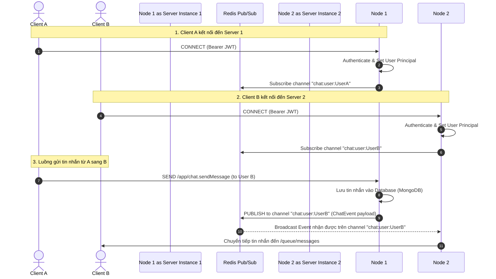

# Thiết kế Kiến trúc WebSocket & Real-time Chat trong VibeCart

Tài liệu này đặc tả chi tiết hạ tầng, cấu hình WebSocket/STOMP, cơ chế bảo mật kết nối và giải pháp đồng bộ tin nhắn đa máy chủ (**Multi-server Message Sync**) sử dụng Redis Pub/Sub trong dự án **VibeCart**.

---

## 1. Tổng quan Kiến trúc WebSocket

*   **Giao thức truyền thông:** **STOMP** (Simple Text Oriented Messaging Protocol) chạy trên nền tảng **WebSocket** (Hỗ trợ SockJS làm cơ chế fallback cho các trình duyệt cũ).
*   **Mục tiêu thiết kế:**
    *   Hỗ trợ chat realtime, cập nhật trạng thái "đang soạn thảo" (typing state), phản hồi "đã xem" (seen/read receipts).
    *   Cung cấp cơ chế Heartbeat ping để duy trì và theo dõi trạng thái trực tuyến (Presence) của người dùng.
    *   **Khả năng scale-up ngang (Horizontal Scaling):** Đồng bộ tin nhắn tức thời giữa các instance Backend khác nhau bằng cơ chế Redis Pub/Sub động.

---

## 2. Quy trình Giao tiếp Real-time đa máy chủ (Multi-server Message Sync)

Sơ đồ trình tự dưới đây minh họa luồng gửi tin nhắn giữa hai Client kết nối đến hai máy chủ Backend khác nhau thông qua kênh trung chuyển Redis Pub/Sub:

---

## 3. Đặc tả Cấu hình WebSocket Broker (`WebSocketConfig.java`)

Hệ thống thiết lập Message Broker và bảo mật kết nối qua các cấu hình chính:

*   **Endpoint kết nối:** `/ws-chat` (Kích hoạt SockJS).
*   **Message Broker Registry:**
    *   `enableSimpleBroker("/topic", "/queue")`:
        *   `/topic`: Điểm nhận tin nhắn broadcast công khai (ví dụ: tin nhắn nhóm, trạng thái chung).
        *   `/queue`: Hàng đợi riêng biệt của từng người dùng (ví dụ: tin nhắn cá nhân, typing cá nhân).
    *   `setApplicationDestinationPrefixes("/app")`: Prefix cho các tin nhắn gửi từ client lên server (ví dụ: `/app/chat.sendMessage`).
    *   `setUserDestinationPrefix("/user")`: Prefix định tuyến tin nhắn cá nhân (ví dụ: `/user/queue/messages`).
*   **Bảo mật kết nối (WebSocket Authentication):**
    *   Cấu hình `ChannelInterceptor` chặn luồng client gửi lệnh `CONNECT` (`StompCommand.CONNECT`).
    *   Đọc JWT từ Native Header `Authorization: Bearer <jwt>`.
    *   Xác thực JWT và gán thông tin `Principal` (username và các quyền `authorities`) vào session context của STOMP thông qua `accessor.setUser(auth)`. Trình kết nối sẽ bị ngắt lập tức nếu thiếu token hoặc token không hợp lệ.

---

## 4. Cơ chế Đăng ký Kênh Động (`DynamicRedisSubscriptionManager.java`)

Khi hệ thống vận hành trong môi trường cụm (Cluster), các kết nối WebSocket được phân bổ ngẫu nhiên trên các Backend Node. Để tối ưu bộ nhớ và số lượng kết nối Redis, hệ thống áp dụng cơ chế **Dynamic Subscription**:

1.  **Chỉ Subscribe khi Online:** Hệ thống không subscribe toàn bộ người dùng vào Redis. Chỉ khi người dùng kết nối WebSocket thành công, Server mới thực hiện subscribe kênh `chat:user:{username}` tương ứng của user đó vào `RedisMessageListenerContainer`.
2.  **Hỗ trợ Multi-tab (Reference Counting):** Khi một người dùng mở nhiều tab trình duyệt (tạo nhiều WebSocket Connection đến cùng một Backend instance):
    *   Hệ thống duy trì một `ConcurrentHashMap` lưu trữ số lượng connection hoạt động của từng user (`username -> referenceCount`).
    *   **Đăng nhập tab mới:** Chỉ tăng số đếm, không đăng ký lại listener lên Redis.
    *   **Đóng tab (Disconnect):** Giảm số đếm. Hệ thống chỉ thực sự unsubscribe khỏi Redis khi tab cuối cùng bị đóng (`referenceCount <= 0`).

---

## 5. Đặc tả các WebSocket Endpoints (`ChatController.java`)

Client gửi tin nhắn và các sự kiện realtime thông qua các địa chỉ (Destinations) sau:

### 5.1. Gửi tin nhắn (`/app/chat.sendMessage`)
*   **Mô tả:** Người dùng gửi nội dung tin nhắn dạng text hoặc đính kèm đa phương tiện.
*   **Payload:** `MessageRequest` (chứa `conversationId`, `content`, `type`, `attachmentMetadata`).
*   **Logic xử lý:**
    *   Lưu tin nhắn vào cơ sở dữ liệu MongoDB.
    *   Cập nhật tin nhắn cuối cùng (`LastMessage`) và tăng số đếm tin nhắn chưa đọc (`unreadCounts`) của các thành viên khác trong Conversation.
    *   Publish sự kiện `ChatEvent` dạng `"MESSAGE"` lên Redis Pub/Sub của tất cả các thành viên nhận tin nhắn.

### 5.2. Trạng thái soạn tin (`/app/chat.typing`)
*   **Mô tả:** Báo hiệu người dùng đang gõ phím hoặc đã dừng gõ.
*   **Payload:** `TypingRequest` (chứa `conversationId`, `isTyping`).
*   **Logic xử lý:** Publish sự kiện `ChatEvent` dạng `"TYPING"` lên Redis Pub/Sub của các thành viên khác để hiển thị hiệu ứng "User is typing...".

### 5.3. Cập nhật Đã đọc (`/app/chat.seen`)
*   **Mô tả:** Đánh dấu người dùng đã xem các tin nhắn của cuộc hội thoại.
*   **Payload:** `SeenRequest` (chứa `conversationId`).
*   **Logic xử lý:**
    *   Reset số tin nhắn chưa đọc của user hiện tại về `0`.
    *   Cập nhật danh sách biên nhận đã đọc (`readBy`) cho các tin nhắn chưa xem của đối phương trong MongoDB.
    *   Publish sự kiện `ChatEvent` dạng `"READ_RECEIPT"` lên Redis để hiển thị trạng thái "Đã xem" cho đối phương.

### 5.4. Heartbeat duy trì kết nối (`/app/chat.ping`)
*   **Mô tả:** Client gửi định kỳ (ping) để báo hiệu vẫn đang hoạt động.
*   **Logic xử lý:** Gọi `presenceService.setOnline(username)` để gia hạn thời gian sống (TTL 40s) của key hoạt động của người dùng trên Redis Cache.

---

## 6. Lắng nghe và Định tuyến tin nhắn (`RedisMessageSubscriber`)

Khi nhận được sự kiện từ Redis Pub/Sub thông qua kênh `chat:user:{username}`, lớp `RedisMessageSubscriber` thực hiện giải mã và định tuyến xuống Client:

*   **Sự kiện `MESSAGE`:**
    *   Gửi đến queue riêng của user: `/user/queue/messages` (dùng `SimpMessagingTemplate`).
    *   Đồng thời broadcast vào topic của room chat: `/topic/chat.{conversationId}`.
*   **Sự kiện `TYPING`:**
    *   Gửi đến queue riêng của user: `/user/queue/typing`.
    *   Đồng thời broadcast vào topic của room chat: `/topic/chat.{conversationId}/typing`.
*   **Sự kiện `READ_RECEIPT` (Đã xem):**
    *   Gửi đến queue riêng của user: `/user/queue/seen`.
    *   Đồng thời broadcast vào topic của room chat: `/topic/chat.{conversationId}/seen`.
